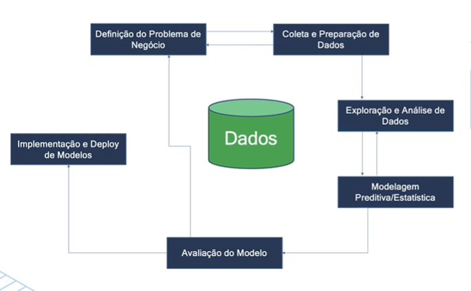
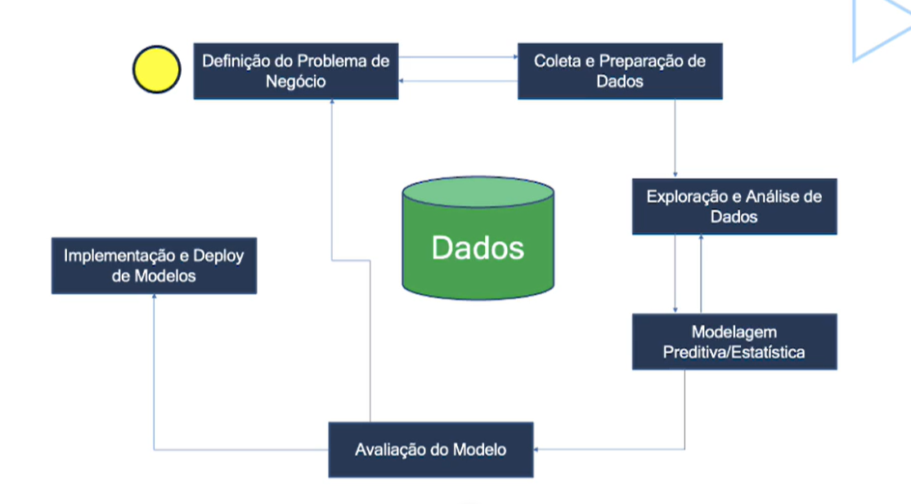
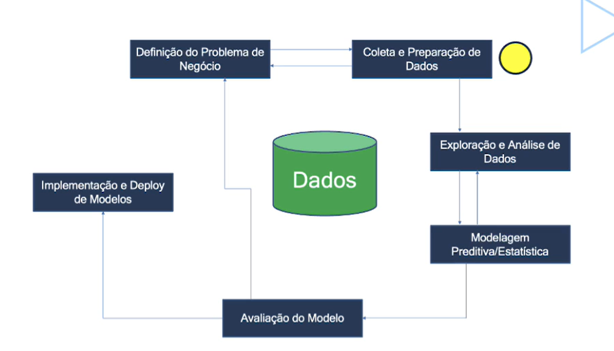
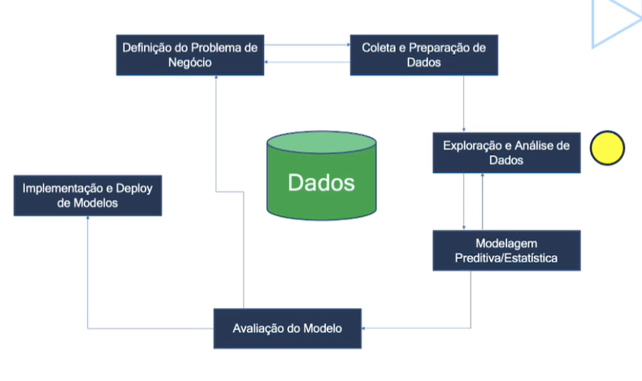
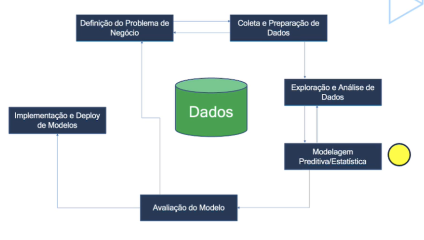
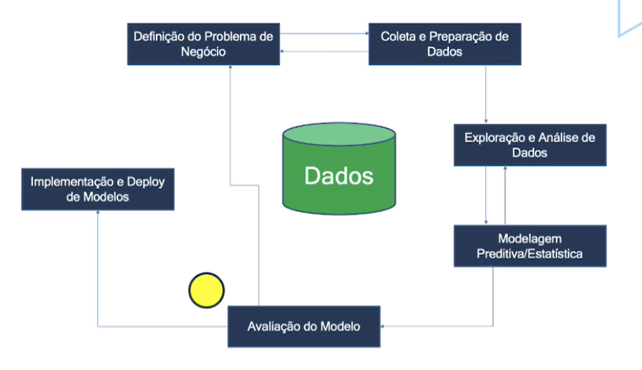
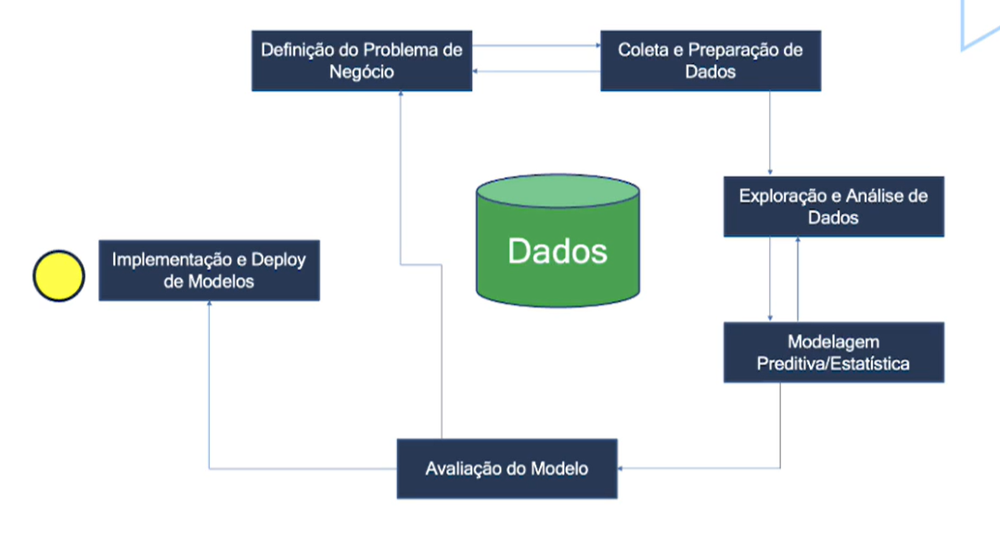
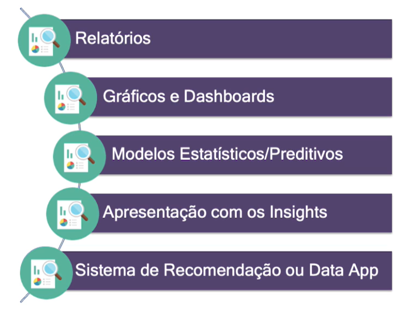

## O que é o Ciclo de Vida de Projetos de Data Science?

O ciclo de vida de projetos de Data Science refere-se ao processo sistemático pelo qual um projeto de Ciência de Dados é idealizado, desenvolvido e concluído.

Esse ciclo envolve várias etapas críticas que ajudam a transformar dados brutos em insights valiosos, decisões informadas e, em última análise, em soluções eficazes para problemas complexos.

O ciclo de vida típico, envolve as seguintes etapas:

 
***

### **Definição do Problema e Objetivos**

Essa fase envolve a identificação clara do problema a ser resolvido e a definição de objetivos específicos. Sempre é importante alinhar o problema com os objetivos estratégicos da empresa, garantindo que as soluções propostas sejam relevantes e viáveis.

 
***

### **Coleta e Preparação dos Dados**

Após a definição dos objetivos, a coleta dos dados é realizada a partir de  diversas fontes internas e externas. A preparação inclui limpeza, tratamento de dados faltantes e transformação de dados para formatos adequados para análise. (Nessa etapa, muitas vezes temos um Engenheiro de Dados envolvido.)

 
***

### **Exploração e Análise de Dados**

Nesta etapa, os dados são explorados através de técnicas estatísticas e de visualização para entender as tendências, padrões e anomalias. A análise exploratória de dados é fundamental para formular hipóteses e planos de modelagem.

Talvez, o projeto de Ciência de Dados se encerre nessa etapa, tudo depende do problema a ser tratado. O analista de dados só atua até essa etapa, a partir dessa, fica a cargo do cientista de dados.

 
***

### **Modelagem Preditiva / Estatística**

Modelos estatísticos ou de Machine Learning são desenvolvidos e treinados usando os dados preparados. Divesas versões de um modelo podem ser criadas aplicando técnicas como otimização de hiperparâmetros e validação cruzada, bem como podemos usar diferentes algoritmos.

 
***

### **Avaliação do Modelo**

É uma etapa crítica para determinar a precisão e a eficácia do modelo em prever ou classificar dados. Se a avaliação do modelo demonstrar que a performance está ruim, pode ser necessário voltar e revisar o problema de negócio ou os dados disponíveis.

 
***

### **Implementação e Deploy de Modelos**

Modelos aprovados, são colocados em produção. Isso pode envolver a integração do modelo com sistemas de TI existentes e o deploy pode ser realizado em ambientes de cloud ou on-premises (rede local da empresa). Ou podemos executar o modelo e entregar o resultado da análise.

 
***

> Ao concluir essa etapa, projeto concluído, cliente feliz, partimos para o próximo projeto!

Esse ciclo de vida se aplica a qualquer empresa de qualquer segmento, o que garante alta empregabilidade para profissionais que dominam a arte da Ciência de Dados!

 
 

## Produtos Gerados em Projetos de Data Science

Alguns exemplos de produtos gerados em projetos de Data Science:

