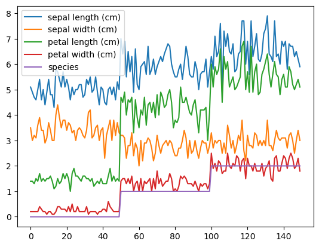
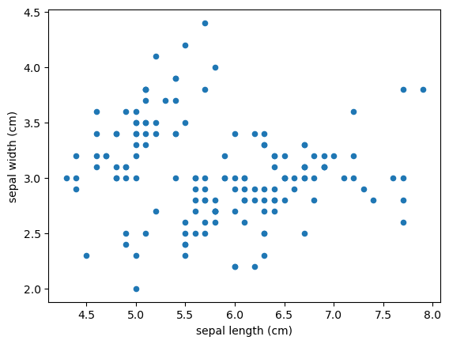
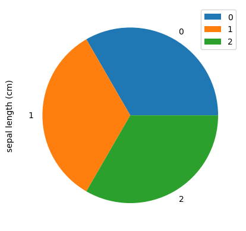
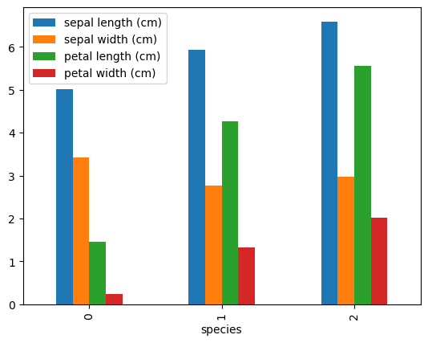
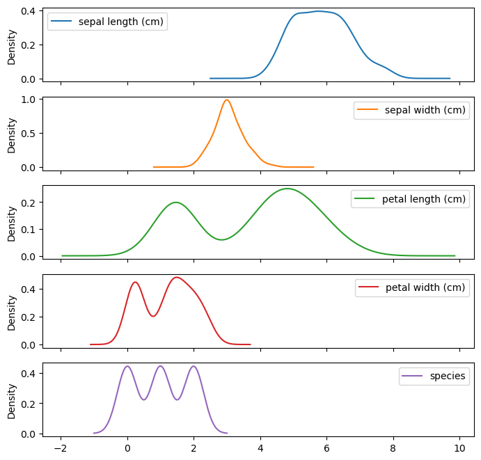

## Construção de gráficos com um DF Pandas!

>Apesar de ter essa funcionalidade no Pandas, não é tão recomendado, existem outras bibliotecas que fazem isso de forma melhor aprimorada!

Instalando uma versão específica do Scikit Learn!
```
python

!pip install scikit-learn==1.2.1
```
***

Importando o Scikit
```
python

import sklearn
sklearn.__version__
# A versão usada é o 1.2.1
```
```
out: '1.2.1'
```
<br>
***

Vamos começar importando o dataset iris do scikit-learn
```
python

from sklearn.datasets import load_iris
data = load_iris()
```
***

Então carregamos o dataset iris como um dataframe do Pandas
```
python

df = pd.DataFrame(data['data'], columns = data['feature_names'])
df['species'] = data['target']
df.head()
```
out:
<div>
<style scoped>
    .dataframe tbody tr th:only-of-type {
        vertical-align: middle;
    }

    .dataframe tbody tr th {
        vertical-align: top;
    }

    .dataframe thead th {
        text-align: right;
    }
</style>
<table border="1" class="dataframe">
  <thead>
    <tr style="text-align: right;">
      <th></th>
      <th>sepal length (cm)</th>
      <th>sepal width (cm)</th>
      <th>petal length (cm)</th>
      <th>petal width (cm)</th>
      <th>species</th>
    </tr>
  </thead>
  <tbody>
    <tr>
      <th>0</th>
      <td>5.1</td>
      <td>3.5</td>
      <td>1.4</td>
      <td>0.2</td>
      <td>0</td>
    </tr>
    <tr>
      <th>1</th>
      <td>4.9</td>
      <td>3.0</td>
      <td>1.4</td>
      <td>0.2</td>
      <td>0</td>
    </tr>
    <tr>
      <th>2</th>
      <td>4.7</td>
      <td>3.2</td>
      <td>1.3</td>
      <td>0.2</td>
      <td>0</td>
    </tr>
    <tr>
      <th>3</th>
      <td>4.6</td>
      <td>3.1</td>
      <td>1.5</td>
      <td>0.2</td>
      <td>0</td>
    </tr>
    <tr>
      <th>4</th>
      <td>5.0</td>
      <td>3.6</td>
      <td>1.4</td>
      <td>0.2</td>
      <td>0</td>
    </tr>
  </tbody>
</table>
</div>

<br>
***

Plotando o DF como um gráfico
```
python

df.plot()
```
out:


    

<br>
***


Vamos fazer um gráfico de dispersão entre duas variáveis
```
python

df.plot.scatter(x = 'sepal length (cm)', y = 'sepal width (cm)')
```
out:



***
    

<br>


Criando um gráfico de área:
```
python


# criando uma lista de títulos de colunas
columns = ['sepal length (cm)', 'petal length (cm)', 'sepal width (cm)', 'sepal width (cm)']

df[columns].plot.area()
```
out:



    

<br>
***

Criando um gráfico de barras com a média de algumas colunas:
```
python


df.groupby('species').mean().plot.bar()
```
out:



    
<br>
***

Ou então, podemos fazer a contagem das classes da coluna species e plotamos em um gráfico de pizza
```
python

df.groupby('species').count().plot.pie(y = 'sepal length (cm)')
```
out:


    
<br>
***

Criando um gráfico KDE para cada variável do DF
```
python

df.plot.kde(subplots = True, figsize = (8,8))
```
out:



***
    
    
<br>

