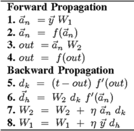

## **O que (Realmente) é Inteligência Artificial?**

A Inteligência Artificial (IA), é um campo da ciência da computação, que se concentra a criação de sistemas capazes de realizar tarefas que normalmente exigiriam inteligência humana.

Essas tarefas incluem aprendizado, raciocínio, resolução de problemas, percepção, reconhecimento de padrões, compreensão de linguagem natural e interação com o ambiente.

Melhor dizendo, tentamos reproduzir nas máquinas a capacidade cognitiva dos seres humanos!

 
***

## **IA e Matemática!**

Usamos matemática através de algoritmos que são treinados a partir de dados. Esses algoritmos são executados no computador através de linguagens de programação.

Se existir um padrão nos dados, um algoritmo será capaz de aprender esse padrão, gerando assim um modelo. Esse modelo pode ser usado com novos dados para resolver o problema para o qual ele foi criado.

Por exemplo:

- Modelo de IA para classificar imagens ou detectar objetos de imagens,
- Modelo de IA para gerar texto,
- Modelo de IA para dectectar anomalias em transações financeiras,
- Modelo de IA para prever as vendas no próximo mês,
- Modelo de IA para prever a ocorrência de doenças.

 
***

## **Inteligência Artificial X Machine Learning X Deep Learning X IA Generativa**

 
***

## **Principais Categorias de IA**

Existem duas categorias de Inteligêcia Artificial:

- **IA Estreita (ou IA Fraca ou Narrow AI):** Projetada para executar uma tarefa específica, como assistentes virtuais, reconhecimento facial, sistemas de recomendação, etc. Essa, não possui consciência ou entendimento além de suas funções programadas. _**É o que existe hoje em termos de IA.**_

- **IA Geral (ou IA Forte ou AGI - Artificial General Intelligence):** Uma IA teórica que teria a capacidade de entender, aprender e aplicar conhecimento de maneira geral, semelhante à inteligência humana. Ainda não foi desenvolvida e é um tópico de pesquisa e debate. _**Não existe ainda!**_

> OBS: Modelos generativos multimodais (que geram texto e imagem) não são IA Geral, mas sim, uma junção de vários modelos de IA Estreita em uma única solução.

 
***

## **Técnicas Comuns Para Construção de Sistemas IA**

As técnicas comuns em IA incluem:

- **Machine Learning (Aprendizado de Máquina):** Subcampo da IA que utiliza algoritmos para aprender padrões a partir de dados e fazer previsões ou decisões sem ser explicitamente programada para cada tarefa. 

- **Deep Learning (Aprendizado Profundo):** Um tipo de Machine Learning que utiliza redes neurais artificiais com muitas camadas (redes neurais profundas) para modelar padrões complexos em grandes quantidades de dados.

- **Aprendizado por Reforço:** Subcampo da IA onde um agente aprende a tomar decisões sequenciais interagindo com um ambiente. O agente recebe recompensas ou punições com base nas ações que executa e seu objetivo é maximizar a recompensa total ao longo do tempo. Amplamente aplicado em áreas como robótica, jogos, controle de sistemas e robôs de ivestimento.

 
***

## **Deep Learning, Dados e GPU**

> Deep Learning, Dados e GPU formam a tempestade perfeita na era da Inteligência Artificial.

Deep Learning, com suas redes neurais complexas, demanda vastas quantidades de dados para treinamento eficaz, enquanto as GPUs (Unidades de Processamento Gráfico) fornecem o poder computacional necessário para processar esses dados de maneira rápida e eficiente.

A sinergia entre esses elementos permite avanços rápidos em áreas como reconhecimento de imagem, processamento de linguagem natural e modelagem preditiva, transformando o mercado de trabalho e abrindo novas fronteiras tecnológicas.

 
***

## **Programação de Computadores na Era da IA**

Programar em IA vai além de usar uma linguaguem de script. Envolve a criação de sistemas que podem aprender a tomar decisões de maneira autônoma. Isso inclui o desenvolvimento de algoritmos de aprendizado de máquina, redes neurais, processamento de linguagem natutral e outras técnicas avançadas.

A programação de IA utiliza linguagens como Python, R, Rust, C++, Scala ou Java, e frameworks como TensorFlow, PyTorch e Scikit-Learn, mas também requer um entendimento profundo de matemática, estatística e lógica.

Além disso, temos que lidar com grandes volumes de dados, pré-processamento, treinamento de modelos, avaliação e otimização contínua para melhorar a precisão e a eficiência dos sistemas de IA.

## Algoritmos e Heurísticas

**Algoritmos** são conjuntos definidos de instruções ou regras que especificam uma sequência de operações a serem realizadas para resolver um problema ou executar uma tarefa. Eles são precisos, detalhados e garantem uma solução específica se seguidos corretamente. Por exemplo, algoritmos podem ser usados para ordenar listas, buscar informações em um banco de dados ou realizar cálculos matemáticos complexos.

---

**Heurísticas**, por outro lado, são abordagens práticas e informais para resolver problemas que não garantem uma solução exata, mas que são rápidas e eficientes para encontrar soluções satisfatórias ou aproximadas. Elas são especialmente úteis em situações complexas ou onde uma solução exata é impraticável ou impossível de obter. Heurísticas são baseadas em experiência, intuição e regras gerais, como "dividir e conquistar" ou "procurar o melhor ajuste primeiro", e são frequentemente usadas em Inteligência Artificial e otimização.

---

> **Muitos Algoritmos e Heurísticas usados em IA já estão prontos** e podem ser usados a partir de frameworks como **TensorFlow** ou **PyTorch**.  
>
> **Desenvolver e criar Algoritmos e Heurísticas** é um trabalho árduo de pesquisa que requer bastante experimentação.

Exemplo de algoritmo:

<b>Forward Propagation</b> é a passada para frente de uma rede neural artificial. Aqui ocorre a <b>previsão</b>.

<b>Backward Propagation</b> é a passada de volta. Aqui ocorre o <b>aprendizado do modelo</b> e a <b>atualização dos pesos</b> (parâmetros).

O <b>backpropagation</b> é baseado no <b>cálculo da derivada</b> (Cálculo Diferencial).

 
***

## IA e Aprendizado de Máquina

Enquanto a IA pode incluir abordagens que não aprendem com dados, como sistemas baseados em regras ou programação lógica, o **Aprendizado de Máquina (Machine Learning)** se baseia na ideia de que os sistemas podem melhorar seu desempenho automaticamente através da experiência.

Dentro do Aprendizado de Máquina, há ainda uma subárea chamada **Deep Learning (Aprendizado Profundo)**, que utiliza **redes neurais artificiais com muitas camadas** para modelar e entender dados complexos.

Este enfoque tem impulsionado muitos dos **avanços recentes em IA**, como o **reconhecimento de imagem** e o **processamento de linguagem natural**.

 
***

## **Aspectos Éticos da IA**

> Os aspectos éticos da IA envolvem uma ampla gama de considerações sobre como o desenvolvimento e a implementação de tecnologias de Inteligência Artificial podem impactar a sociedade de maneira justa, segura e responsável.

Alguns aspectos éticos associados à IA:

**1 - Viés e Discriminação:** Os algortimos de IA podem perpetuar ou amplificar os preconceitos presentes nos dados usados para treiná-los. Isso pode resultar em discriminação contra determinados grupos de pessoas, minorias raciais, de gênero ou socioeconômicas. É importante desenvolver técnicas para que possamos detectar e mitigar vieses nos modelos de IA.

**2 - Privacidade e Segurança:** A coleta e uso de grandes quantidades de dados pessoais para treinar modelos de IA, levantam preocupações sobre privacidade. Garantir que os dados sejam usados de maneira ética e protegidos contra acessos não autorizados é fundamental.

**3 - Transparência e Explicabilidade:** Muitos algoritmos de IA, especialmente aqueles baseados em Deep Learning e outras técnicas mais complexas, são frequentemente descritos como "caixa-preta", ou seja, algo difícil de interpretar ou explicar. É de extrema importância que os sistemas de IA sejam transparentes e que suas decisões possam ser explicadas de maneira compreensível para os usuários.

**4 - Responsabilidade e Prestação de Contas:** Determinar quem é responsável pelas decisões tomadas por sistemas de IA pode ser algo bem complexo. Desenvolvedores, empresas e usuários devem ser responsabilizados pelo uso da IA, especialmente quando as decisões resultam em consequências significativas.

**5 - Impacto no Emprego:** A automação impulsionada pela IA pode levar à perda de empregos em certos setores, enquanto cria novas oportunidades em outros. É essencial considerar políticas que ajudem na transcrição de trabalhadores deslocados e na formação de habilidades para novas funções.

**6 - Segurança e Robustez:** Sistemas de IA devem ser projetadas para serem seguros e robustos contra falhas e ataques. Isso deve garantir que eles possam lidar com situações imprevistas e resistir a tentativas de manipulação.

**7 - Tomada de Decisão Autônoma:** Em áreas como veículos autônomos e armamentos, a capacidade da IA de tomar decisões sem intervenção humana direta levanta questões éticas sobre controle e responsabilidade. Decisões críticas que afetam vidas humanas devem ser cuidadosamente regulamentadas.

**8 - Acesso e Justiça:** O acesso a tecnologias de IA, devem se exarcebar desigualdades existentes se não for distribuído de maneira justa. É importante garantir que os benefícios da IA estejam disponíveis para todos, independentemente de sua localização geográfica ou status socioeconômico.

**9 - Impacto Ambiental:** O treinamento de grandes modelos de IA requer enormes quantidades de energia. Desenvolver técnicas mais eficientes e sustentáveis é vital para minizar o impacto ambiental de IA.

**10 - Uso Militar e de Vigilância:** O uso de IA em aplicações militares e de vigilância pode ter implicações éticas significativas, incluindo questões de direitos humanos e liberdades civis. O desenvolvimento e a implementação dessas tecnologias devem ser cuidadosamente considerados e regulamentados.

> Aspectos éticos da IA são complexos e exigem uma abordagem interdisciplinar