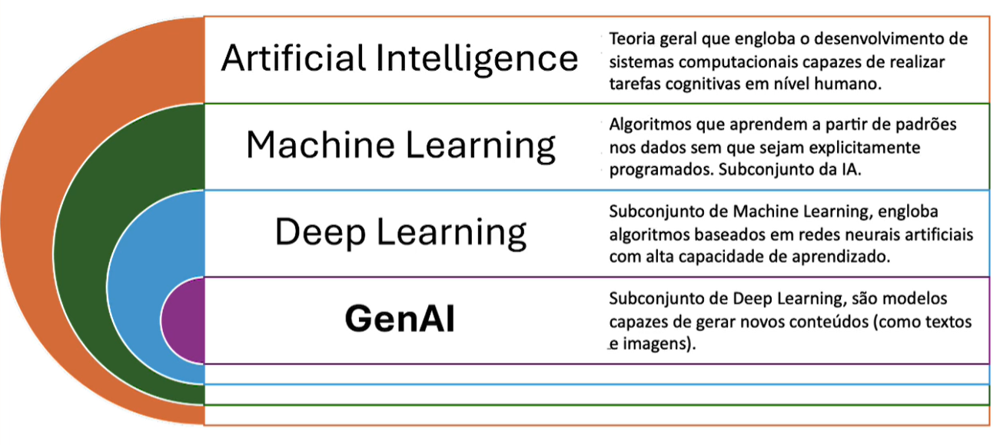

## O que (Realmente) é Inteligência Artificial?

A Inteligência Artificial (IA), é um campo da ciência da computação, que se concentra a criação de sistemas capazes de realizar tarefas que normalmente exigiriam inteligência humana.

Essas tarefas incluem aprendizado, raciocínio, resolução de problemas, percepção, reconhecimento de padrões, compreensão de linguagem natural e interação com o ambiente.

Melhor dizendo, tentamos reproduzir nas máquinas a capacidade cognitiva dos seres humanos!

 
***

## IA e Matemática!

Usamos matemática através de algoritmos que são treinados a partir de dados. Esses algoritmos são executados no computador através de linguagens de programação.

Se existir um padrão nos dados, um algoritmo será capaz de aprender esse padrão, gerando assim um modelo. Esse modelo pode ser usado com novos dados para resolver o problema para o qual ele foi criado.

Por exemplo:

- Modelo de IA para classificar imagens ou detectar objetos de imagens,
- Modelo de IA para gerar texto,
- Modelo de IA para dectectar anomalias em transações financeiras,
- Modelo de IA para prever as vendas no próximo mês,
- Modelo de IA para prever a ocorrência de doenças.

 
***

## Inteligência Artificial X Machine Learning X Deep Learning X IA Generativa

 
***
