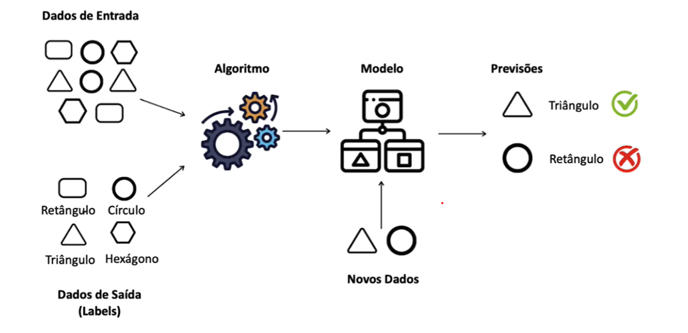
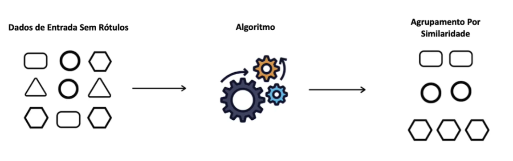
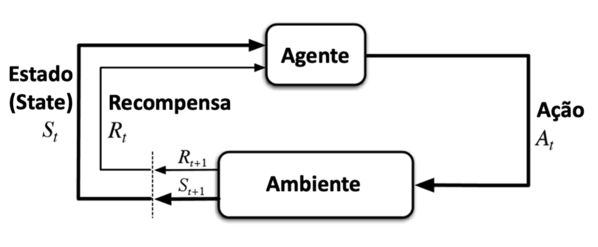
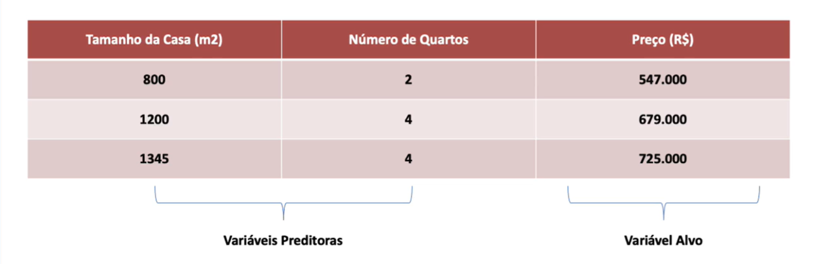
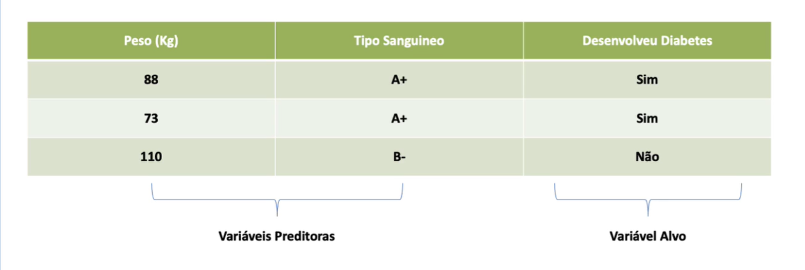
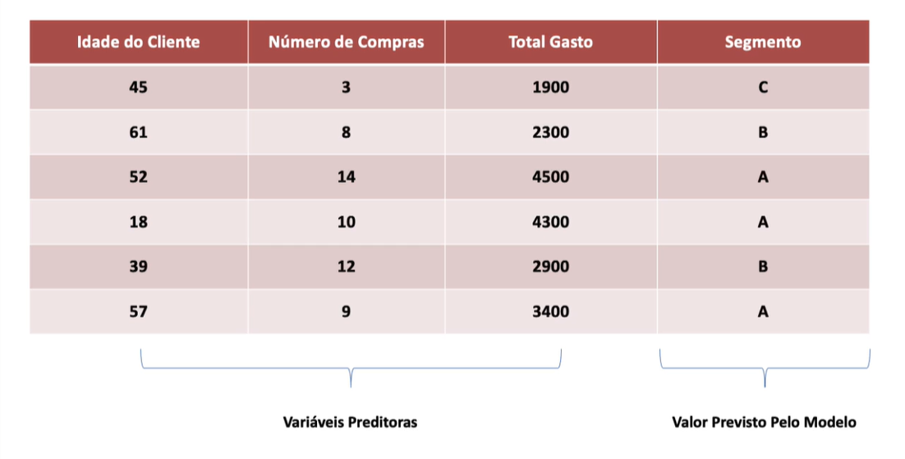
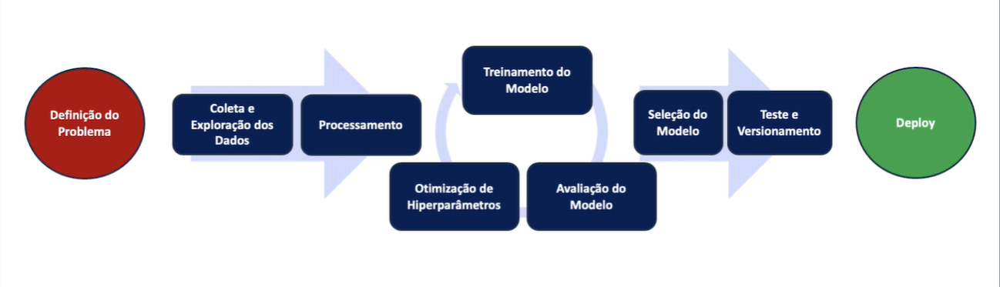
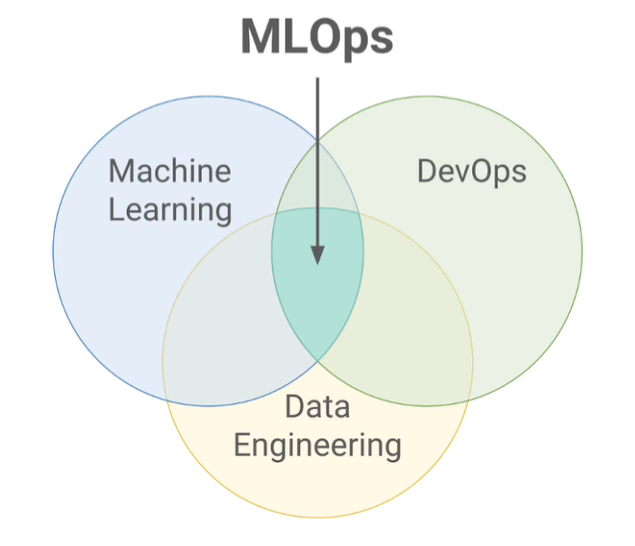

## O que é Machine Learning?

É uma subárea da Inteligência Artificial que permite que sistemas aprendam e melhorem automaticamente com a experiência, sem serem explicitamente programados.

Com Machine Learning utilizamos algoritmos que analisam dados, identificam padrões e fazem previsões ou decisões com bases nos dados.

> Machine Learning não é um conceito novo. Mas, só agora temos dados em grandes quantidades e varidade (Big Data) e capacidade de processamento (especialmente com GPUs - Unidade de Processamento Gráfico), o que nos permite criar modelos de Machine Learning que tenham alta precisão.

### **O que é aprendizado?**

Aprendizado é a capacidade de se adaptar, modificar e melhorar seu comportamento e suas respostas, sendo portanto uma das propriedades mais importantes dos seres ditos inteligentes, sejam eles humanos ou não.

Estamos tentando reproduzir o processo de aprendizado dos seres humanos em máquinas, através de algoritmos de Machine Learning.

Machine Learning (ou Aprendizado de Máquina) é um método de análise de dados que automatiza o desenvolvimento de dados analíticos. Usando algoritmos que aprendem a partir de dados, o aprendizado de máquina faz com que os computadores possam encontrar padrões ocultos sem que sejam explicitamente programados para procurar algo específico.

 
***

## **Ciência de Dados X Machine Learning**

Os dois estão intimamente relacionados!

A Ciência de Dados é um campo abrangente que envolve coleta, processamento, análise e interpretação de grandes volumes de dados para extrair insights e conhecimento.

Machine Learning é uma subárea da IA que se concentra em desenvolver algoritmos e modelos que permitem aos sistemas aprenderem com os dados aprenderem com os dados e então fazer previsões ou tomar decisões.

Em essência, Machine Learning fornece as ferramentas e técnicas para a análise preditiva e a descoberta de padrões dentro do vasto campo da Ciência de Dados.

> -> Todo projeto de Machine Learning é um projeto de Ciência de Dados, mas, nem todo projeto de Ciência de Dados precisa envolver Machine Learning

 
***

## **Tipos de Aprendizado de Máquina**

### **Aprendizado Supervisionado**

 Nesse tipo de aprendizado, o algoritmo é treinado com um conjunto de dados rotulados, onde tanto as entradas quanto as saídas desejadas são conhecidas. O principal objetivo é aprender uma função que mapeie entradas e saídas, de forma direcionada para fazer previsões precisas para novos dados. Exemplos incluem regressão linear e classificadores de árvore de decisão.

 
***

### **Aprendizado Não Supervisionado**

O algoritmo é treinado com dados que não possuem rótulos. O principal objetivo é identificar padrões ou estruturas ocultas nos dados, como agrupamentos ou reduções de dimensionalidade. Exemplos incluem clustering (agrupamento como o k-means) e análise de componentes principais (PCA).

 
***

### **Aprendizado Por Reforço**

Esse tipo de aprendizado envolve treinar um agente para tomar decisões sequenciais, onde ele recebe recompensas ou punições com base nas ações que realiza em um ambiente. O objetivo é aprender uma política que maximize a recompensa acumulada ao longo do tempo. Exemplos incluem jogos de tabuleiro, controle robótico, otimização de processos e robôs financeiros.

 
***

## **Sub-Categorias dos Tipos de Aprendizado**

> Dados os tipos de aprendizado de máquina, temos as subcategorias de cada tipo:

### **Aprendizado Supervisionado**

#### **Regressão**
É uma técnica do aprendizado supervisionado utilizada para prever um valor contínuo. O objetivo é modelar a relação entre uma variável dependente (y) e uma ou mais variáveis independentes (x). Exemplos: Prever preços de casas com base em características como tamanho, localização, etc., ou prever a temperatura com base em dados históricos.

 
***

#### **Classificação** 
Também é uma técnica de aprendizado supervisionado, mas utilizada para prever uma categoria ou classe para os dados. O objetivo é mapear as entradas para uma ou mais categorias discretas. Exemplos incluem a classificação de e-mails como spam ou não spam, ou a classificação de pacientes como propensos ou não a desenvolver uma doença.

 
***

### **Aprendizado Não Supervisionado**

#### **Clusterização**

É uma técnica de aprendizado não supervisionado que agrupa os dados de forma que os itens dentro do mesmo grupo (ou cluster) sejam mais semelhantes entre si do que aos de outros grupos.

o objetivo é identificar e separar padrões ou estruturas nos dados. Um exemplo comum de clusterização é o algoritmo k-means, que particiona o conjunto de dados em k clusters, com cada pronto de dados atribuídos ao cluster com o centróide mais próximo.

Amplamente utilizado em segmentação de mercado, análise de comportamento do cliente e detecção de anomalias.    

 
***

## **Pipeline de Machine Learning**

 
***

## **Operacionalização do Aprendizado de Máquina (MLOps)**

Operacionalização do Aprendizado de Máquina, ou MLOps, é uma prática que combina Machine Learning com DevOps (Desenvolvimento e Operações) para automatizar, monitorar e gerenciar o ciclo de vida dos modelos de Machine Learning de forma eficiente e escalável.

> O MLOps abrange todas as fases do ciclo do modelo, desde a concepção e desenvolvimento até a implementação e monitoramento contínuo em produção.

Os principais componentes do MLOps incluem:

- Desenvolvimento e Treinamento de Modelos
- Continuous Integration (CI)
- Continuous Deployment (CD)
- Monitoramento e Gestão de Modelos
- Gestão de Dados
- Automação de Pipeline de ML
- Governança e Compliance
- Colaboração e Reprodutibilidade