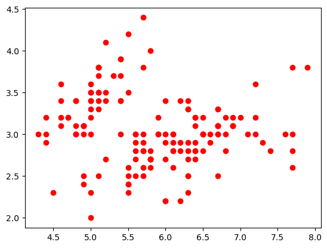

## Manipulando arquivos com NumPy
Vamos importar a biblioteca OS para podermos manipular os arquivos:
```
python

import os
filename = os.path.join('dataset.csv')
```


***


ㅤ


Vamos importar o famoso dataset **Iris Dataset**, amplamente utilizado para aprendizado de máquina e estatística para classificação e análise de dados.
```
python

!more dataset.csv
```
```
out: sepal_length,sepal_width,petal_length,petal_width,species
     5.1,3.5,1.4,0.2,setosa
     4.9,3,1.4,0.2,setosa
     4.7,3.2,1.3,0.2,setosa
     4.6,3.1,1.5,0.2,setosa
     5,3.6,1.4,0.2,setosa
     5.4,3.9,1.7,0.4,setosa
     4.6,3.4,1.4,0.3,setosa
     5,3.4,1.5,0.2,setosa
     4.4,2.9,1.4,0.2,setosa
     4.9,3.1,1.5,0.1,setosa
     5.4,3.7,1.5,0.2,setosa
     4.8,3.4,1.6,0.2,setosa
     4.8,3,1.4,0.1,setosa
     4.3,3,1.1,0.1,setosa
     5.8,4,1.2,0.2,setosa
     5.7,4.4,1.5,0.4,setosa
     5.4,3.9,1.3,0.4,setosa
     5.1,3.5,1.4,0.3,setosa
     5.7,3.8,1.7,0.3,setosa
     5.1,3.8,1.5,0.3,setosa
     5.4,3.4,1.7,0.2,setosa
     5.1,3.7,1.5,0.4,setosa
     m--More--(14%)
```


***


ㅤ

Vamos carregar esse arquivo para dentro de um array, separando por vírgula, dizando que teremos 4 elmento por coluna e pulando a primeira linha do dataset pois ela é o cabeçalho:
```
python

arr13 = np.loadtxt(filename, delimiter = ',', usecols = (0,1,2,3), skiprows = 1)
print(arr13)
```
```
out: [[5.1 3.5 1.4 0.2]
      [4.9 3.  1.4 0.2]
      [4.7 3.2 1.3 0.2]
      [4.6 3.1 1.5 0.2]
      [5.  3.6 1.4 0.2]
      [5.4 3.9 1.7 0.4]
      [4.6 3.4 1.4 0.3]
      [5.  3.4 1.5 0.2]
      [4.4 2.9 1.4 0.2]
      [4.9 3.1 1.5 0.1]
      [5.4 3.7 1.5 0.2]
      [4.8 3.4 1.6 0.2]
      [4.8 3.  1.4 0.1]
      [4.3 3.  1.1 0.1]
      [5.8 4.  1.2 0.2]
      [5.7 4.4 1.5 0.4]
      [5.4 3.9 1.3 0.4]
      [5.1 3.5 1.4 0.3]
      [5.7 3.8 1.7 0.3]
      [5.1 3.8 1.5 0.3]
      [5.4 3.4 1.7 0.2]
      [5.1 3.7 1.5 0.4]
      [4.6 3.6 1.  0.2]
      [5.1 3.3 1.7 0.5]
      [4.8 3.4 1.9 0.2]
     ...
      [6.3 2.5 5.  1.9]
      [6.5 3.  5.2 2. ]
      [6.2 3.4 5.4 2.3]
      [5.9 3.  5.1 1.8]]
```


***


### Criando um gráfico com NumPy
>Por mais que o NumPy tenha essa opção, não é a melhor opção para isso, temos ferramentas que são mais dimensionadas para essa tarefa, mas, TUDO DEPENDE!

Criando as variáveis do gráfico:
```
python

var1, var2 = np.loadtxt(filename, delimiter = ',', usecols = (0,1), skiprows = 1, unpack = True)
```

***


Criando o gráfico de dispersão para mostrar a relação entre as duas colunas:
```
python

import matplotlib.pyplot as plt
plt.show(plt.plot(var1, var2, 'o', markersize = 6, color = 'red'))
```
out:




