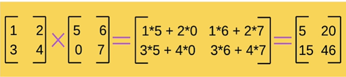

## Operações Matemáticas com Numpy

Criando o Array para manipularmos
```
python

arr15 = np.arange(1,10)
arr15
```

ㅤ
***


Somando todos os elementos dentro de uma array:
```
python

np.sum(arr15)
```
```
out: 45
```

***

ㅤ

Retornando o produto da array:
```
python

np.prod(arr15)
```
```
out: 362880
```

ㅤ
***


Retornando a soma acumulada
```
python

np.cumsum(arr15)
```
```
out: array([ 1,  3,  6, 10, 15, 21, 28, 36, 45])
```

***


Criando dois arrays
```
python

arr16 = np.array([3,2,1])
arr17 = np.array([1,2,3])
```
***

Somando os elementos dos dois arrays:
```
python

arr18 = np.add(arr16,arr17)
print(arr18)
```
```
out: [4 4 4]
```

***


## Multiplicação entre matrizes

Para isso, podemos usar a função dot() ou o operador @, ambos, conseguem executar uma multiplicação matricial.

***

>__PONTO IMPORTANTE:__ O número de colunas da primeira matriz deve ser obrigatoriamente *igual* ao número de linhas da segunda matriz.
***

Criando as arrays para manipulação:
```
python

arr19 = np.array(([1,2], [3,4]))
arr20 = np.array(([5,6], [7,8]))
```
***

```
python

# As duas formas estão corretas!
arr21 = np.dot(arr19, arr20)
arr23 = arr19 @ arr20
print(arr21)
```
```
out: [[19 22]
      [43 50]]
```

