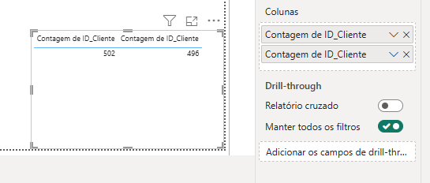
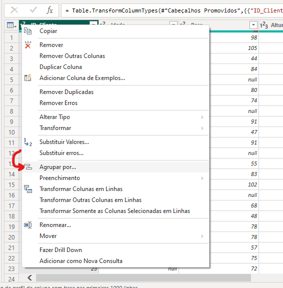
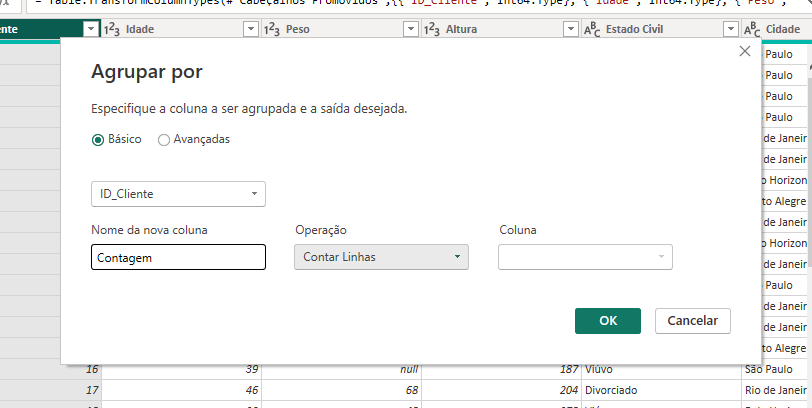
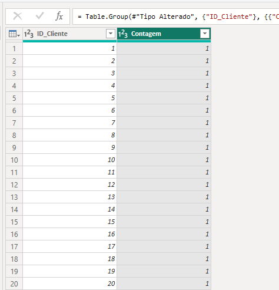
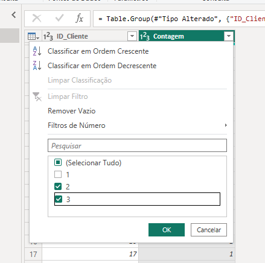
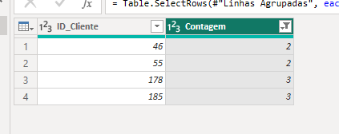
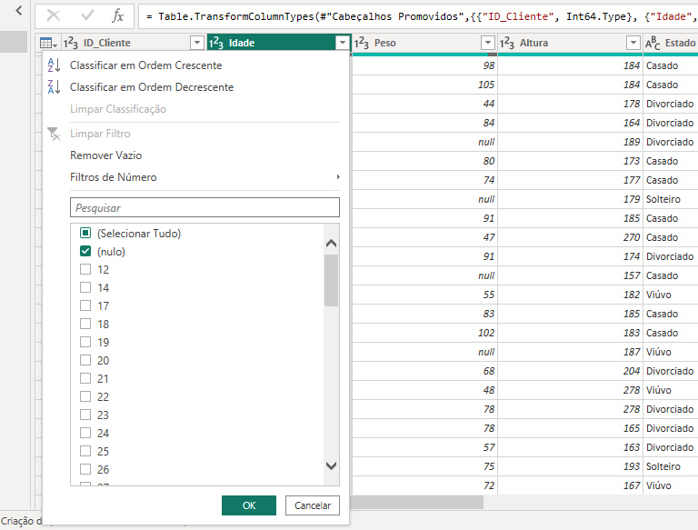
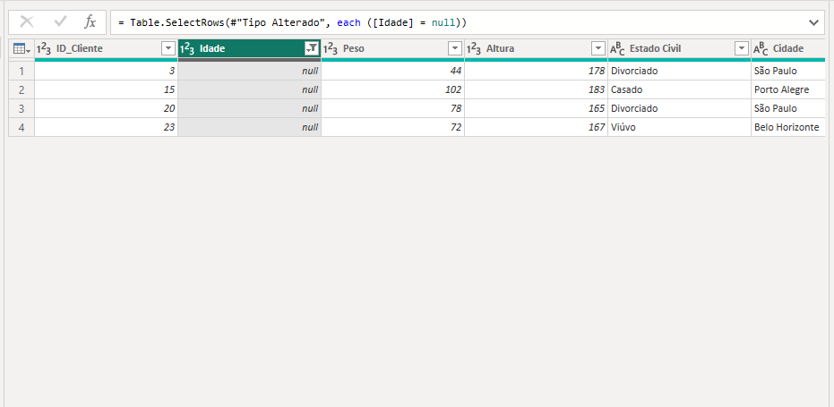
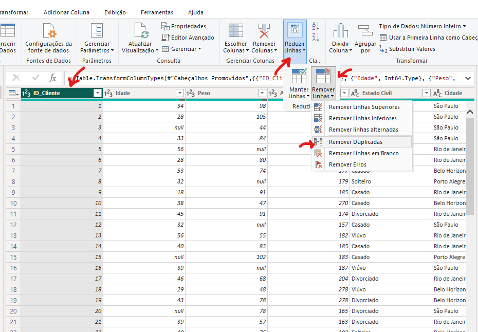
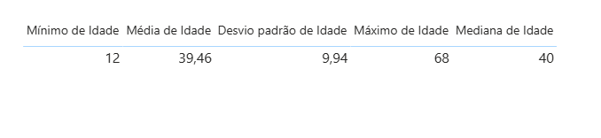

A análise exploratória de dados é uma etapa fundamental no Power BI, pois permite identificar possíveis erros ou inconsistências na base de dados, como valores ausentes, valores duplicados, outliers ou formatações incorretas. Essa etapa é essencial para garantir que as análises e visualizações construídas sejam confiáveis e representem corretamente a realidade dos dados.

---

## Identificando Duplicidade

Uma forma simples de identificar se há valores duplicados, é com a contagem distinta, então, vamos criar uma tabela com os valores de contagem de ID's e contagem distinta de ID's:

De forma fácil, podemos identificar que ao total, temos 502 ID's, porém, só temos 496 ID's únicos, ou seja, os outros ID's estão duplicados, um erro comum.

---

Agora que sabemos que temos duplicidade nos ID's, vamos identificar qual ID está duplicado, no PowerQuery, onde está o tipo do dado, clique com o botão direito e vá em 'Agrupar Por':

Irá abrir essa caixa, clique em 'Ok':

Ele irá criar uma nova coluna como 'Contagem':

Podemos filtrar essa coluna para exibir apenas os ID's que estão tendo mais de uma contagem:

E então, de forma simples, conseguimos enxergar os ID's com duplicidade:

---

## Identificando Valores Nulos

Conseguimos identificar valores nulos de forma fácil e simples, no PowerQuery clique na coluna a ser analisada e deixe somente a opção 'Nulo' selecionada e clique em 'Ok':

E pronto, ele já nos retorna as linhas que estão com valores ausentes:

---

## Removendo Linhas Duplicadas

Agora que sabemos que nossa base de dados tem valores duplicados, uma das tratativas para isso é remover esses valores, vá no PowerQuery, selecione a opção 'Reduzir Linhas', depois em 'Remover Linhas' e então 'Remover Duplicadas':

> Dessa forma, eliminamos as linhas que tem duplicidade no data-set.

---

## Tratando Valores Ausentes

Uma forma de tratar valores ausentes é eliminando a linha, tudo bem que resolveria esse problema, pois o valor nulo deixaria de existir. Em contrapartida eu iria perder a observação sobre aquele cliente. Em uma base de dados onde se tem muitos valores ausentes, eu iria reduzir de forma considerável o data-set, perdendo muitos exemplos de clientes e podendo afetar diretamente nas análises.

Uma outra alternativa é a interpolação de dados, ou seja, preencher esse valor ausente com algum dado, mas não podemos fazer o preenchimento forma aleatória! 

**CENÁRIO:** Vamos supor que temos muitos valores ausentes para uma tabela que tem a coluna de idade dos clientes.

Para melhor compreensão dos dados, vamos fazer o resumo estatístico dessa coluna:

Tendo como base o resumo, podemos usar a média para preencher o valor nulo, é uma boa opção. Porém, para usar a média, o ideal seria primeiro aplicar um teste estatístico para checar a distribuição da variável. O problema é que o PowerBI não tem isso de maneira nativa. Podemos criar isso com DAX, porém, poderia ser algo que demandaria muito trabalho e talvez não tão vantajoso e sem sentido. Sendo assim, o ideal não seria aplicar a média.

Para melhor preencher esses valores, poderiamos usar a mediana, que é o valor do meio, para preencher os valores ausentes. Poderiamos ainda aplicar a moda para preencher os valores. Ou ainda construir um modelo de Machine Learning para prever os valores que estão em falta.

> Uma grande questão é: E se esse cliente não tiver a idade de 40 (Mediana) anos? 
>
> Se formos por esse lado, ou deletamos a linha, ou colocamos um valor APROXIMADO. Se deletarmos a linha, talvez impacte a análise em alguma outra coluna e deixar o valor nulo não é uma opção válida!

