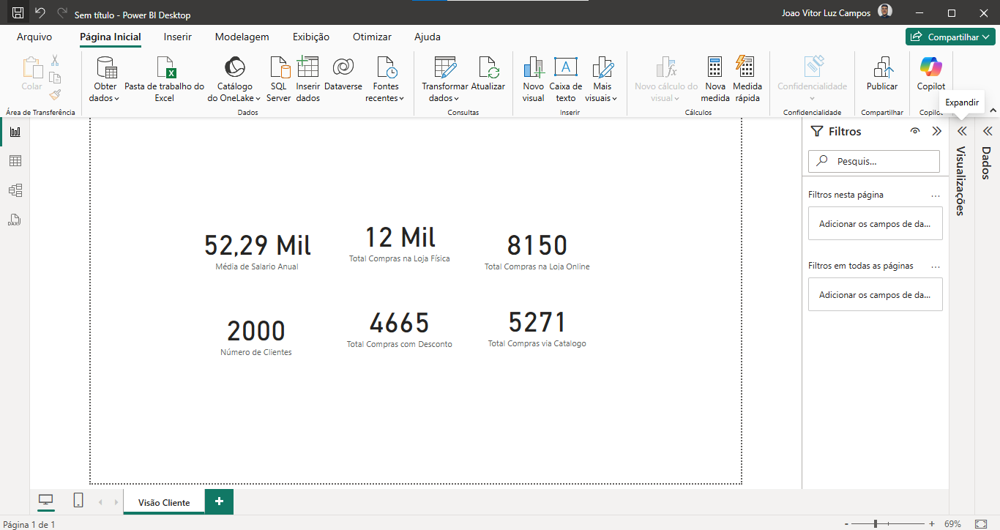
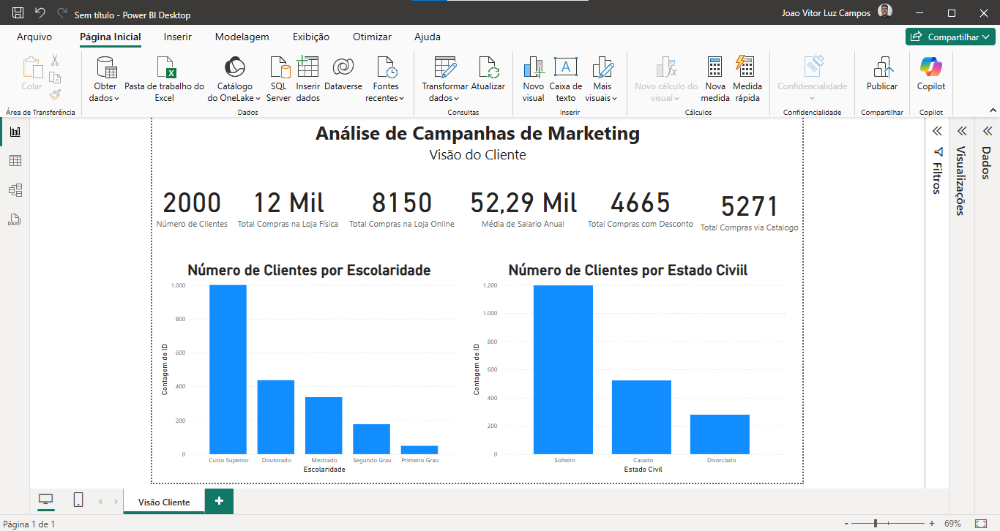
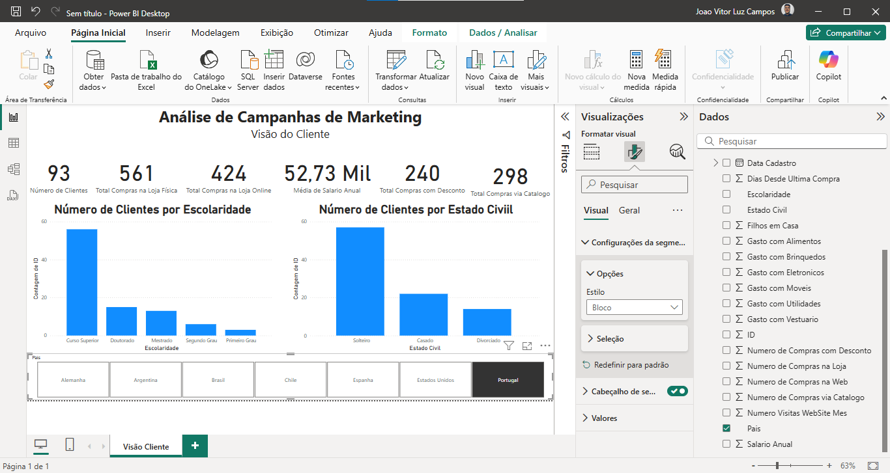
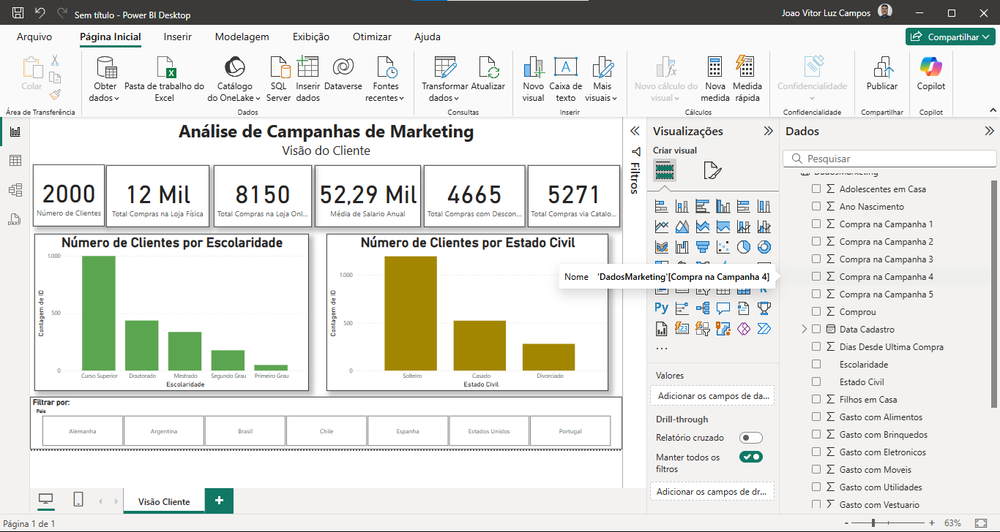
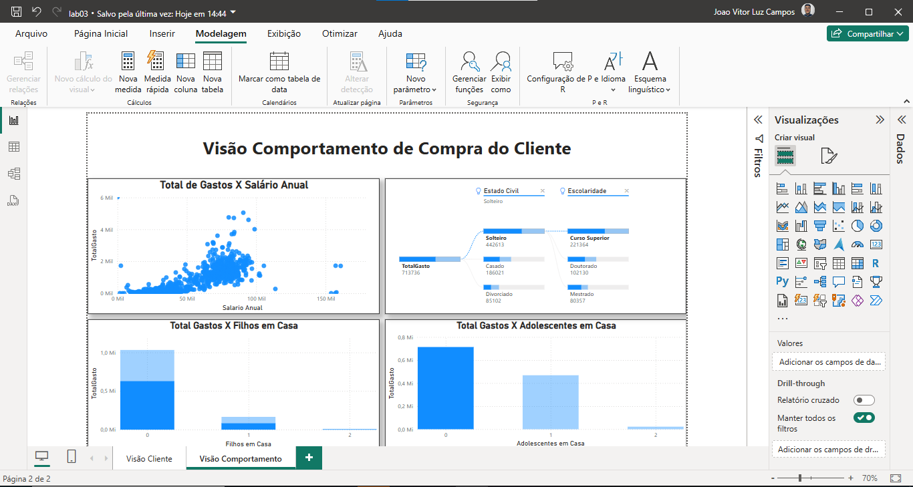
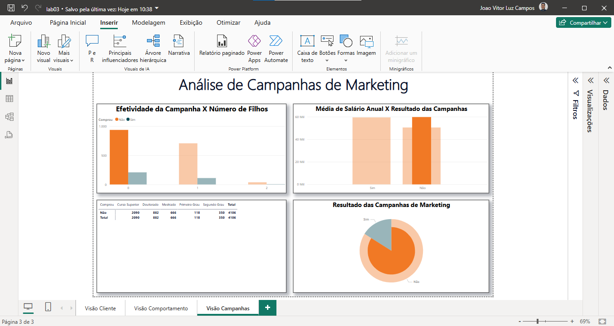

# Análise de Dados em Marketing

Marketing  é  o  processo  de  planejar  e  executar  a  concepção,  preço,  promoção  e distribuição de ideias, bens e serviços para criar trocas que satisfaçam objetivos individuais e organizacionais. É uma das funções mais importantes em uma empresa e é responsável por atrair e  manter  clientes.  Ele  envolve  pesquisa  de  mercado,  análise  de  concorrência,  definição  de estratégias e planejamento de campanhas publicitárias.

---

## Principais KPI's

- **Taxa de conversão:** A proporção de visitantes do site que realizam uma ação desejada, como comprar um produto ou preencher um formulário de contato.

- **Taxa  de  retenção  do  cliente:** A proporção de clientes que compram de uma empresa novamente.

- **Custo por aquisição de cliente (CAC):** O custo total de adquirir um novo cliente, incluindo despesas com publicidade e marketing.
- **Retorno sobre investimento (ROI):**O lucro ou prejuízo obtido em relação ao investimento feito em uma campanha de marketing.
- **Conscientização da marca:** A medida da familiaridade e reconhecimento da marca entre o público-alvo.

- **Engajamento:**A medida da interação dos usuários com conteúdo, campanhas e canais de marketing.

- **Net  Promoter  Score  (NPS):**Uma  medida  da  lealdade  dos  clientes,  baseada  em  sua disposição para recomendar uma empresa ou produto para outras pessoas.

- **Tráfego do website:** Número de visitas no website

---

## Visão do Cliente

Para começarmos, é sempre bom termos as métricas gerais do nosso data-set, então:

Crie os gráficos que fazem sentido para a visão do cliente:

> O estado civil e a escolaridade são fatores que influenciam fortemente e são importantes para a área de marketing.

Vamos segmentar por país, utilizando a segmentação dos dados como um filtro e também como um visual para nosso Dashboard:

> Além de ser funcional, se torna atrativo visualmente para nossos clientes.

E formatando nossa visualização, tornamos visualmente muito mais atrativo:

---
## Visão Comportamento de Compra

O dashboard apresentado tem como foco a **análise do comportamento de compra dos clientes**, considerando variáveis **demográficas** e **socioeconômicas**. Ele busca identificar padrões e relações entre o **perfil do cliente** e o seu **nível de gastos**, permitindo uma compreensão mais profunda sobre os fatores que influenciam o consumo.

A estrutura do dashboard é composta por quatro seções principais:

### 1. Total de Gastos x Salário Anual (Gráfico de Dispersão)
Este gráfico analisa a correlação entre o salário anual dos clientes e o total de gastos.  
Observa-se que, em geral, conforme o salário aumenta, há uma tendência de crescimento nos gastos, embora com dispersões em faixas salariais mais elevadas.  
Isso permite identificar clientes com maior potencial de consumo.

### 2. Total de Gastos por Estado Civil e Escolaridade (Segmentação por Filtros)
Este painel combina filtros por estado civil e nível de escolaridade, mostrando o total de gastos por perfil.  
É possível visualizar, por exemplo, que clientes **solteiros** e com **curso superior** apresentam um volume de gastos expressivo, o que pode ser relevante para segmentações e campanhas direcionadas.

### 3. Total de Gastos x Filhos em Casa (Gráfico de Colunas)
Este gráfico apresenta o impacto do número de filhos no total de gastos.  
Nota-se que clientes **sem filhos** concentram a maior parte dos gastos, sugerindo que a ausência de dependentes pode influenciar positivamente o consumo.

### 4. Total de Gastos x Adolescentes em Casa (Gráfico de Colunas)
Similar ao gráfico anterior, esta visualização foca nos adolescentes.  
Também aqui observa-se que, quanto **menor o número de adolescentes em casa**, **maior tende a ser o gasto total**, o que pode indicar restrições orçamentárias impostas pela presença de dependentes.

---

## Visão da Performance das Campanhas de Marketing

O presente dashboard tem como foco a análise do comportamento dos clientes frente às campanhas de marketing, avaliando a efetividade das ações promocionais com base em variáveis demográficas e socioeconômicas.

O objetivo principal é identificar quais perfis de clientes tendem a responder positivamente às campanhas, auxiliando na definição de estratégias mais assertivas.

A visualização é composta por quatro elementos principais:

### 1. Efetividade da Campanha x Número de Filhos

Este gráfico compara a quantidade de clientes que **compraram** ou **não compraram** após as campanhas, segmentando-os conforme o número de filhos em casa.

- **Clientes sem filhos** apresentaram a maior taxa de resposta positiva, com **208 compras**, frente a **936 que não compraram**.
- Conforme o número de filhos aumenta, a taxa de conversão tende a cair, indicando que clientes com filhos podem ter mais restrições financeiras ou prioridades distintas.

---

### 2. Resultado das Campanhas de Marketing

O gráfico de pizza mostra a **distribuição geral das respostas** às campanhas:

- Aproximadamente **16,01% dos clientes realizaram compras** após o recebimento das campanhas.
- A maioria (**83,99%**) **não converteu**, evidenciando que ainda há espaço para melhorias na abordagem, segmentação ou canal de comunicação utilizado.

---

### 3. Tabela Cruzada: Resposta x Escolaridade e Estado Civil

A tabela detalha a quantidade de clientes que compraram ou não, cruzando os dados de **escolaridade** com o **estado civil**.

- Os **solteiros com curso superior** foram o grupo que mais respondeu positivamente (**495 compras**).
- Clientes com menor escolaridade (como ensino fundamental ou médio) tiveram taxas de conversão significativamente menores.
- O cruzamento de variáveis permite identificar nichos específicos mais propensos à conversão.

---

### 4. Média Salarial x Resultado das Campanhas

O gráfico mostra a média do salário anual entre os clientes que **compraram** e os que **não compraram**.

- Clientes que compraram após a campanha apresentaram um **salário médio de 59 mil**.
- Clientes que não compraram possuem um salário médio de **51 mil**.
- Isso indica que **renda pode ser um fator relevante** para o sucesso das campanhas e que públicos com maior poder aquisitivo tendem a responder melhor.

---

## Conclusão

Este dashboard fornece uma análise clara e objetiva da **eficácia das campanhas de marketing**, revelando que variáveis como:

- **Renda**
- **Escolaridade**
- **Estado civil**
- **Quantidade de filhos**

influenciam significativamente na taxa de conversão.

Com base nesses insights, a empresa pode:

- Redefinir o público-alvo das campanhas.
- Personalizar mensagens com base no perfil do cliente.
- Investir em ações específicas para públicos com maior probabilidade de conversão.
- Reavaliar a abordagem usada para atingir clientes com menores taxas de resposta.