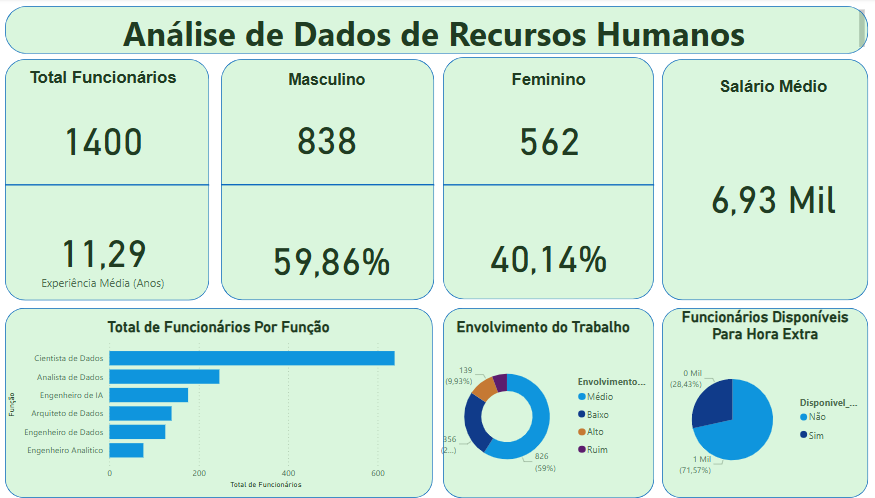

# Análise de Dados em Recursos Humanos

A área de **Recursos Humanos (RH)** tem como função principal **gerenciar e administrar as atividades relacionadas ao pessoal** de uma empresa, a fim de promover o **desenvolvimento** e a **satisfação dos funcionários** e, consequentemente, contribuir para o **sucesso da organização**.

Algumas das responsabilidades comuns da área de RH incluem:

- **Recrutamento e seleção**: publicar vagas, conduzir entrevistas, aplicar testes e avaliar candidatos para preencher posições na empresa.
- **Treinamento e desenvolvimento**: identificar necessidades de capacitação, planejar e implementar programas de treinamento para aprimorar habilidades e promover o crescimento profissional.
- **Remuneração e benefícios**: definir salários competitivos e administrar programas de benefícios, como plano de saúde, vale-alimentação e férias remuneradas.
- **Gestão de conflitos**: auxiliar na resolução de disputas entre funcionários ou entre funcionários e gestores, promovendo um ambiente de trabalho saudável e produtivo.
- **Políticas e práticas de RH**: desenvolver e implementar políticas organizacionais, como igualdade de oportunidades, diversidade e inclusão, garantindo sua aplicação consistente.
- **Avaliação de desempenho**: realizar avaliações periódicas do desempenho dos colaboradores, fornecer feedback construtivo e ajudar na definição de metas e planos de desenvolvimento.

---

## Principais KPI's

Os **KPIs (Key Performance Indicators)** são indicadores quantitativos que ajudam a **avaliar o sucesso** de uma área ou função dentro da empresa.  
Na área de RH, os principais KPIs incluem:

- **Taxa de rotatividade**: mede com que frequência os funcionários deixam a empresa, podendo indicar problemas relacionados ao clima organizacional, remuneração ou oportunidades de carreira.
- **Satisfação do funcionário**: avalia o nível de contentamento dos colaboradores em relação ao trabalho, remuneração, ambiente e desenvolvimento.
- **Tempo médio para preenchimento de vagas**: indica a eficiência do processo de recrutamento, medindo o tempo necessário para preencher uma vaga aberta.
- **Custo de contratação por funcionário**: calcula o custo total envolvido na contratação de um novo colaborador, incluindo anúncios, entrevistas, testes e treinamentos.
- **Participação em treinamentos**: mede o número de funcionários que participam de programas de capacitação, refletindo o engajamento com o desenvolvimento profissional.
- **Avaliação de desempenho**: acompanha a evolução dos funcionários em ciclos de trabalho (normalmente semestrais ou anuais).
- **Nível de absenteísmo**: mede a frequência de faltas dos colaboradores, o que pode indicar problemas de saúde, motivação ou clima organizacional.
- **Nível de engajamento**: avalia o envolvimento e comprometimento dos funcionários com a organização, geralmente baseado em métricas como absenteísmo, pontualidade e desempenho.

---

# 📋 Relatório de Análise de Dados de Recursos Humanos

---

## 👥 Perfil Geral dos Colaboradores

- **Total de Funcionários**: A empresa conta com **1.400 colaboradores ativos**.
- **Experiência Média**: A média de tempo de experiência dos profissionais é de **11,29 anos**, o que indica um quadro com bom nível de maturidade e conhecimento técnico acumulado.
- **Salário Médio**: A remuneração média dos colaboradores está em **6,93 mil**, o que pode refletir o alto grau de especialização exigido nas funções exercidas.

### Distribuição por Gênero

- **Masculino**: 838 colaboradores, representando **59,86%** do total.
- **Feminino**: 562 colaboradoras, correspondendo a **40,14%**.
  
Essa distribuição aponta para um cenário de predominância masculina na força de trabalho da empresa, mas com uma participação feminina significativa, que deve ser considerada em ações de diversidade e inclusão.

---

## 🧑‍💼 Distribuição por Função

O gráfico apresentado evidencia a distribuição dos funcionários entre as principais funções técnicas da empresa. A seguir, uma estimativa aproximada com base nos dados visuais:

| Função                | Quantidade Aproximada | Observações |
|-----------------------|------------------------|-------------|
| Cientista de Dados    | ~600                   | Função mais comum, provavelmente estratégica. |
| Analista de Dados     | ~400                   | Papel fundamental no suporte à análise de negócios. |
| Engenheiro de IA      | ~180                   | Área técnica especializada e crescente. |
| Arquiteto de Dados    | ~150                   | Responsável por estrutura e integração de dados. |
| Engenheiro de Dados   | ~120                   | Suporte à infraestrutura e pipelines de dados. |
| Engenheiro Analítico  | ~50                    | Função menos comum, pode estar relacionada a análises específicas. |

A predominância de cargos voltados à **ciência e análise de dados** evidencia uma estrutura organizacional altamente orientada por dados e tecnologia.

---

## 📈 Envolvimento no Trabalho

A análise de engajamento dos colaboradores mostra:

- **Envolvimento Médio**: 826 funcionários (**59%**)
- **Envolvimento Baixo**: 256 funcionários (**18,29%**)
- **Envolvimento Alto**: 179 funcionários (**12,79%**)
- **Envolvimento Ruim**: 139 funcionários (**9,93%**)

Apesar de a maioria estar moderadamente engajada, o número relativamente alto de colaboradores com **baixo ou ruim envolvimento** (juntos somam 28,22%) é um ponto de atenção. Isso pode impactar negativamente a produtividade, qualidade do trabalho e clima organizacional.

---

## ⏱️ Disponibilidade para Hora Extra

- **Sim**: 1.000 funcionários (**71,57%**)
- **Não**: 400 funcionários (**28,43%**)

Essa alta disponibilidade para horas extras é positiva para a flexibilidade operacional, especialmente em períodos de alta demanda. Contudo, deve ser monitorada para evitar sobrecarga de trabalho e problemas de saúde ocupacional.

---

## 📌 Considerações Finais

A análise de Recursos Humanos revela um quadro funcional experiente, majoritariamente masculino, com forte atuação em funções técnicas ligadas à ciência de dados. O nível de engajamento médio é predominante, mas há sinais de desmotivação em uma parte significativa dos colaboradores.

A disponibilidade elevada para horas extras é um ponto forte, mas exige gestão cuidadosa. Recomenda-se:

- Investir em ações de **engajamento e motivação** para reduzir os índices de envolvimento baixo/ruim.
- Promover políticas de **diversidade e inclusão**, visando maior equilíbrio de gênero.
- Avaliar a **estrutura de remuneração e benefícios** para manter a atratividade do quadro técnico.
- Monitorar a **carga de trabalho** dos colaboradores disponíveis para horas extras.

Essa análise oferece uma base concreta para o planejamento estratégico do RH, orientado à valorização e ao desempenho do capital humano da empresa.
