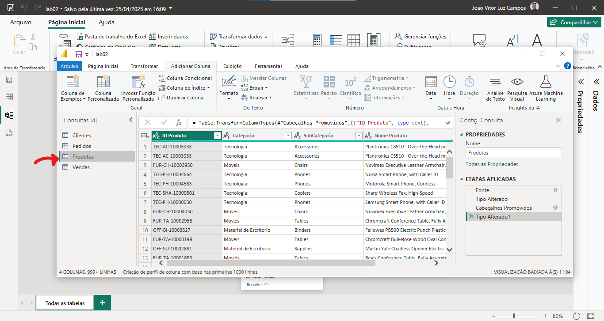

Iremos abordar alguns conceitos básicos sobre BI:

## Importação de dados

Primeiro passo, devemos clicar na opção 'Obter dados':


Em seguida selecionar o tipo de dado do dataset que vamos manipular:


Ao terminar de importar, deve-se verificar se foi importado de maneira correta, se não, ajustar, e em seguida clicar em 'Carregar':


Para visualizar os dados carregados, clique na opção 'Modo exibição de tabela':


E pronto, você terá a visualização de seus dados de forma tabular:


> **IMPORTANTE:** O Power BI tem alguns limites em termos de carga de dados, se o volume de dados for elevado, não se pode fazer dessa maneira, deve colocar em um banco de dados e conectar o Power BI ao banco de dados!

### Cabeçalho do dataset

Muitas vezes, quando vamos carregar dados para a ferramente, ela não consegue identificar os dados da primeira coluna como um cabeçalho, então por padrão, o mesmo coloca os nomes como 'Coluna 1', 'Coluna 2', etc... Veja isso abaixo:


> Podemos observar que a primeira linha é o cabeçalho, mas ele não conseguiu compreender isso!

Uma maneira fácil de fazer isso é antes mesmo de carregar esses dados, vamos em 'Transformar Dados':


E então selecionar a opção 'Usar a Primeira Linha como Cabeçalho':
 

E pronto, já alteramos nosso cabeçalho para a forma correta!
 


---

## Tipos de Dados

Para sabermos os tipos de dados que estamos manipulando, podemos utilizar a aba de 'Transfomar dados':


> Ele irá nos dar a visão geral do data-set, no topo de cada coluna ele indica o tipo dos dados, 'ABC = Texto', '123 = Inteiro',  '1.2 = Decimal', etc.

---

## Cartão de visitas

Vamos clicar no ícone do 'cartão':


Vamos selecionar o cartão inserido no tela de desenho e depois na aba de dados:


E então, selecionamos o dado que deverá ser exibido nesse cartão, nesse caso, vamos selecionar o total de vendas:


> Os dados que tem ao lado o símbolo de somatório **∑**, indicam que podemos fazer operações matemáticas com eles

---

## Gráfico Pizza

Vamos criar um gráfico de pizza, então, selecione a visualização desse gráfico:


Então, vamos selecionar o campo 'Categoria':


Então, vamos arrastar a categoria 'ID_Pedido' para o campo das visualizações 'Valores':


E então, pronto, gráfico de pizza criado com sucesso!


> **QUANDO USAR O GRÁFICO DE PIZZA?**
>
> Quando estamos manipulando poucas categorias, o gráfico de pizza é uma das melhores opções, porém, se for muitas categorias, ele se torna uma das piores opções!

---
## Gráfico de Barras Empilhadas

Vamos criar um gráfico de barras empilhadas, começando a selecionar a visualização desse gráfico:


Vamos selecionar para o eixo Y os dados de 'Pais':


Para o eixo X a contagem do 'ID_Pedido':


E como legenda, a 'Prioridade':


E pronto, dessa forma temos o nosso gráfico de barras empilhadas:


> Importante se atentar aos Eixos e Legendas, pois fazem total diferença na apresentação dos dados.

---
## Gráfico de Barras Horizontais
Vamos criar um gráfico de barras horizontais, começando a selecionar a visualização desse gráfico:


Então, para o Eixo Y vamos selecionar os dados de 'SubCategoria':


E para o Eixo X, os dados de 'Desconto':


A ferramenta escolheu a 'Soma de Desconto' como padrão, mas, queremos a média, então, basta selecionar e alterar o comportamento:


---

## Gráfico de Colunas Clusterizado

> O gráfico de Barras pode parecer simples, porém, para ter a informação precisa, é necessário conhecimento sobre.

Estamos buscando saber a seguinte informação: Quantidade de vendas por 'Tem ou Não Tem Filhos em Casa'. Porém, quando estamos colocando as colunas nos eixos, devemos tomar cuidado, pois pode haver erros e exibir as informações de forma errada:


> Nesse cenário, foi preciso colocar a mesma coluna, tanto em Eixo X e em Eixo Y, o fator influenciador é a Legenda e a Contagem que faz toda diferença.
---
## Mapa Mundial

Vamos criar um Mapa com os dados, vamos selecionar a visualização 'Mapa':


Como temos uma coluna 'Pais' em nosso dataset, vamos selecionar colocar ela no campo 'Localização':


E para os dados de 'Total_Vendas' no campo 'Tamanho da Bolha':


E selecionar a média de 'Total_Vendas':


E então vamos ter um gráfico Mapa Mundial:


---

## Gráfico de Cascata

Vamos selecionar o ícone do gráfico de cascata:


Coloque a coluna 'Modo Envio' para 'Categoria':


E arraste o 'Valor Venda' para o 'Eixo Y':


E pronto, temos o gráfico de cascata criado:


> Esse gráfico é recomendado apenas quando se tem poucas categorias, quando se tem muitas, esse gráfico não é uma opção tão viável.

---
## Gráfico TreeMap

Selecione o ícone de visualização do 'Treemap':


Então, vamos colocar a coluna 'Mercado' para a  'Categoria':


Então, vamos colocar o 'Custo Envio' para 'Valores':


E vamos colocar como 'Média de Custo de Envio':


Pronto, gráfico treemap criado:


---

## Gráfico de Dispersão

Vamos selecionar o ícone de visualização 'Gráfico de dispersão':


Para o eixo X, vamos selecionar o 'Salário Anual':


E para o eixo Y, selecionar o 'Gasto com Alimentos':

> Por padrão, o PowerBI ele tenta agrupar os dados, porém, nesse contexto, a soma dos dados nos retorna um gráfico sem sentido, vamos consertar isso.

Em vez da soma, para o 'Salario Anual', selecione 'Não resumir':


E pronto, temos um gráfico de dispersão criado:


>Se a variável discreta tiver poucos valores distintos (como "Sim" e "Não", ou "Baixo", "Médio", "Alto"), um gráfico de dispersão pode não ser o mais adequado — gráficos de caixa (boxplots) ou de barras podem transmitir melhor a informação. Pode haver sobreposição de pontos, dificultando a visualização, especialmente se a variável discreta tiver poucos valores.

---

## Árvore Hierárquica

Vamos selecionar o ícone de visualização 'Árvore hierárquica':


Então, vamos selecionar a variável a ser analisada:


Devemos escolher uma variável categórica para o 'Explicar por':


E então, temos o gráfico criado, ao clicar, nós escolhemos como ele irá exibir esses dados:


E pronto, podemos ter a visão específica do nosso dataset:


---

## Matriz

> Funcionando como uma tabela, a matriz nos permite cruzar diversos dados.

Vamos selecionar o ícone de visualização da Matriz:


Vamos cruzar duas colunas na matriz:


E então, cruzando mais colunas, podemos expandir a matriz deixando cada vez mais específico:

---
## Indicador Chave de Performance (KPI)

Vamos selecionar o ícone de visualização 'Indicador':


Então, selecionar a coluna 'Valor Venda' para 'Valor':


Vamos colocar como 'Média Valor Venda':

> Por enquanto, a média não está associada a nenhuma categoria, a ferramenta fez apenas a média aritmética.

Vamos então colocar uma linha de meta para esse indicador, vamos colocar o valor de 350.
Vá nas opções de 'Formatar visual', depois em 'Eixo do Medidor', vamos ter algumas opções como 'Min', 'Max' e 'Destino':

> O min, serve como o inicial para o indicador, o max serve para melhor dimensionarmos o gráfico, já o destino é como o alvo ou a meta do objetivo.

---
## Aplicando Filtros

O mapa está poluido, da forma que está dificulta a compreensão e visualização, vamos aplicar um filtro para olhar apenas alguns valores, vamos abrir a aba de filtros:


Vamos selecionar a 'Média de total vendas':


Selecionar que queremos ver somente 'quando for maior que':


E colocar que queremos ver acima de '250':


E então temos que aplicar os filtros selecionados:


E então a visualização desse gráfico ficou mais limpa e fácil de compreender:


---

## Segmentação dos Dados

A segmentação dos dados permite que o usuário possa filtrar os dados dos gráficos de maneira prática, para fazer isso, em visualizações clique em 'Segmentação dos Dados':


E então, clicar na caixa de segmento criada e depois nos dados que será parâmetro para filtro, por exemplo, 'Pais':


E então, de maneira fácil foi criado um filtro por Pais:


Criei um segmento por 'Data_Pedido', como o tipo do dado é Data, ele já deixa em um formato adequado:


Porém, queremos olhar apenas para os anos, então, vamos desmarcar a caixa 'Data_Pedido', expandir a 'Hierarquia de Datas' e selecionar apenas o 'Ano':


---
## Títulos

Podemos adicionar uma caixa de texto com o título de nosso Dashboard criado, para isso, devemos ir em 'Inserir':


Depois selecionar a opção 'Caixa de texto':


E então podemos criar diversos títulos informando o Dashboard:


Podemos ainda modificar um título de um gráfico específico, vamos selecionar o gráfico e abrir a janela de 'Visualizaçãoes':


Vamos então selecionar a opção de 'Formatar seu visual':


Vamos selecionar a aba 'Geral' e então expandir o 'Título', podemos modificar o título de nosso gráfico:


Então podemos dar um título personalizado, em negrito e centralizado:


Modificando todos os títulos, deixamos de maneira mais agradável a leitura e exibição das análises:


---

## Estilos

Podemos aplicar outros estilos para nosso Dashboard, vamos na seção 'Exibição':


Clicando para expandir, podemos ver que tem diversos estilos disponíveis para aplicar aos modelos:


Pronto, de maneira rápida alteramos o estilo de nosso Dashboard!


---

## Removendo Duplicatas nos Dados

Vamos no nosso editor PowerQuery, então clique na opção 'Transformar Dados':


Selecione a tabela a ser manipulada:


Então, clique com o botão direito no nome da coluna e vá na opção 'Agrupar por':


Selecione a opção 'Contagem' e depois clique em 'Ok':


E então, iremos ver que temos um ID duplicado, pois a contagem contou 2 IDS com o mesmo número:


Clique nessa opção:


E então, vá na opção 'Remover Duplicadas':


E pronto, já foi removido os dados duplicados, clique em 'Fechar e Aplicar':


---

## Criando Nova Coluna

Clique em 'Modo de Exibiçã de Tabela' e depois em 'Nova coluna':


Então, irá abrir a caixa para colocar a fórmula da nova coluna,
Como estamos fazendo uma coluna de lucro, implementei da seguinte forma:

> Primeiro o nome da nova coluna e então a regra que ele terá para definir os valores


E pronto, teremos uma nova coluna criada:


> A grande vantagem é que podemos adicionar novas medidas às tabelas de dados que podemos usar para construção de gráficos.

---
### Nova Coluna com DAX

Vamos criar a coluna de margem de lucro com função DAX,
Vá em 'Modo exibição de tabela', selecione qual tabela terá a nova coluna, e depois vá em 'Nova coluna': 


Então, vamos usar a seguinte expressão DAX:
```SQL title='DAX'
MargemLucro = ROUND(DIVIDE(Vendas[Lucro], Vendas[Valor Venda]) * 100, 2)
```

> Ele está dividindo o Lucro de vendas pelo Valor Venda (DIVIDE), multipilicando por 100 para se ter o percentual (* 100) e depois arredondando para apenas 2 casas decimais (ROUND, 2).


E pronto, aplicando as alterações, já temos a nova coluna criada:


---

## Removendo Outliers

Quando identificado um Outlier, precisamos remover o mesmo, vá em 'Transformar Dados':


Vamos selecionar a coluna que se tem o outlier e colocar em ordem Crescente ou Decrescente para visualizar o outlier:


E pronto, conseguimos identificar o outlier:

> Podemos perceber que o segundo salário mais alto, é muito menor que o primeiro, isso impacta diretamente na construção dos gráficos.

Vamos selecionar 'Reduzir Linhas', 'Remover Linhas' e 'Remover Linhas Superiores', e então selecionar a primeira linha:


E pronto, o outlier foi removido:


---

## Criando Medidas

### SUMX

>**CENÁRIO:** Estamos trabalhando em um dataset onde se tem muitos gastos, porém, não se tem uma coluna com o total de gastos, vamos criar uma coluna pra isso.

No modo de exibição de tabela, vamos em 'Nova medida':


Vamos criar essa nova medida DAX:
```SQL title='DAX'
TotalGasto = SUMX(NomeDoDataset, NomeDoDataset[ColunaGasto1] + NomeDoDataset[ColunaGasto2] NomeDoDataset[ColunaGasto3])
```

>A função SUM ela faz o agrupamento geral, o SUMX faz o agrupamento por linha, nesse cenário ela é a melhor.

E pronto, a medida foi criada para que podemos usar em nossas visualizações!

---

### COUNTROWS

>**CENÁRIO:** Estamos trabalhando em um dataset onde se tem os dados de diversos funcionários, porém, queremos saber apenas a quantidade de funcionários.

Poderiamos criar uma medida DAX, tendo como premissa cada linha ser um funcionário:
```SQL title='DAX'
TotalFuncionarios = COUNTROWS(DatasetRH)
```
E pronto, contamos a quantidade de linhas e geramos uma nova medida! 

---

### CALCULATE

>**CENÁRIO:** Agora, queremos saber a quantidade de funcionários do sexo feminimo e masculino.

Podemos criar uma função DAX que calcula a quantidade de funcionários do sexo feminino:
```SQL title='DAX'
TotalFeminino = CALCULATE([TotalFuncionarios], DatasetRH[Genero] = "Feminino")
```

E essa outra função para o sexo masculino:
```SQL title='DAX'
TotalMasculino = CALCULATE([TotalFuncionarios], DatasetRH[Genero] = "Masculino")
```
---

## Substituição de Valores

> Quando trabalhamos com um dataset onde temos um valor que seja positivo e negativo, esse pode ser representado por 0 ou 1, sendo 0 a ação negativa e 1 a ação positiva. 

Vá em transformar valores:


Vá na coluna a ter os valores substituidos, clique com o botão direito e vá em 'Substituir valores':


E então, vamos colocar para 1, o valor 'Sim' (Fazer o mesmo para 0 sendo 'Não'):


Depois, fechar e aplicar para salvar as alterações:


> Com isso facilitamos a interpretação de diversas visualizações, deixando o entendimento melhor.

---
