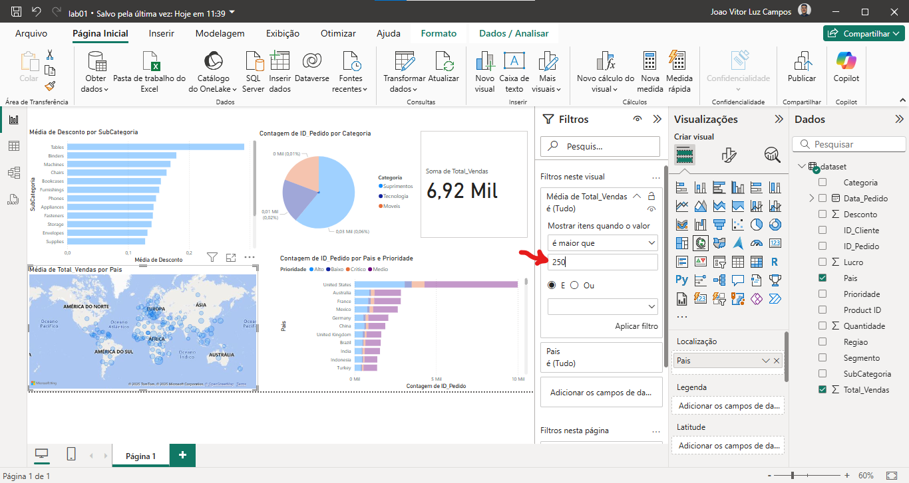
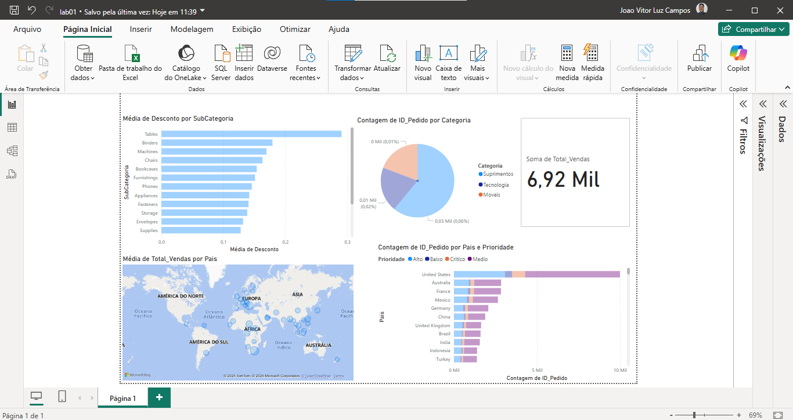
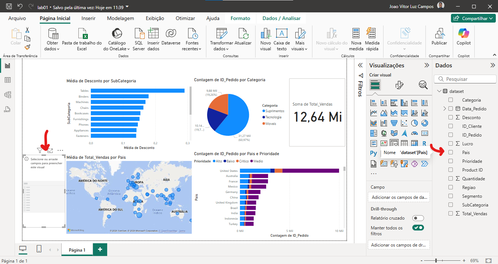
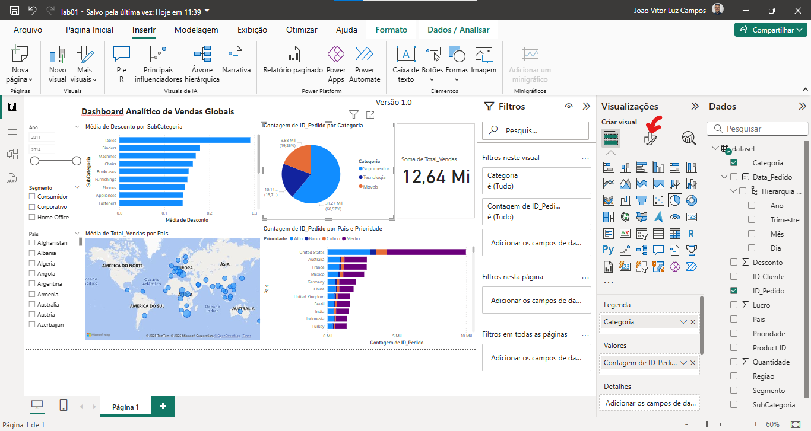
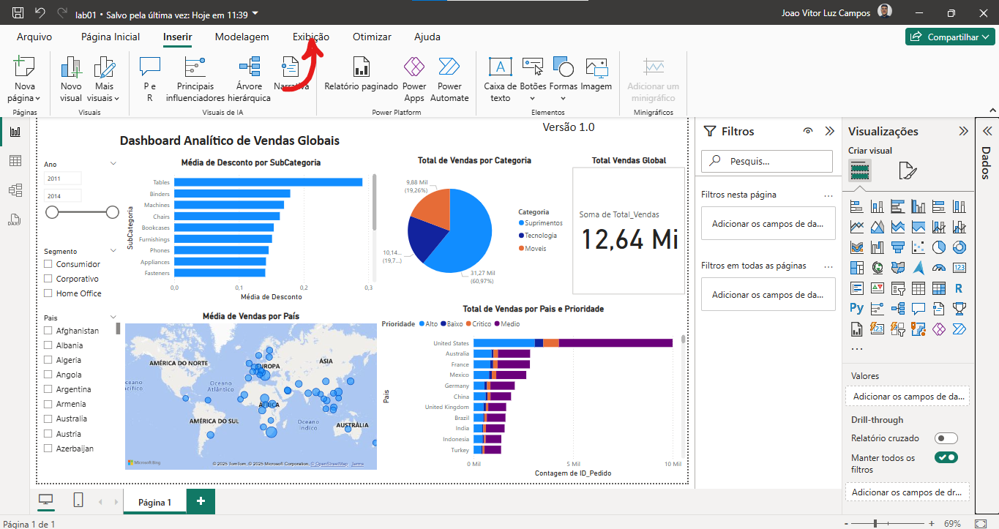
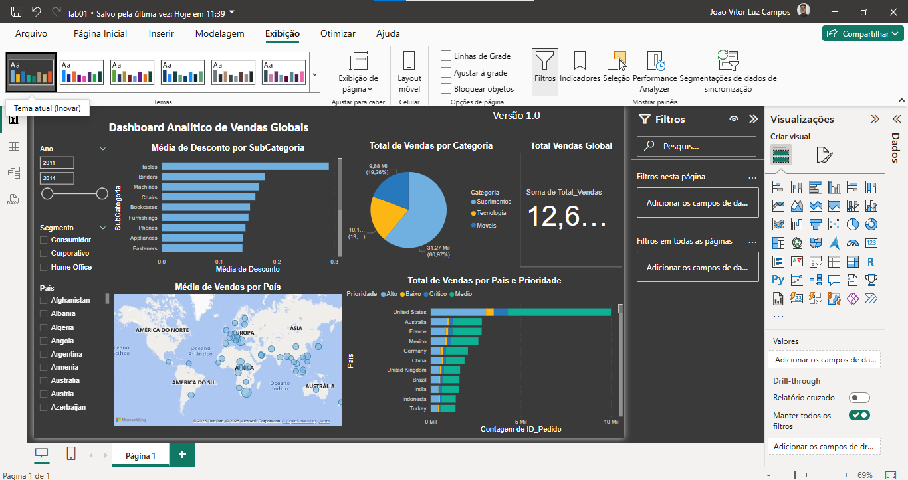

## Aplicando Filtros

O mapa está poluido, da forma que está dificulta a compreensão e visualização, vamos aplicar um filtro para olhar apenas alguns valores, vamos abrir a aba de filtros:

Vamos selecionar a 'Média de total vendas':

Selecionar que queremos ver somente 'quando for maior que':

E colocar que queremos ver acima de '250':

E então temos que aplicar os filtros selecionados:

E então a visualização desse gráfico ficou mais limpa e fácil de compreender:

---

## Segmentação dos Dados

A segmentação dos dados permite que o usuário possa filtrar os dados dos gráficos de maneira prática, para fazer isso, em visualizações clique em 'Segmentação dos Dados':

E então, clicar na caixa de segmento criada e depois nos dados que será parâmetro para filtro, por exemplo, 'Pais':

E então, de maneira fácil foi criado um filtro por Pais:

Criei um segmento por 'Data_Pedido', como o tipo do dado é Data, ele já deixa em um formato adequado:

Porém, queremos olhar apenas para os anos, então, vamos desmarcar a caixa 'Data_Pedido', expandir a 'Hierarquia de Datas' e selecionar apenas o 'Ano':

---
## Títulos

Podemos adicionar uma caixa de texto com o título de nosso Dashboard criado, para isso, devemos ir em 'Inserir':

Depois selecionar a opção 'Caixa de texto':

E então podemos criar diversos títulos informando o Dashboard:

Podemos ainda modificar um título de um gráfico específico, vamos selecionar o gráfico e abrir a janela de 'Visualizaçãoes':

Vamos então selecionar a opção de 'Formatar seu visual':

Vamos selecionar a aba 'Geral' e então expandir o 'Título', podemos modificar o título de nosso gráfico:

Então podemos dar um título personalizado, em negrito e centralizado:

Modificando todos os títulos, deixamos de maneira mais agradável a leitura e exibição das análises:

---

## Estilos

Podemos aplicar outros estilos para nosso Dashboard, vamos na seção 'Exibição':

Clicando para expandir, podemos ver que tem diversos estilos disponíveis para aplicar aos modelos:

Pronto, de maneira rápida alteramos o estilo de nosso Dashboard!

---