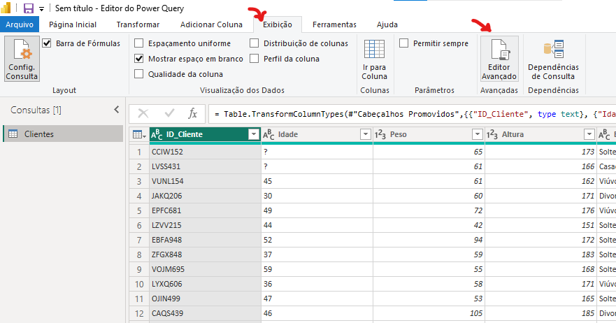

# 🗃️ Manipulação de Dados (Engenharia de Atributos)

>Ao aplicarmos a manipulação de dados, vamos utilizar alguns conceitos de Engenharia de Atributos, caso queira aprender sobre Engenharia de Atributos, clique aqui: [Ciência de Dados - Engenharia de Atributos](../cienciadados/engenhariaatributos.md).

Para a manipulação dos dados, será utilizado a linguagem M (Power Query Formula Language). Essa linguagem é essencial para o tratamento, transformação e preparação dos dados antes da modelagem e visualização.

Com a linguagem M, é possível realizar tarefas como:

- Limpeza de dados (remoção de valores nulos, duplicados, erros etc.)
- Transformações complexas (mesclagem de tabelas, criação de colunas personalizadas, transposição de dados)
- Automatização de etapas de ETL (Extract, Transform, Load)
- Enriquecimento dos dados com regras condicionais e parâmetros dinâmicos.

---

Para acessar a aba de manipulação com linguagem M, vá no PowerQuery, depois em 'Exibição' e então 'Editor Avançado':


---

## Conceitos Básicos Linguagem M
Vamos entender de forma rápida e objetiva alguns conceitos fundamentais da linguagem **M**, usada no Power BI.

A **linguagem M** é uma linguagem de programação funcional utilizada no **Power Query** para realizar transformações nos dados. Assim como outras linguagens, ela possui **palavras reservadas**, **estruturas de controle** e uma **sintaxe própria**.

---

### 🏷️ Principais palavras reservadas:

- **`let`** e **`in`**:  
  Esses dois termos são a base da estrutura de código em M.  
  - `let` é onde você **declara as etapas e variáveis** da transformação de dados.  
  - `in` indica **qual será o resultado final**, ou seja, o que será retornado após as operações.

  > 💡 Pense da seguinte forma:  
  > Primeiro, você "deixa" (`let`) as ações serem executadas em sequência.  
  > Depois, informa (`in`) qual foi a última transformação que define o resultado final.

---

### ✍️ Sintaxe:

- No Power BI, **cada linha de transformação dentro do `let` deve terminar com vírgula**, exceto a última.  
  Se você esquecer uma vírgula, o Power Query apresentará um erro de sintaxe.
- Após adicionar uma nova tarefa, não esqueça de modificar o `in` e colocar a tarefa adicionada nele.

---

### 🔖 Sobre o uso de `#`:

- Quando você vê algo como `#“Nome da Etapa”`, o símbolo `#` seguido de aspas é usado para **referenciar nomes com espaços ou caracteres especiais**.  
  Exemplo:  
  ```m title='M'
  #"Dados Transformados"
  ```

---

#### 💬 Comentários na Linguagem M

Assim como em outras linguagens de programação, os comentários em M servem para **documentar o código**, facilitar o entendimento e organizar melhor as etapas de transformação.

A linguagem M permite dois tipos de comentários:

- **Comentário de linha única**:  
  Use dois sinais de barra (`//`) para escrever comentários em uma única linha.

```SQL title='M'
// Esse é um comentário de linha.
```

- **Comentário de múltiplas linhas:.**
Use `/* para abrir e */` para fechar o bloco de comentário


```SQL title='M'
/*
Esse é
um Comentário
de múltiplas linhas.
*/
```

---

## Manipulando Dados com M

### **Substituindo Valores**

**Cenário:** Temos um dataset onde se tem alguns valores ausentes e foram identificados como '?', vamos então substituir esses valores:

```SQL title='M'
// Substituindo valor

#"Valor Substituido" = 
Table.ReplaceValue(#"Tipo Alterado", 
"?", "45", Replacer.ReplaceText, {"Idade"})
```

> **EXPLICAÇÃO:** Primeiro, vou dar o nome da operação a ser feito **(`#"Valor Substituido"`)**, do Pacote Table **(`Table.`)**, irei usar uma função para substituir valores **(`ReplaceValue()`)**, mas, vou fazer isso depois de uma operação anterior **(`#"Tipo Alterado"`)**, irei substituir os valores com interrogração **(`"?"`)** e irei substituir por quarenta e cinco **(`"45"`)**, vou fazer essa substituição **(`Replace.ReplaceText`)** na coluna  que tem esses valores ausentes **(`{"Idade"}`)**.

**ATENÇÃO: Depois disso, o in terá que tem última função feita, nesse caso #"Valor Substituido", ficaria assim:**

```SQL title='M'
in
    #"Valor Substituido"
```

---

### **Removendo Colunas**

**CENÁRIO:** Chegamos a conclusão que não queremos mais a coluna "Estado Civil".

Em nosso editor avançado, adicione:

```SQL title='M'
//Removendo Coluna

#"Coluna Removida" = 
Table.RemoveColumns(#"Valor Substituido", 
{"Estado Civil"})
```

> **EXPLICAÇÃO:** Vamos adicionar uma nova etapa **(`#"Coluna Removida"`)**, então, do pacote Table **(`Table.`)**, vamos usar uma função para remover colunas **(`RemoveColumns()`)**, mas isso será feito depois de uma outra etapa **(`#"Valor Substituido"`)** e especificar qual coluna queremos remover **(`{"Estado Civil"}`)**.

---

### **Adicionando Novas Colunas**

**CENÁRIO:** Temos uma base de dados com uma coluna onde se tem o valor da compra sem o desconto (`Valor Compra`), e uma coluna do valor do desconto (`Valor Desconto`), porém, não temos uma coluna com o valor final.

```SQL title='M'
// Adicionando Coluna

#"Coluna Adicionada" = 
Table.AddColumn(#"Coluna Removida", "Valor Final",
each [Valor Compra] - [Valor Desconto])
```

> **EXPLICAÇÃO:** Vamos adicionar uma nova etapa **(`#"Coluna Adicionada"`)**, onde iremos utilizar do pacote Table **(`Table.`)** uma função de adicionar uma nova coluna **(`AddColumn()`)**, vamos fazer isso depois de uma etapa **(`#"Coluna Removida"`)**, iremos dar o nome da nova coluna **(`"Valor Final"`)**, dizendo que para cada linha **(`each`)**, vamos realizar uma operação aritmética **(`[Valor Compra] - [Valor Desconto]`)** para setar os valores de cada linha.

**OBS:** Para reforçar, a palavra reservada `each`, que em inglês é 'cada', ou seja, para cada linha, faça algo.

O que fizemos aqui, é uma típica tarefa de Engenharia de Atributos.

---

### **Dividindo Coluna**

**CENÁRIO:** Temos uma coluna em nossa base de dados que armazena os ID's dos clientes ("ID_Cliente"), os ID's são compostos por letras e números (**EX:** CCIW152, LVSS431, VUNL154). Ao observar, é possível ver que temos duas informações em uma só coluna, 4 letras e 3 números. Vamos separar essas duas informações em duas colunas diferentes.

Vamos criar uma função para separar essas informações:

```SQL title='M'
// Dividindo Coluna

#"Dividir Coluna Pela Posição" = 
Table.SplitColumn(#"Coluna Adicionada",
"ID_Cliente", Splitter.SplitTextByPositions({0, 4}, false), 
{"ID_Cliente.1", "ID_Cliente.2"}), 

#"Coluna Dividida" = 
Table.TransformColumnTypes(#"Dividir Coluna Pela Posição", 
{{"ID_Cliente.1", type text}, 
{"ID_Cliente.2", Int64.Type}}),
```
>**EXPLICAÇÃO:** 
>
> **Primeira Etapa:** Vamos criar uma nova etapa **(`#"Dividindo Coluna Pela Posição"`)**, então do pacote Table **(`Table.`)** vamos usar uma função para dividir colunas **(`SplitColumn()`)**, vamos fazer isso depois da etapa anterior **(`#"Coluna Adicionada"`)**, vamos falar qual coluna queremos dividir **(`"ID_Cliente"`)**, vamos então chamar uma função para isso dividir por uma posição específica **(`Splitter.SplitTextByPositions()`)**, que será a posição 0 até a posição 4 **(`{0, 4}`)** e então será colocado em uma primeira coluna **(`{"ID_Cliente.1",`)**, a partir de 4 tudo o que ele encontrar vai ser colocado para uma segunda coluna **(`"ID_Cliente.2"}`)**.
>
>**Segunda Etapa:** Depois da etapa anterior, precisamos dizer o tipo das novas colunas criadas, vamos criar uma etapa para isso **(`#"Coluna Dividida"`)**, então, do pacote Table **(`Table.`)** vamos usar uma função para transformar o tipo das colunas **(`TransformColumnTypes()`)**, vamos fazer isso depois da etapa anterior **(`#"Dividindo Coluna Pela Posição"`)**, então vamos selecionar a primeira coluna **(`{{ID_Cliente.1},`)** e falar que o tipo dela será texto **(`type text`,)** e então selecionar a segunda coluna **(`{"ID_Cliente.2",`)** como tipo número inteiro **(` Int64.Type}}`)**.

**OBS:** Isso é extremamente útil, algumas empresas adotam como prática adicionar ao ID do cliente a data de aniversário, ou então, data de início do cliente na empresa, dessa forma, podemos obter uma nova informação a partir de uma coluna já feita.

---

### **Renomeando Colunas** 

**CENÁRIO:** Depois de criarmos as novas colunas, precisamos renomear elas para que fiquem mais entendíveis.

Vamos criar uma nova etapa para renomear as colunas:
```SQL title='M'
// Ajustando Nome de Coluna

#"Colunas Renomeadas" = 
Table.RenameColumns(#"Coluna Dividida", 
{{"ID_Cliente.1", "Codigo"}, 
{"ID_Cliente.2", "ID"}})
```
>**EXPLICAÇÃO:** Vamos criar uma nova etapa para renomear as colunas **(`#"Colunas Renomeadas"`)**, então, do pacote Table **(`Table.`)** vamos usar a função de renomear colunas **(`RenameColumns()`)**, essa tarefa será executada depois da última etapa **(`#"Coluna Dividida"`)**, então, vamos dizer qual é a coluna a ser renomeada **(`{{"ID_Cliente.1",`)** e então o novo nome **(`"Codigo"},`)** e fazer o mesmo para a segunda coluna **(`{"ID_Cliente.2", "ID"}})`)**.

---

### **Colunas Condicionais**

**CENÁRIO:** Temos uma coluna em nossa base de dados que indica o tipo do cliente (Tipo de Cliente), e então queremos que para cada tipo do cliente, ele tenha um tipo de desconto diferente, vamos então criar uma coluna representando essa regra de negócio.

Vamos criar essa etapa:

```SQL title='M'
// Coluna Condicional

#"Coluna Condicional Adicionada" = 
Table.AddColumn(#"Colunas Renomeadas", "% Desconto Especial",
each if [Tipo de Cliente] = "Bronze" then 5
else if [Tipo de Cliente] = "Prata" then 10 
else if [Tipo de Cliente] = "Ouro" then 15 
else if [Tipo de Cliente] = "Diamante" then 20 
else 0)
```

>**EXPLICAÇÃO:** Vamos criar uma nova etapa **(`#"Coluna Condicional Adicionada"`)**, onde iremos utilizar do pacote Table **(`Table.`)** uma função que vai adicionar uma nova coluna **(`AddColumn()`)**, vamos fazer isso depois da etapa anterior **(`#"Colunas Renomeadas",`)**, então setamos o nome dessa nova coluna **(`"% Desconto Especial"`)** e passamos as regras para os valores, para cada valor **(`each`)**, se **(`if` e `else if`)** o tipo do cliente for algum em específico **(`[Tipo de Cliente] = "Bronze"`)**, ele irá receber um determinado valor de desconto **(`then 5`)**, se o tipo dele não for nenhum dos que foram passados para comparação, é atribuiudo um valor padrão **(`else 0)`)**. 

---

### **Ajustando Escala dos Dados**

Essa atividade é muito típica para **preparação dos dados** para serem consumidos em **Aprendizado de Máquina**. Uma coluna que tem muitos valores, pode ter os valores com **escalas diferentes** (Unidade, Dezena, Centena, Milhar), diversos algoritmos de Machine Learning **esperam receber os algoritmos na mesma escala**, então, toda vez que ele for usado, **sempre vai esperar os valores na mesma escala**, então, essa tarefa de **Engenharia de Atributos** se torna **essencial**. 

**CENÁRIO:** Em nossa base de dados, temos uma coluna que se tem os limites de créditos dos clientes (Limite de Credito), vamos então deixar os dados na mesma escala.

Criando a etapa:

```SQL title='M'
// Ajustando a escala dos dados com Transformação Logarítmica

#"Logaritmo de Base 10 Calculado" = 
Table.TransformColumns(#"Coluna Condicional Adicionada", 
{{"Limite de Credito", Number.Log10, type number}})
```
> **EXPLICAÇÃO:** Vamos criar uma nova etapa **(`#"Logaritmo de Base 10 Calculado"`)**, utilizando do pacote Table **(`Table.`)**, uma função que irá transformar uma coluna **(`TransformColumns()`)**, vamos fazer isso depois da etapa anterior **(`#"Coluna Condicional Adicionada",`)**, vamos selecionar a coluna a ser modificada **(`{{"Limite de Credito",`)**, do pacote Number **(`Number.`)** vamos usar uma função que irá fazer a escala logarítmica **(`Log10,`)** e o resultado será do tipo numérico **(`type number}})`)**. 

**OBS:** Caso a função não consiga transformar os valores, ele irá retornar um NaN (Not a Number), ou seja, um valor ausente.

---