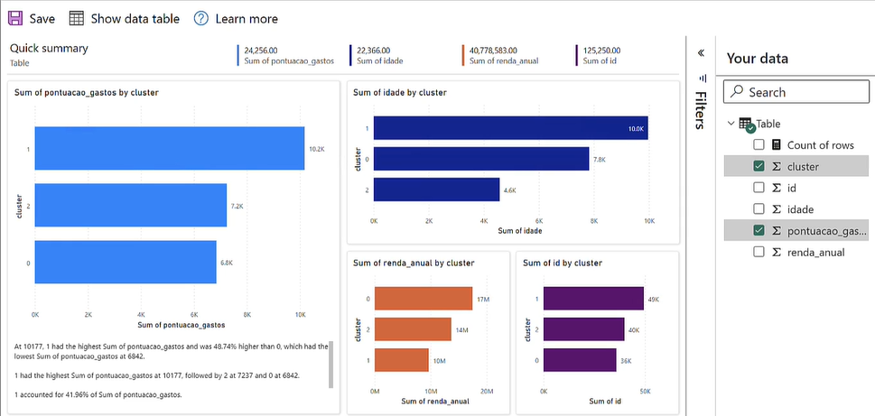

# 🎯 Segmentação de Clientes com Machine Learning para o Power BI

## 📌 Aplicação Prática: Segmentando Clientes com Clusterização

Vamos aplicar Machine Learning em um **cenário realista de negócios** com foco em **segmentação de clientes**. Essa abordagem ajuda a equipe de marketing a personalizar estratégias para diferentes perfis de clientes, com base em seus comportamentos.

---

## 🧠 CENÁRIO

Suponha que temos uma **base de dados de clientes** contendo informações como:

- Renda anual;
- Pontuação de gastos.

Queremos dividir esses clientes em **três grupos distintos**:

- **Grupo Ouro**: clientes que compram frequentemente e gastam mais;
- **Grupo Prata**: clientes com comportamento intermediário;
- **Grupo Bronze**: clientes com baixa frequência de compra e menor valor gasto.

Cada grupo receberá **ações de marketing personalizadas**, como:

- Diferentes faixas de desconto;
- Acompanhamento diferenciado;
- Campanhas exclusivas.

---

## 🔍 Qual técnica será usada?

Vamos utilizar o conceito de **[Clusterização](../inteligenciaartificial/machinelearning.md#clusterizacao)** — uma técnica de **aprendizado não supervisionado** que agrupa dados com base em similaridades.

---

## ⚠️ Limitação do Power BI

> O Power BI **NÃO É** uma ferramenta de Machine Learning (ainda), então, **não é possível construir o modelo diretamente nele**.

No entanto, podemos **usar a linguagem Python** para:

- Processar os dados;
- Treinar o modelo de clusterização;
- Retornar os resultados diretamente para os relatórios interativos do Power BI.

---

## ⚙️ Criação do Modelo

### Importando bibliotecas

Irei utilizar o Pandar e SkLearn para a construção desse modelo, então, vamos importar eles:

```python title='Python'
# Imports
import pandas as pd
from sklearn.cluster import KMeans
from sklearn.preprocessing import StandardScaler
```
> ### 🧠 Explicação:
>
> Esses pacotes vêm por padrão com a instalação do **Anaconda**, que é uma distribuição do Python voltada para **ciência de dados**.
>
> - **`pandas`**: conhecido como o "**Excel do Python**", é usado para **manipular e analisar dados estruturados** (tabelas).
>
> - **`sklearn`** *(Scikit-Learn)*: é um dos principais **frameworks de Machine Learning em Python**.
>   - **`KMeans`**: algoritmo de **clusterização (agrupamento)**, que será utilizado para segmentar os clientes com base em suas características.
>   - **`StandardScaler`**: ferramenta de **pré-processamento**, usada para padronizar os dados numéricos, garantindo que todos os atributos estejam na **mesma escala** antes de aplicar o algoritmo de aprendizado.


---

### Carregando os dados

Vamos agora fazer o carregamento da base de dados que vamos utilizar:

```python title='Python'
# Carregando os dados
df = pd.read_csv('dados_clientes.csv')
```
> Carregamos o data-set e gravamos no objeto 'df'.

Vamos visualizar o que foi gravado nesse objeto:

```python title='Python'
df.head(10)
```

```python title='out'
id	idade	renda_anual	pontuacao_gastos
0	1	56	94740	90
1	2	69	136352	50
2	3	46	86617	62
3	4	32	114841	97
4	5	60	36896	51
5	6	25	145729	37
6	7	38	66175	96
7	8	56	27805	87
8	9	36	25237	78
9	10	40	135247	29
```

> Com o pandas, conseguimos exengar os dados de forma tabular, facilitando a compreensão dos mesmos.

---

### Análise Exploratória

Para evitar possíveis erros com os dados, vamos criar um resumo estatístico dos mesmos para entender eles:

```python title='Python'
# Resumo estatístico
df[['idade', 'renda_anual', 'pontuacao_gastos']].describe()
```
```python title='out'
	    idade	    renda_anual	    pontuacao_gastos
count	500.000000	500.000000	    500.000000
mean	44.732000	81557.166000	48.512000
std	    15.239707	36764.379945	29.556946
min	    18.000000	20384.000000	0.000000
25%	    32.000000	49172.750000	24.000000
50%	    45.000000	79219.000000	48.500000
75%	    57.000000	113017.250000	73.250000
max	    70.000000	149695.000000	100.000000
```

> Dessa forma, temos o resumo estatístico de nossos dados para melhor análise e compreensão dos mesmos

---

### Pré-Padronizar os Dados

Antes de aplicarmos o algoritmo de agrupamento, precisamos **padronizar os dados**.

O **K-Means** é um algoritmo que trabalha com **distâncias matemáticas**, como a **distância euclidiana**. Por isso, **espera que os dados estejam na mesma escala**. No entanto, no nosso dataset, temos variáveis com escalas muito diferentes — por exemplo:

- Algumas colunas possuem valores na **casa das dezenas**,
- Outras, na **casa dos milhares**.

Se enviarmos esses dados **sem padronização**, o K-Means poderá **dar mais peso a variáveis com valores maiores**, distorcendo o agrupamento.


Vamos utilizar a classe `StandardScaler` do `sklearn` para **transformar os dados**, ajustando-os para que tenham:

- Média igual a **0**,
- Desvio padrão igual a **1**.

Assim, todos os atributos passam a ter **a mesma importância** para o algoritmo de clusterização.

```python title='Python'
# Cria o padronizador dos dados
padronizador = StandardScaler()
```


```python title='Python'
# Aplica o padronizador somente nas colunas de interesse
dados_padronizados = padronizador.fit_transform(df[['idade', 'renda_anual', 'pontuacao_gastos']])
```

```python title='Python'
# Visualiza os dados
print(dados_padronizados)
```

```python title='out'
[[ 0.74012478  0.35893538  1.40506904]
 [ 1.59401387  1.49192537  0.05039391]
 [ 0.08328703  0.13776654  0.45679645]
 ...
 [-0.31081563  0.32661636  0.18586143]
 [-1.23038848 -1.48706069  1.43893592]
 [-1.03333716 -0.96992912 -0.59307677]]
```

> ℹ️ **Nota importante sobre a visualização dos dados padronizados:**
>
> Ao visualizar os dados após a padronização, **pode parecer confuso num primeiro momento**, já que os valores estarão diferentes dos originais.
>
> Isso acontece porque os dados foram transformados para uma **nova escala**.  
> 
> 🎯 **Importante:** A informação dos dados **permanece a mesma**, o que muda é apenas a **escala numérica** — esse é um **truque matemático** para que os algoritmos, como o K-Means, possam trabalhar de forma mais eficiente e justa com todas as variáveis.

---

### Construção do Modelo de Machine Learning Para Segmentação de Clientes

Vamos utilizar o algoritmo **K-means**. Esse algoritmo recebe alguns parâmetros de entrada para controlar seu funcionamento. 

Um desses parâmetros é o **número de *clusters*** — ou seja, é necessário informar ao algoritmo **quantos grupos** você deseja que ele classifique nos dados.

```python title='Python'
# Definimos o número de clusters (k)
k = 3
```

```python title='Python'
# Criamos o modelo K-means
kmeans = KMeans(n_clusters = k)
```

```python title='Python'
# Treinamento do modelo com os dados padronizados
kmeans.fit(dados_padronizados)
```
> Pronto, já criamos e treinamos o modelo.

```python title='Python'
# Atribuímos os rótulos dos clusters aos clientes
df['cluster'] = kmeans.labels_
```
> Agora criamos uma nova coluna no data-frame e atribuir o valor dos labels à ela.

```python title='Python'
# Exibe o resultado (10 primeiras linhas)
df.head(10)
```
```python title='out'
id	idade	renda_anual	pontuacao_gastos	cluster
0	1	56	94740	90	0
1	2	69	136352	50	0
2	3	46	86617	62	2
3	4	32	114841	97	1
4	5	60	36896	51	2
5	6	25	145729	37	1
6	7	38	66175	96	2
7	8	56	27805	87	2
8	9	36	25237	78	2
9	10	40	135247	29	0
```
> A coluna de cluster são os grupos que definimos, temos clientes do grupo 0, 1 ou 2.

---

### Gerando Relatório dos Segmentos de Clientes com Power BI no Jupyter Notebook

> Isso só pode ser feito para emails corporativo ou de estudante. Caso não tenha, você pode carregar os dados do jeito que estão para usar no PowerBI. Vamos gerar um relatório a partir do Jupyter para o PowerBI.

> Caso queira entender mais sobre o pacote do powerbi utilizado visite: [pypi - powerbiclient](https://pypi.org/project/powerbiclient/)

Vamos instalar o pacote do PowerBI Client:
```python title='Python'
# Instala o pacote  
!pip install -q powerbiclient
```

E então utilizar as funções para autentificação:

```python title='Python'
# Carrega as funções usadas para autenticar e gerar  relatórios
from powerbiclient import QuickVisualize, get_dataset_config, Report
from powerbiclient.authentication import DeviceCodeLoginAuthentication
```

E então fazer a autenticação do nosso email corporativo ou estudante:
```python title='Python'
# Define a autenticação no Power BI Service
device_auth = DeviceCodeLoginAuthentication()
```
> Ele irá nos retornar um token, então precisamos clicar no link que ele indica e informar o email e tokens para fazermos login.

E então o resultado da autentificação fica:

```python title='out'
Device flow authentication successfully completed.
You are now logged in .

The result should be passed only to trusted code in your notebook.
```

> Pronto, conseguimos fazer login no PowerBI.

Vamos agora criar a nossa visualização:
```python title='Python'
# Cria o relatório no Power BI
relatorio_PBI = QuickVisualize(get_dataset_config(df), auth = device_auth)
```

E fazer a visualização da mesma:
```python title='Python'
# Renderiza (visualiza) o relatório
relatorio_PBI
```

Pronto, nossa visualização foi gerada dentro do Jupyter Notebook:


> O problema é que a ferramenta não consegue identificar o que fazer com as informações de forma correta. Por exemplo, ele somou as idades, algo que não faz sentido, o certo seria fazer a média da idade dos clientes dos grupos, por exemplo.

Para acessarmos esse relatório em nosso PowerBI, basta clicar em 'Salvar' e ele será salvo em nossa conta Microsoft.