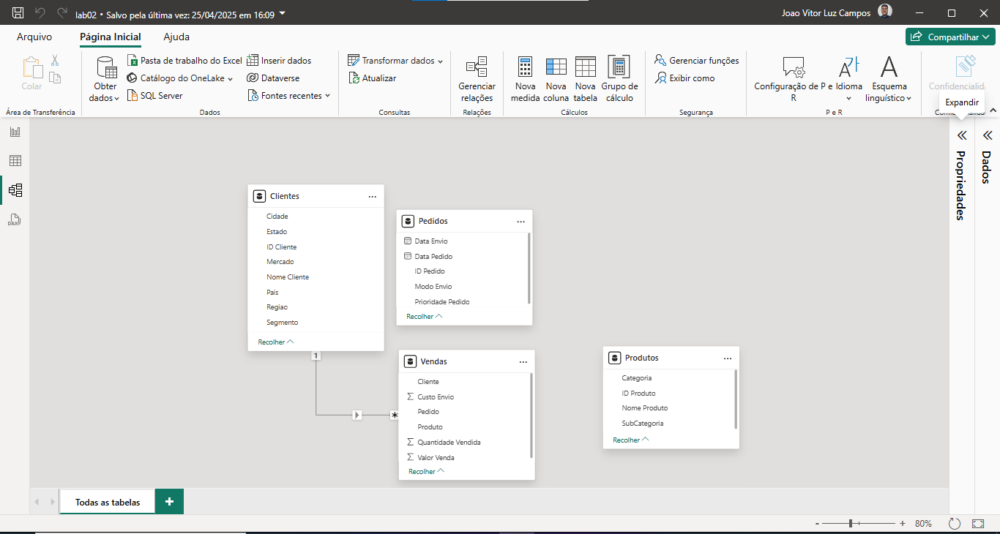
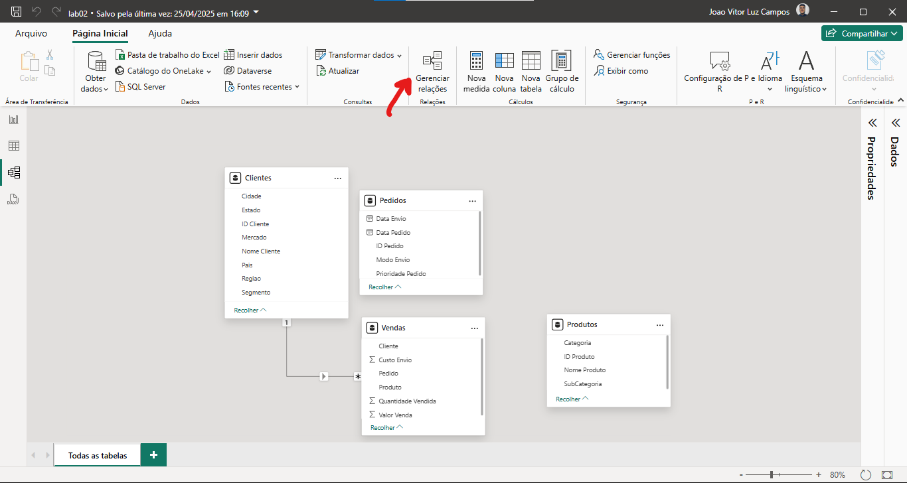
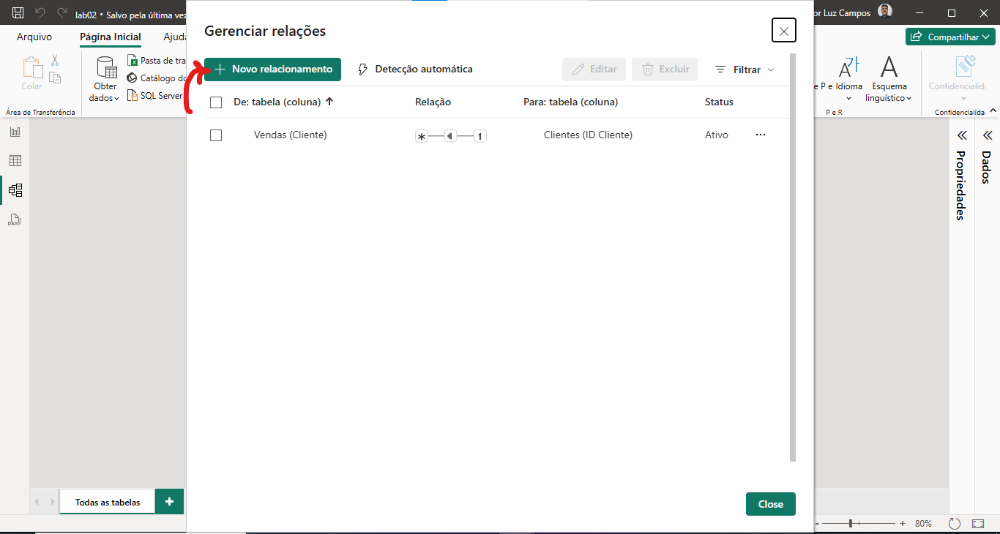
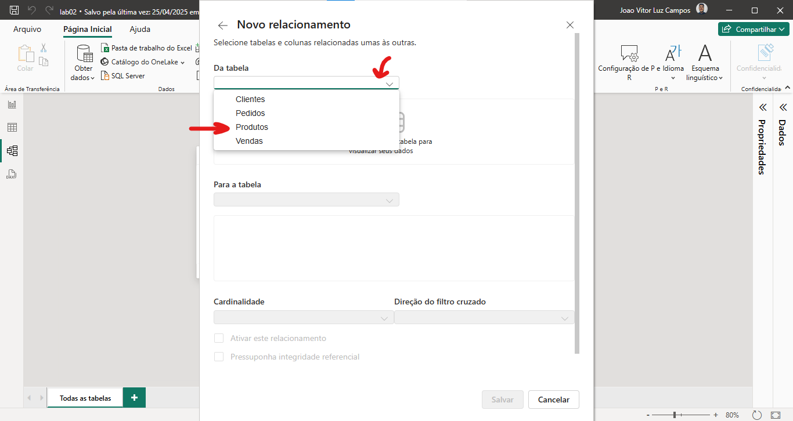
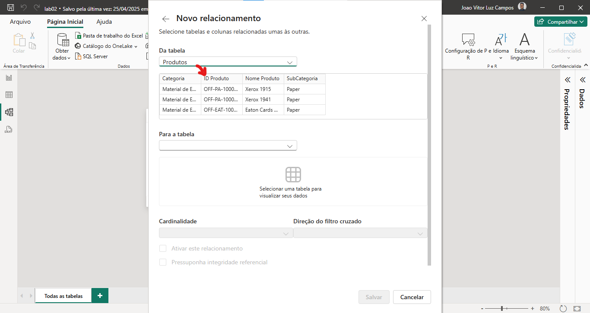
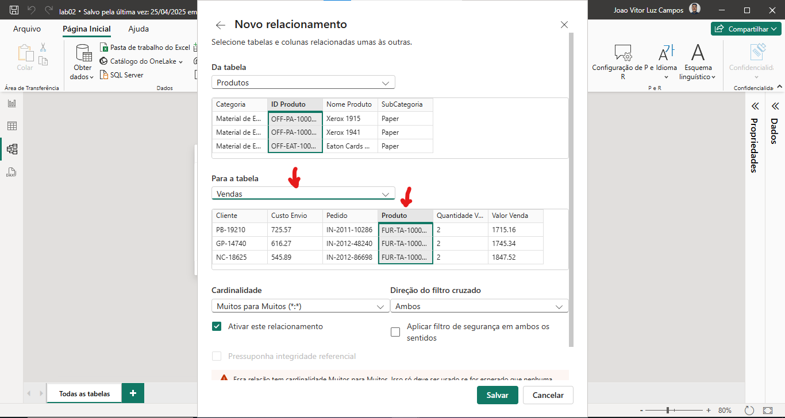
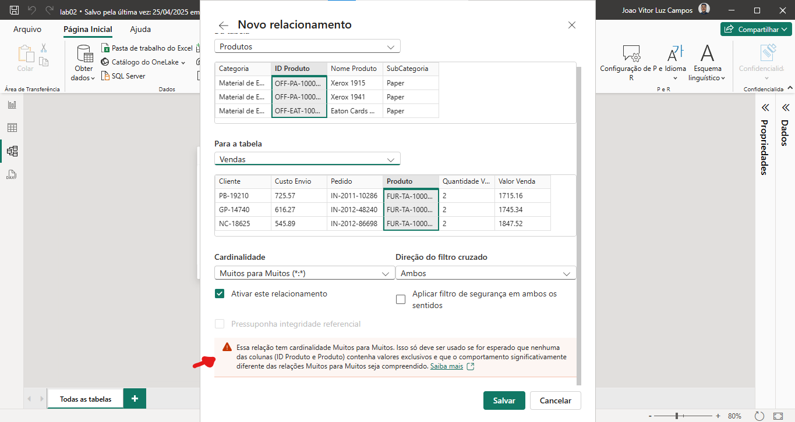
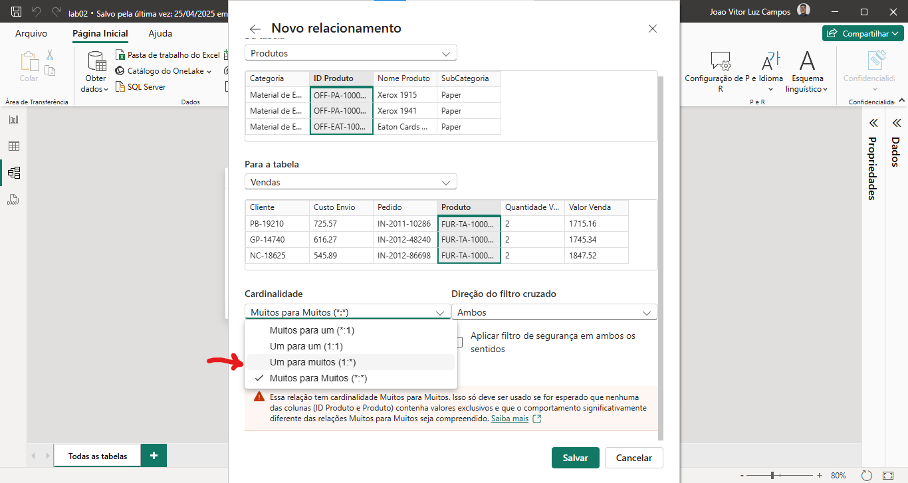
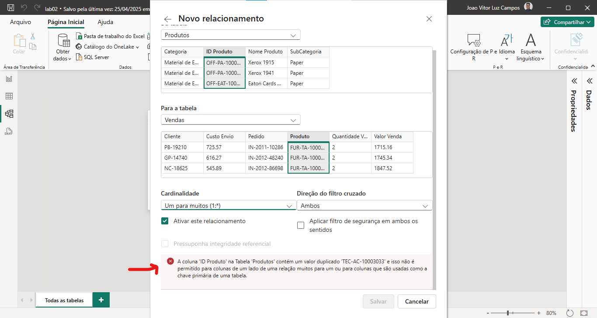

Business Intelligence (BI), ou Inteligência de Negócios, combina análise de negócios, mineração de dados, visualização de dados, ferramentas/infraestrutura de dados e práticas recomendadas para ajudar as organizações a tomar decisões impulsionadas por dados.

O foco em BI é analisar o passado, para compreender métricas, indicadores, padrões e relacionamentos. O principal objetivo é análise descritiva do que aconteceu.

A Modelagem de Dados é uma parte importante do processo de Business Intelligence (BI).

Ela ajuda a garantir que os dados sejam armazenados de forma organizada e consistente, o que facilita a recuperação e análise dos dados. Algumas maneiras como a modelagem de dados pode ser usadas em BI incluem:

- **Criação de um Data Warehouse (DW):** A modelagem é usada para criar um DW, um repositório centralizado de dados de negócios que é usado para suportar a análise e tomada de decisão.
- **Design de Cubos Multidimensionais:** A modelagem é usada para projetar cubos multidimensionais, que são estruturas de dados que ajudam a agregar e analisar dados de várias fontes.
- **Criação de Modelos Estrela (Star Schema):** A modelagem de dados estrela é uma técnica usada para projetar DWs, que ajuda a garantir a consistência e a facilidade de acesso aos dados.
- **Otimização de Consultas:** A modelagem de dados é usada para otimizar as consultas a um DW, garantindo a eficiência nas consultas.
- **Integração dos dados:** Pode ser usada para integrar dados de várias fontes, garantindo consistência e qualidade dos dados.
- **Governança dos Dados:** A modelagem de dados também é importante para garantir a qualidade dos dados e para implementar medidas de governança de dados, como rastreamento de alterações e auditoria.

---

## Benefícios Modelagem de Dados

A modelagem de dados é uma parte importante no processo de criação de relatórios e visualizações, as razões para isso são:

- **Importação de Dados:** O PowerBI nos permite importar dados de uma variedades de fontes, como bancos de dados, arquivos e serviços na nuvem. A modelagem de dados é usada para preparar os dados importados, deixando eles em um formato consistente e estruturado para análise.
- **Criação de Tabelas e Relações:** A modelagem de dados é usada para criar tabelas e estabelecer relações entre elas, deixando de forma organizada e coerente.
- **Medidas e Cálculos:** Nos permite criar medidas e cálculos personalizados como soma, médias e percentuais. A modelagem de dados é usada para garantir que esses cálculos sejam aplicados de forma consistente e correta.
- **Filtros e Segmentação:** A modelagem de dados é usada para criar filtros e segmentação para os relatórios, permitindo que os usuários explorem os dados de forma precisa e detalhada.
- **Publicação de Relatórios e Dashboards:** O PowerBI permite publicar relatórios e dashboards que são baseados na modelagem de dados.

**Observações Importantes:**

- Sempre verificar o modelo de dados no Power BI quando estiver usando mais de uma fonte de dados.
- Compreenda o que são os relacionamentos de negócio e estabelecer o relacionamento no PowerBI (Ele irá tentar fazer isso de forma automática).
- Observe os relacionamentos entre os dados e considere desmembrar uma única planilha ou tabela em diferentes partes para construir um relacionamento adequado.
- Fazer os ajustes e correções nos dados para estabelecer os relacionamentos.

> A modelagem não irá consertar problemas de negócio! Isso deve ser verificado antes mesmo de levar os dados ao PowerBI, caso tenha um problema na regra de negócio, deve se verificar antes.

---

## Implemetando Modelagem

Por padrão o PowerBI tenta encontrar os relacionamentos, em alguns cenários ele consegue acertar, porém, não é regra:

> Nesse cenário, ele conseguiu encontrar 1 relacionamento, porém, está faltando alguns!

Para gerenciarmos os relacionamentos, vamos em 'Gerenciar Relações':

> Nessa tela conseguimos ter a visão geral dos relacionamentos em nossa modelagem, conseguimos determinar que a ferramenta busque as relaçõe automaticamente, podemos adicionar ou remover alguns relacionamentos também!

Vamos criar um novo relacionamento, selecione a opção 'Novo relacionamento':

Vamos selecionar a tabela:

Então, selecione a coluna que identifica de maneira única aquela tabela, ou seja, o ID:

Vamos selecionar a tabela que irá se relacionar e qual coluna que estabelece esse relacionamento, ou seja, a chave da outra tabela que se encontra nessa:

Podemos perceber que a ferramenta colocou como relacionamento muitos pra muitos (N * N), algo que não deve ser usado em PowerBI, normalmente é usando quando alguém não consegue resolver o problema de relacionamento:

> Na própria documentação da Microsoft indica que devemos indicar esse relacionamento N * N, para muitos pra muitos, o ideal seria criar uma tabela intermediária e aí relacionar 1 * N e 1 * N.

O cenário ideal, seria utilizar o um para muitos (1 * N):

Porém, como temos dados duplicados em nosso data-set, ele não deixará implementar esse relacionamento:

> Caso seu data-set esteja bem estruturado, sem dados duplicados, muitas vezes a 'Detecção Automática' já consegue verificar os relacionamentos de forma correta!

