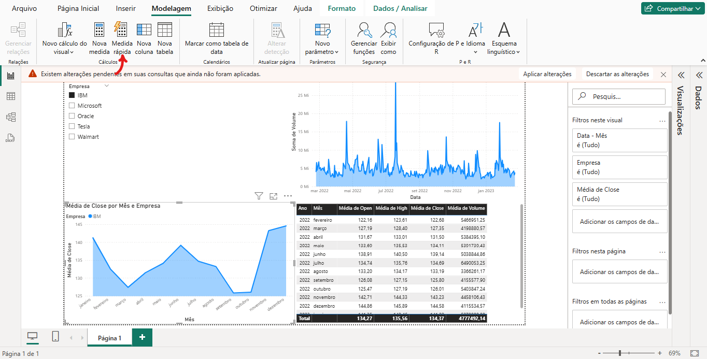
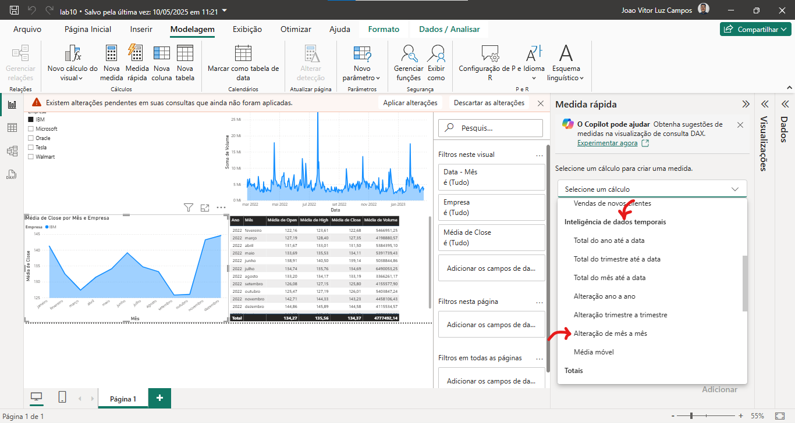
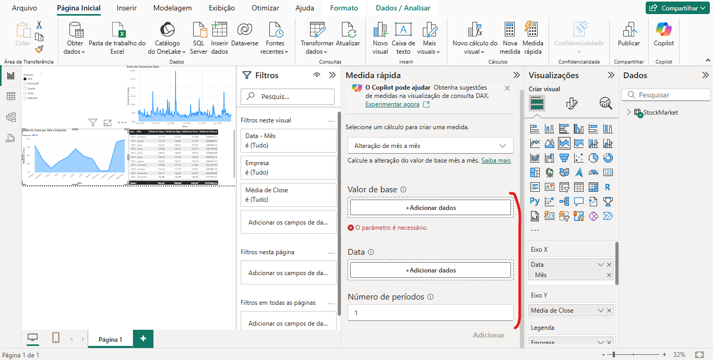
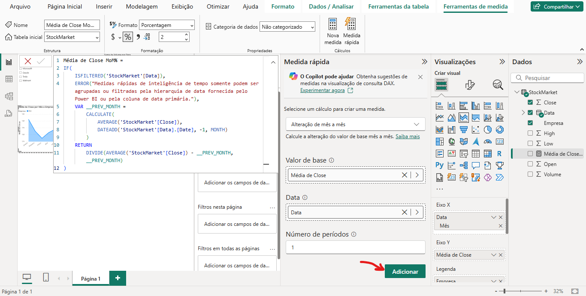
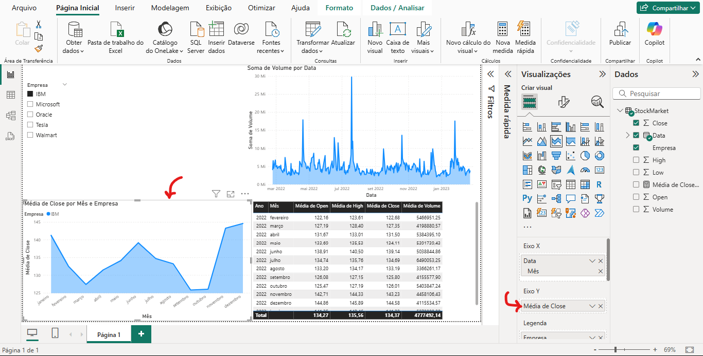
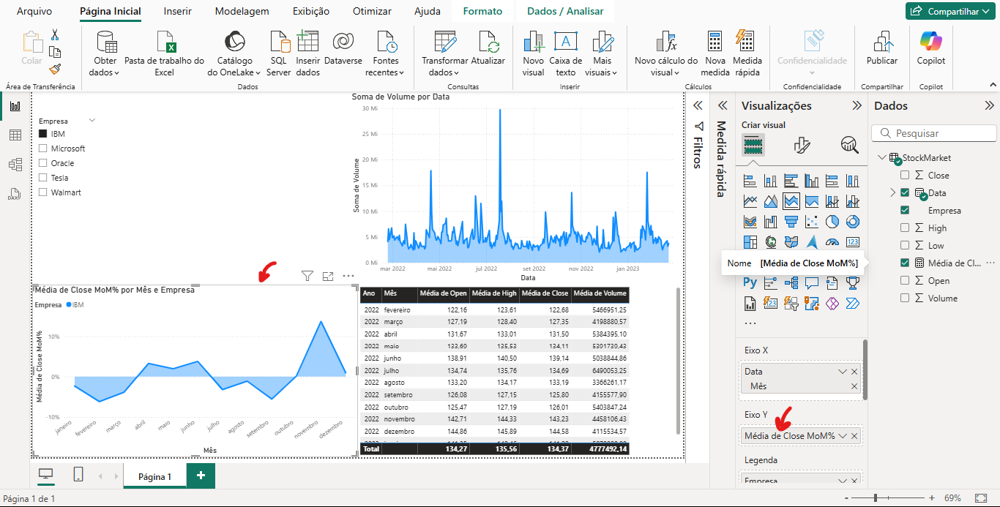
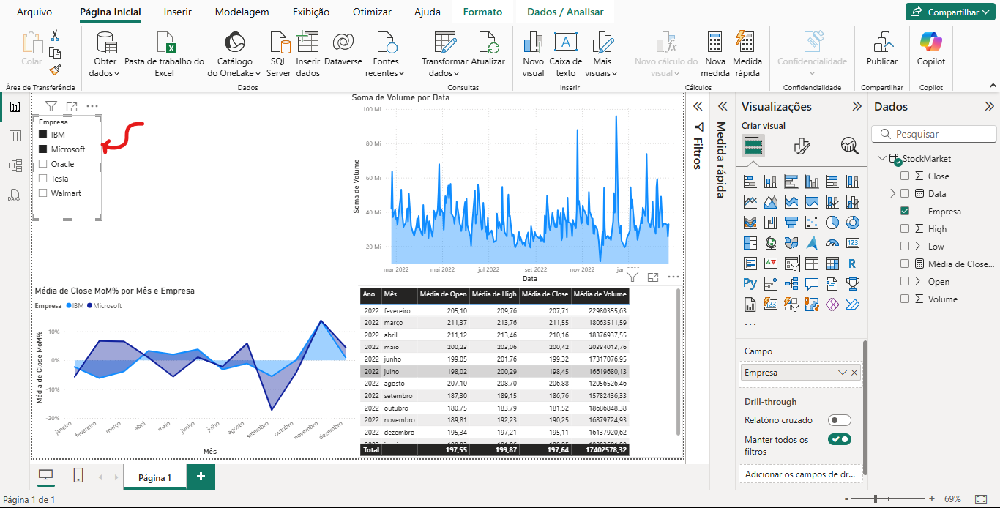

Podemos usar o recurso de Time Intelligence quando queremos analisar como uma variável se comporta ao longo do tempo, como uma séria temporal, por exemplo. 

Vá na opção de 'Medida Rápida':

Ao selecionar a opção 'Selecione um Cálculo', vamos ter a seção 'Inteligência de Dados Temporais' que é exatamente Time Intelligence. Vamos ter diversas opções para analisar os dados com o tempo, para exemplificar, selecione a opção 'Alteração de mês a mês':

Então, devemos adicionar os valores à esses 3 campos:

Ao clicar em adicionar, o PowerBI nos gera um código DAX pronto com a inteligência de datas:

Para observação, criei um gráfico de áreas empilhadas com a média de fechamento:

Ao trocar a váriavel do eixo Y para a média de fechamento MoM (Mês a Mês), percebe-se que é uma informação totalmente diferente:

Se segmentarmos, podemos comparar as médias de fechamento mês a mês por empresa:
