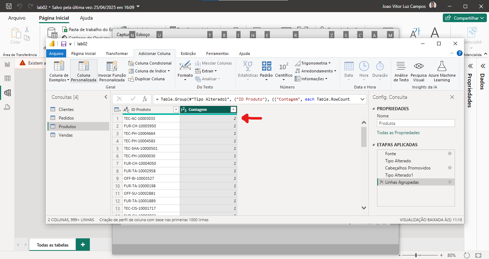
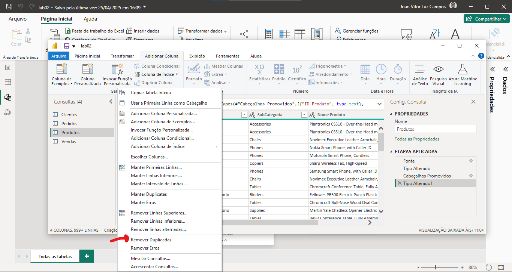
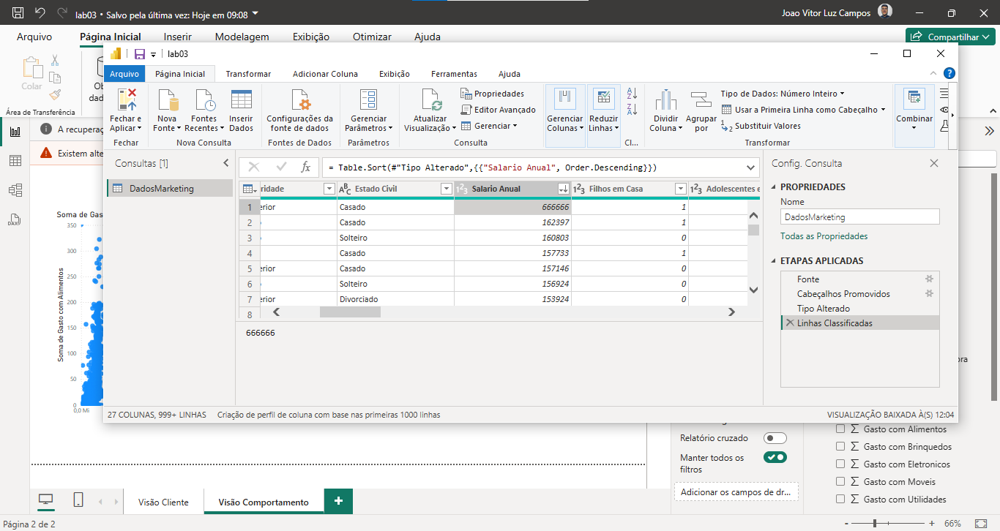
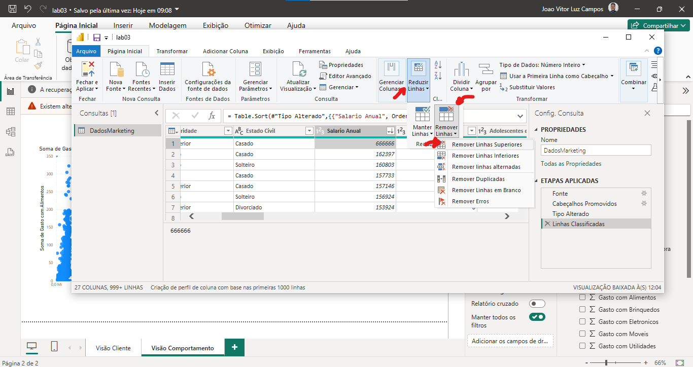
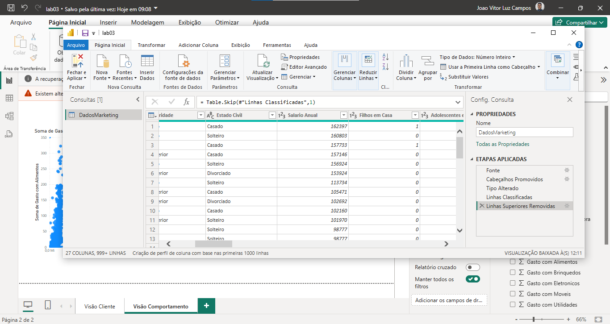
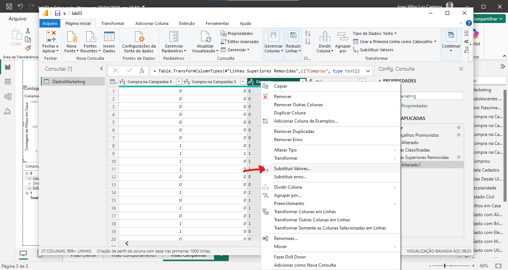
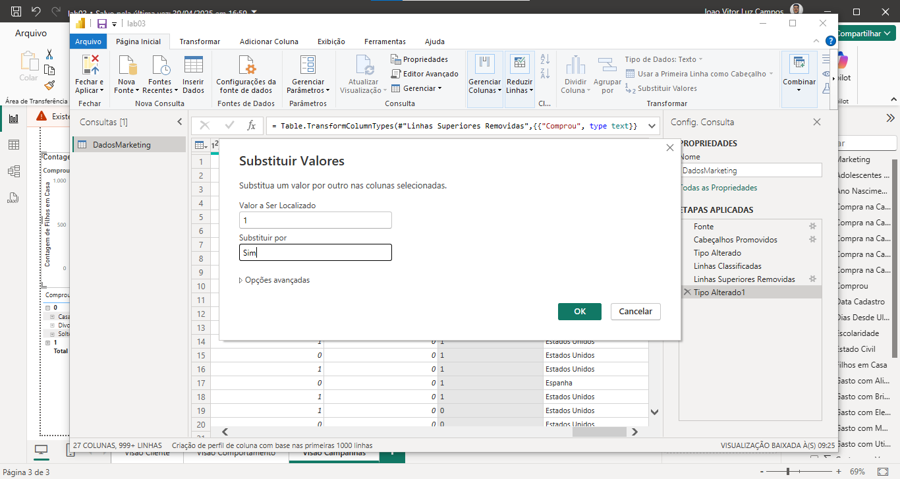

## Removendo Duplicatas nos Dados

Vamos no nosso editor PowerQuery, então clique na opção 'Transformar Dados':


Selecione a tabela a ser manipulada:


Então, clique com o botão direito no nome da coluna e vá na opção 'Agrupar por':


Selecione a opção 'Contagem' e depois clique em 'Ok':


E então, iremos ver que temos um ID duplicado, pois a contagem contou 2 IDS com o mesmo número:


Clique nessa opção:


E então, vá na opção 'Remover Duplicadas':


E pronto, já foi removido os dados duplicados, clique em 'Fechar e Aplicar':


---

## Criando Nova Coluna

Clique em 'Modo de Exibiçã de Tabela' e depois em 'Nova coluna':


Então, irá abrir a caixa para colocar a fórmula da nova coluna,
Como estamos fazendo uma coluna de lucro, implementei da seguinte forma:

> Primeiro o nome da nova coluna e então a regra que ele terá para definir os valores


E pronto, teremos uma nova coluna criada:


> A grande vantagem é que podemos adicionar novas medidas às tabelas de dados que podemos usar para construção de gráficos.

---
### Nova Coluna com DAX

Vamos criar a coluna de margem de lucro com função DAX,
Vá em 'Modo exibição de tabela', selecione qual tabela terá a nova coluna, e depois vá em 'Nova coluna': 


Então, vamos usar a seguinte expressão DAX:
```DAX title='DAX'
MargemLucro = 
    ROUND(DIVIDE(Vendas[Lucro], 
    Vendas[Valor Venda])
     * 100, 2)
```

> Ele está dividindo o Lucro de vendas pelo Valor Venda (DIVIDE), multipilicando por 100 para se ter o percentual (* 100) e depois arredondando para apenas 2 casas decimais (ROUND, 2).


E pronto, aplicando as alterações, já temos a nova coluna criada:


---

### Criando Coluna Condicional


Queremos criar uma coluna que irá identificar uma regra de negócio específica de uma outra coluna.

**Cenário:** Queremos criar uma coluna que identifique à quanto tempo um funcionário não recebe promoção, e então verificar se ele está apto ou não para recebê-la.

No PowerQuery, selecione a opção de 'Adicionar Coluna':


E então clique em 'Coluna Condicional':


E então, vamos dar um nome para essa nova coluna, depois, adicionar as regras que ela vai conter para retornar a saída esperada, feito, clique em 'Ok':


E pronto, temos uma nova coluna criada a partir de uma regra específicada para uma coluna específica:


---

## Removendo Outliers

Quando identificado um Outlier, precisamos remover o mesmo, vá em 'Transformar Dados':


Vamos selecionar a coluna que se tem o outlier e colocar em ordem Crescente ou Decrescente para visualizar o outlier:


E pronto, conseguimos identificar o outlier:

> Podemos perceber que o segundo salário mais alto, é muito menor que o primeiro, isso impacta diretamente na construção dos gráficos.

Vamos selecionar 'Reduzir Linhas', 'Remover Linhas' e 'Remover Linhas Superiores', e então selecionar a primeira linha:


E pronto, o outlier foi removido:


---

## Criando Medidas

### SUMX

>**CENÁRIO:** Estamos trabalhando em um dataset onde se tem muitos gastos, porém, não se tem uma coluna com o total de gastos, vamos criar uma coluna pra isso.

No modo de exibição de tabela, vamos em 'Nova medida':


Vamos criar essa nova medida DAX:
```DAX title='DAX'
TotalGasto = 
    SUMX(NomeDoDataset,
    NomeDoDataset[ColunaGasto1] + 
    NomeDoDataset[ColunaGasto2] 
    NomeDoDataset[ColunaGasto3])
```

>A função SUM ela faz o agrupamento geral, o SUMX faz o agrupamento por linha, nesse cenário ela é a melhor.

E pronto, a medida foi criada para que podemos usar em nossas visualizações!

---

### COUNTROWS

>**CENÁRIO:** Estamos trabalhando em um dataset onde se tem os dados de diversos funcionários, porém, queremos saber apenas a quantidade de funcionários.

Poderiamos criar uma medida DAX, tendo como premissa cada linha ser um funcionário:
```DAX title='DAX'
TotalFuncionarios = 
    COUNTROWS(DatasetRH)
```
E pronto, contamos a quantidade de linhas e geramos uma nova medida! 

---

### CALCULATE

>**CENÁRIO:** Agora, queremos saber a quantidade de funcionários do sexo feminimo e masculino.

Podemos criar uma função DAX que calcula a quantidade de funcionários do sexo feminino:
```DAX title='DAX'
TotalFeminino = 
    CALCULATE([TotalFuncionarios], 
    DatasetRH[Genero] = "Feminino")
```

E essa outra função para o sexo masculino:
```DAX title='DAX'
TotalMasculino = 
    CALCULATE([TotalFuncionarios], 
    DatasetRH[Genero] = "Masculino")
```


---

Podemos ainda usar o CALCULATE com o SUM, por exemplo, queremos o total de valores do tipo 'Receitas'

```DAX title='DAX'
TotalReceitas = 
    CALCULATE(
        SUM(DadosFinanceiros[Valor]),
        DadosFinanceiros[Tipo]="Receitas"
        )
```

---

### DIVIDE

Queremos saber o percentual de funcionários masculinos, podemos usar uma função DAX para dividir a quantidade de funcionários masculinos por total de funcionários:

```DAX title='DAX'
% Masculino = 
    DIVIDE([TotalMasculino], 
    [TotalFuncionarios],0)
```
> O zero é um valor alternativo, se ele não conseguir fazer a divisão, ele irá colocar como valor zero, impedindo que ele estoure uma mensagem de erro indesejada!

Vamos fazer o mesmo para o total de funcionários do sexo feminino:

```DAX title='DAX'
% Feminino = 
    DIVIDE([TotalFeminino], 
    [TotalFuncionarios],0)
```

---

### AVERAGE

Queremos agora ter a *média* da experência dos funcionários e média do salário, podemos criar as funções DAX:

Para a média dos salários:
```DAX title='DAX'
SalarioMedio = 
    AVERAGE(DatasetRH[Salario_Mensal])
```

## Substituição de Valores

> Quando trabalhamos com um dataset onde temos um valor que seja positivo e negativo, esse pode ser representado por 0 ou 1, sendo 0 a ação negativa e 1 a ação positiva. 

Vá em transformar valores:


Vá na coluna a ter os valores substituidos, clique com o botão direito e vá em 'Substituir valores':


E então, vamos colocar para 1, o valor 'Sim' (Fazer o mesmo para 0 sendo 'Não'):


Depois, fechar e aplicar para salvar as alterações:


> Com isso facilitamos a interpretação de diversas visualizações, deixando o entendimento melhor.

---

## Customizando Valores Percentuais

Por mais que uma coluna esteja calculando os valores percentuais, é necessário fazer um pequeno ajuste para que esses valores sejam realmente percentuais:


> Na imagem acima, podemos ver que não está no valor percentual corretamente.

Na área de Modelagem, selecione a coluna ser modificada e em 'Formatação' clique em 'Formato':


E então, selecione 'Porcentagem':


E pronto, temos a porcentagem de forma correta e visualmente melhor:


---

## Pivot de Tabelas

Muitas vezes, o data-set pode não estar adequado para os padrões que necessitamos, como por exemplo:


> Nesse modelo, a análise está sendo dificultada, cada data está sendo considerada como uma coluna, mas, data é uma variável que pode assumir diversos valores. Nesse modelo, cada data está assumindo o papel de uma variável independente.

Por padrão, o Power BI tem uma função que consegue transpor os dados, vamos utilizá-la, no PowerQuery, vá em 'Tranformar' e depois selecione 'Transpor': 


E então podemos ver as alterações feitas:


> Podemos ver que as alterações feitas, não é o resultado esperado, ele acabou alterando as colunas de 'Tipo' e 'Componente', vamos modificar o código, utilizando linguagem M.


Modificando a linha de código da etapa, vamos deixá-la assim:

```M title='M'
= Table.UnpivotOtherColumns(#"Tipo Alterado1", {"Tipo", "Componente"}, "Data", "Valor")
```


> Com essa linha de código, estamos fazendo o seguinte:  Estamos pegando o objeto table ***(Table.)***, que é a tabela que estamos manipulando, e estamos fazendo o Unpivot dela ***(UnpivotOtherColumns())***, e estamos fazendo isso depois da etapa de alterar o cabeçalho ***("#Tipo Alterado 1")***, vamos fazer isso com base nas colunas Tipo e Componente ***({"Tipo", "Componente"})*** e vamos colocar o que sobrar nas colunas ***Data e Valor***. 