## Mapa Mundial

Vamos criar um Mapa com os dados, vamos selecionar a visualização 'Mapa':

Como temos uma coluna 'Pais' em nosso dataset, vamos selecionar colocar ela no campo 'Localização':

E para os dados de 'Total_Vendas' no campo 'Tamanho da Bolha':

E selecionar a média de 'Total_Vendas':

E então vamos ter um gráfico Mapa Mundial:
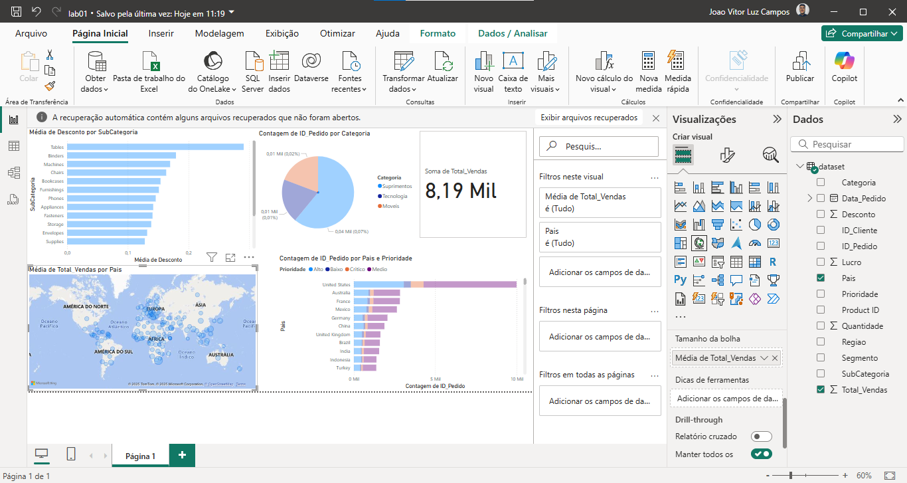

---

## Gráfico de Cascata

Vamos selecionar o ícone do gráfico de cascata:
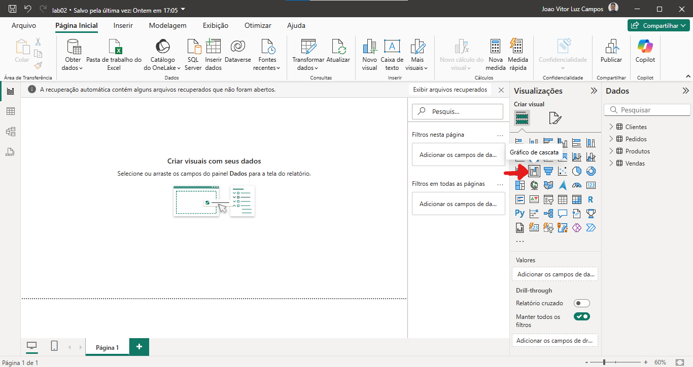

Coloque a coluna 'Modo Envio' para 'Categoria':

E arraste o 'Valor Venda' para o 'Eixo Y':
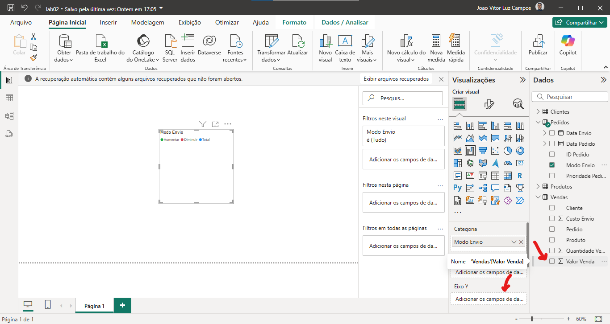

E pronto, temos o gráfico de cascata criado:
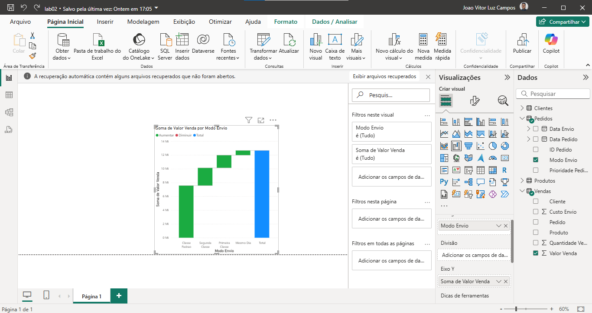

> Esse gráfico é recomendado apenas quando se tem poucas categorias, quando se tem muitas, esse gráfico não é uma opção tão viável.

---
## Gráfico TreeMap

Selecione o ícone de visualização do 'Treemap':

Então, vamos colocar a coluna 'Mercado' para a  'Categoria':

Então, vamos colocar o 'Custo Envio' para 'Valores':
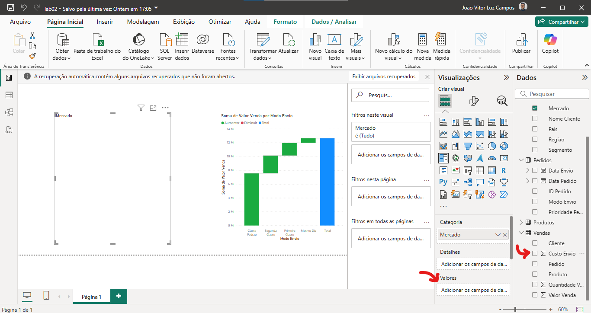

E vamos colocar como 'Média de Custo de Envio':

Pronto, gráfico treemap criado:

---

## Gráfico de Dispersão

Vamos selecionar o ícone de visualização 'Gráfico de dispersão':
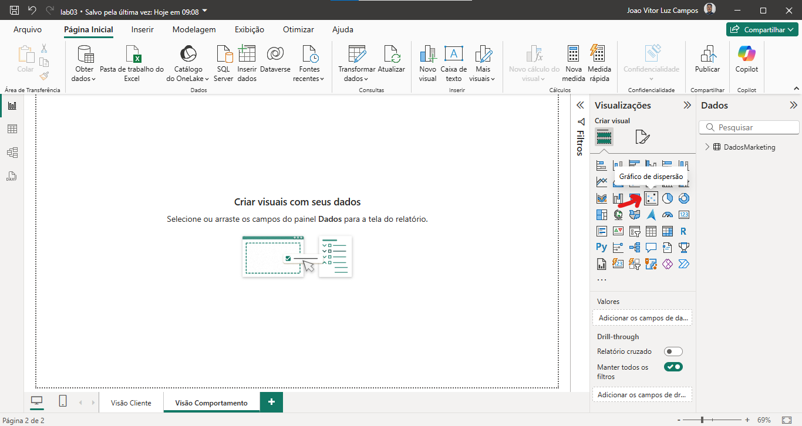

Para o eixo X, vamos selecionar o 'Salário Anual':

E para o eixo Y, selecionar o 'Gasto com Alimentos':

> Por padrão, o PowerBI ele tenta agrupar os dados, porém, nesse contexto, a soma dos dados nos retorna um gráfico sem sentido, vamos consertar isso.

Em vez da soma, para o 'Salario Anual', selecione 'Não resumir':

E pronto, temos um gráfico de dispersão criado:
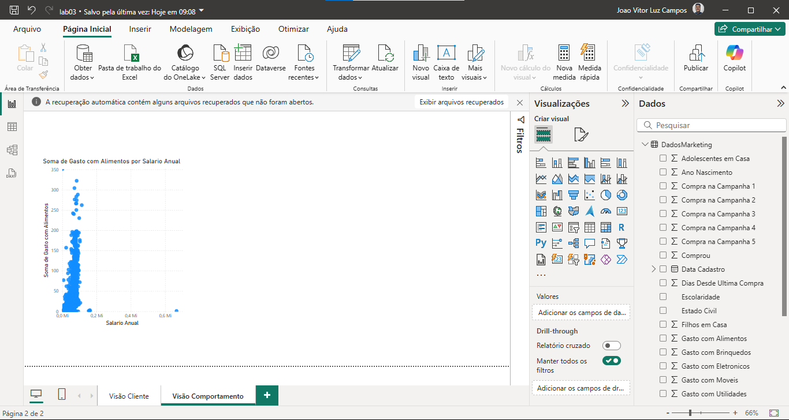

>Se a variável discreta tiver poucos valores distintos (como "Sim" e "Não", ou "Baixo", "Médio", "Alto"), um gráfico de dispersão pode não ser o mais adequado — gráficos de caixa (boxplots) ou de barras podem transmitir melhor a informação. Pode haver sobreposição de pontos, dificultando a visualização, especialmente se a variável discreta tiver poucos valores.

---

## Árvore Hierárquica

Vamos selecionar o ícone de visualização 'Árvore hierárquica':

Então, vamos selecionar a variável a ser analisada:

Devemos escolher uma variável categórica para o 'Explicar por':

E então, temos o gráfico criado, ao clicar, nós escolhemos como ele irá exibir esses dados:

E pronto, podemos ter a visão específica do nosso dataset:
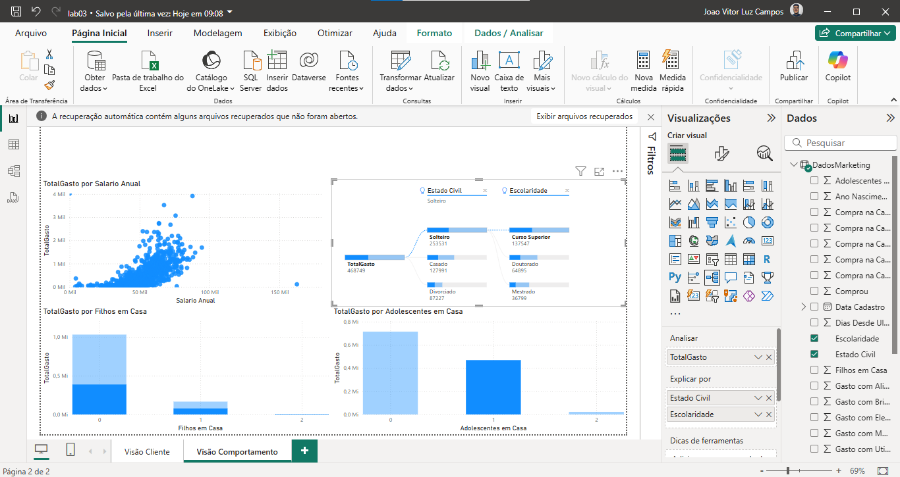

---

## Matriz

> Funcionando como uma tabela, a matriz nos permite cruzar diversos dados.

Vamos selecionar o ícone de visualização da Matriz:

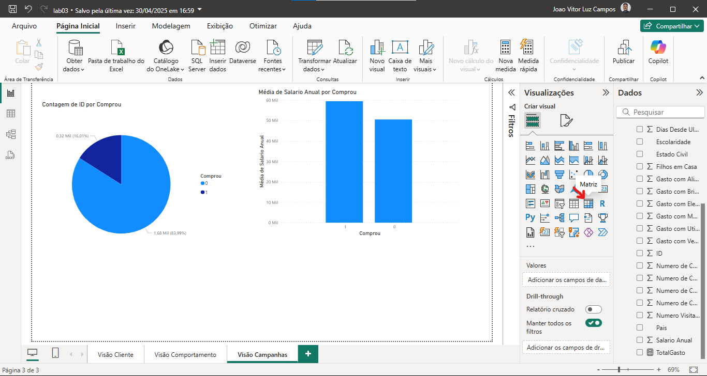

Vamos cruzar duas colunas na matriz:

E então, cruzando mais colunas, podemos expandir a matriz deixando cada vez mais específico:
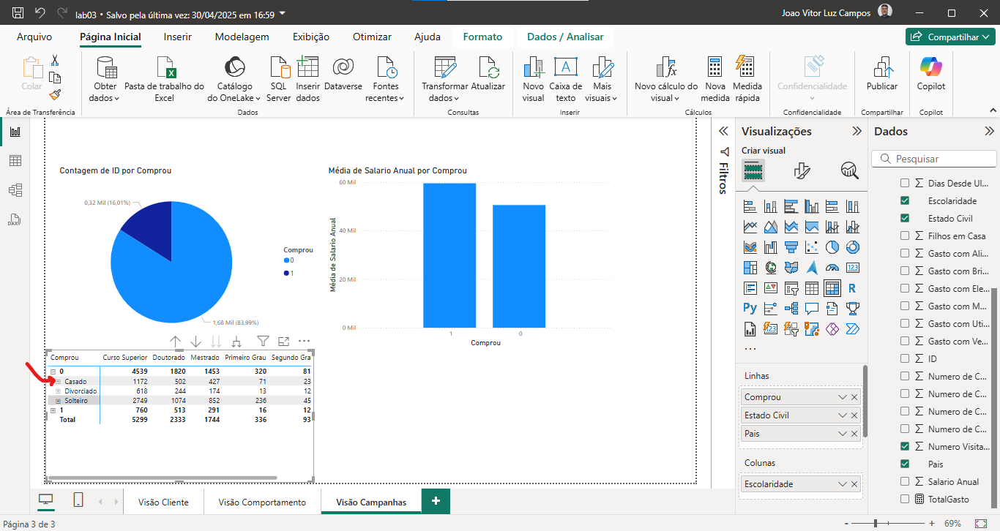
---
## Indicador Chave de Performance (KPI)

Vamos selecionar o ícone de visualização 'Indicador':

Então, selecionar a coluna 'Valor Venda' para 'Valor':

Vamos colocar como 'Média Valor Venda':
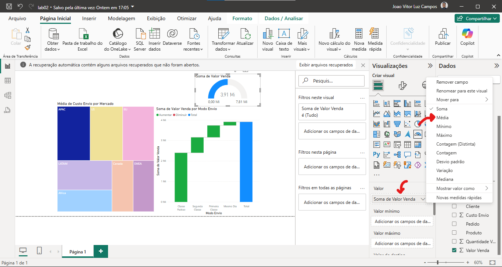
> Por enquanto, a média não está associada a nenhuma categoria, a ferramenta fez apenas a média aritmética.

Vamos então colocar uma linha de meta para esse indicador, vamos colocar o valor de 350.
Vá nas opções de 'Formatar visual', depois em 'Eixo do Medidor', vamos ter algumas opções como 'Min', 'Max' e 'Destino':
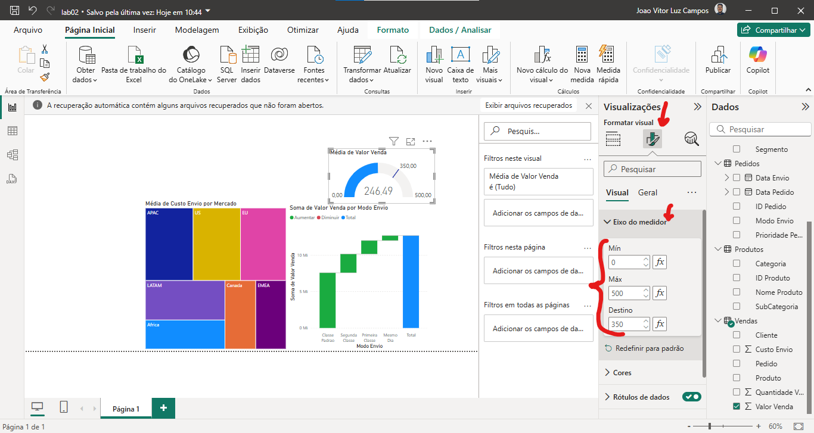
> O min, serve como o inicial para o indicador, o max serve para melhor dimensionarmos o gráfico, já o destino é como o alvo ou a meta do objetivo.

---