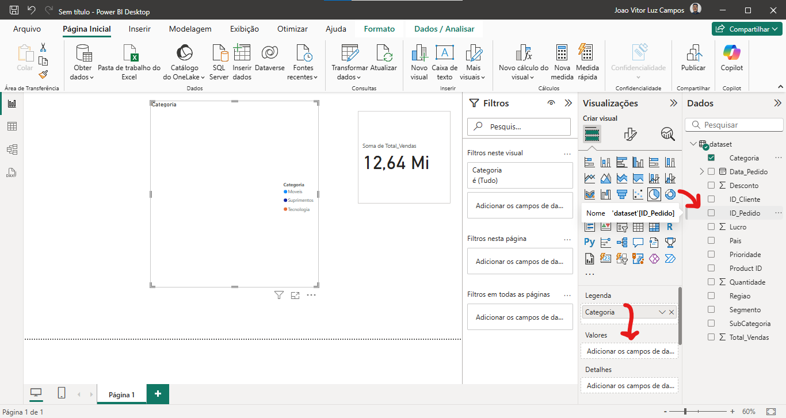
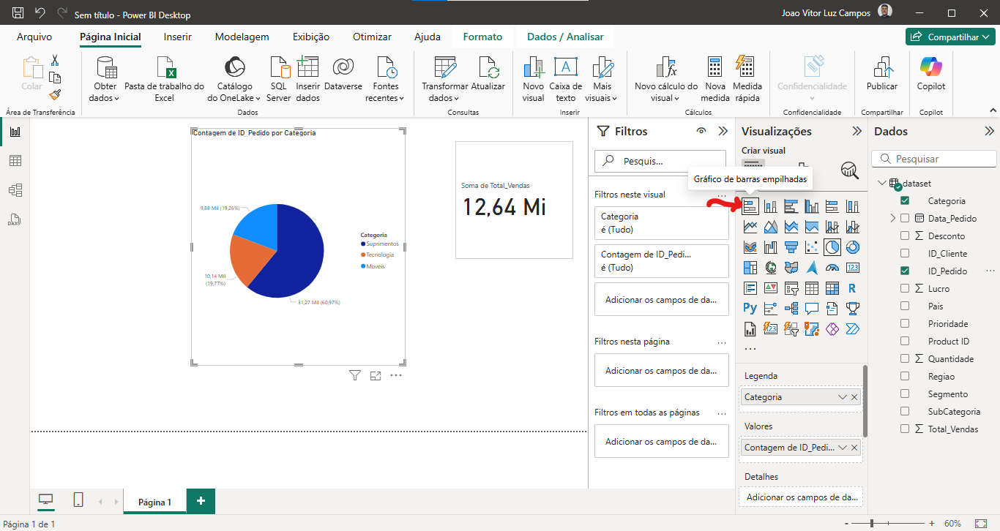
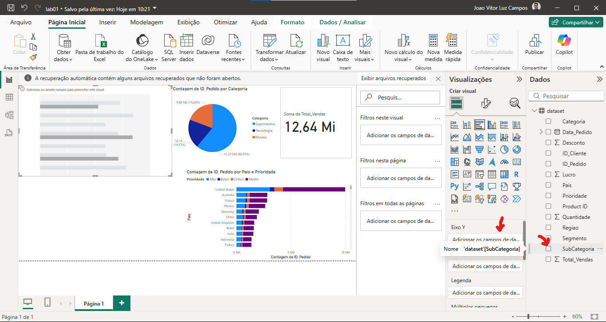

# Visualizações Básicas

## Cartão de visitas

Vamos clicar no ícone do 'cartão':

Vamos selecionar o cartão inserido no tela de desenho e depois na aba de dados:

E então, selecionamos o dado que deverá ser exibido nesse cartão, nesse caso, vamos selecionar o total de vendas:

> Os dados que tem ao lado o símbolo de somatório **∑**, indicam que podemos fazer operações matemáticas com eles

---

## Gráfico Pizza

Vamos criar um gráfico de pizza, então, selecione a visualização desse gráfico:

Então, vamos selecionar o campo 'Categoria':

Então, vamos arrastar a categoria 'ID_Pedido' para o campo das visualizações 'Valores':

E então, pronto, gráfico de pizza criado com sucesso!

> **QUANDO USAR O GRÁFICO DE PIZZA?**
>
> Quando estamos manipulando poucas categorias, o gráfico de pizza é uma das melhores opções, porém, se for muitas categorias, ele se torna uma das piores opções!

---
## Gráfico de Barras Empilhadas

Vamos criar um gráfico de barras empilhadas, começando a selecionar a visualização desse gráfico:

Vamos selecionar para o eixo Y os dados de 'Pais':

Para o eixo X a contagem do 'ID_Pedido':

E como legenda, a 'Prioridade':

E pronto, dessa forma temos o nosso gráfico de barras empilhadas:

> Importante se atentar aos Eixos e Legendas, pois fazem total diferença na apresentação dos dados.

---
## Gráfico de Barras Horizontais
Vamos criar um gráfico de barras horizontais, começando a selecionar a visualização desse gráfico:

Então, para o Eixo Y vamos selecionar os dados de 'SubCategoria':

E para o Eixo X, os dados de 'Desconto':

A ferramenta escolheu a 'Soma de Desconto' como padrão, mas, queremos a média, então, basta selecionar e alterar o comportamento:

---

## Gráfico de Colunas Clusterizado

> O gráfico de Barras pode parecer simples, porém, para ter a informação precisa, é necessário conhecimento sobre.

Estamos buscando saber a seguinte informação: Quantidade de vendas por 'Tem ou Não Tem Filhos em Casa'. Porém, quando estamos colocando as colunas nos eixos, devemos tomar cuidado, pois pode haver erros e exibir as informações de forma errada:

> Nesse cenário, foi preciso colocar a mesma coluna, tanto em Eixo X e em Eixo Y, o fator influenciador é a Legenda e a Contagem que faz toda diferença.
