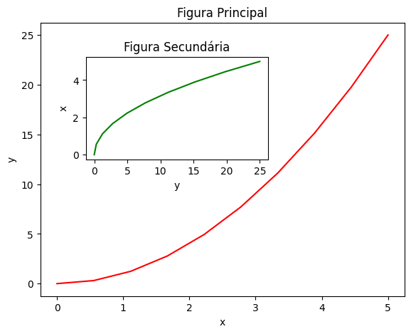

## Pylab
**Criando gráficos customizados com PyLab**

Importando o pylab para utilização
```
python

from pylab import *
%matplotlib inline
```

### Gráfico de Linha
Criando o gráfico de linha
```
python


# Dados
x = linspace(0,5,10)
y = x ** 2

# Cria a figura, ou seja a área de plotagem
fig = plt.figure()

# Definindo a escala dos eixos
axes= fig.add_axes([0,0,0.8,0.8])

# Cria o plot
axes.plot(x,y,'r')

# Definindo labels e título
axes.set_xlabel('x')
axes.set_ylabel('y')
axes.set_title('Gráfico de Linha')
```


    
    
***


### Gráfico de Linha com 2 figuras

Criando um gráfico de linha com duas figuras na mesma área de plotagem
```
python

# Gráficos de linha com 2 figuras

# Dados
x = linspace(0, 5, 10)
y = x ** 2

# Cria a figura
fig = plt.figure()

# Cria os eixos
axes1 = fig.add_axes([0.1, 0.1, 0.8, 0.8])  # eixos da figura principal
axes2 = fig.add_axes([0.2, 0.5, 0.4, 0.3])  # eixos da figura secundária

# Figura principal, área de plotagem
axes1.plot(x, y, 'r')
axes1.set_xlabel('x')
axes1.set_ylabel('y')
axes1.set_title('Figura Principal')

# Figura secundária, segunda área de plotagem
axes2.plot(y, x, 'g')
axes2.set_xlabel('y')
axes2.set_ylabel('x')
axes2.set_title('Figura Secundária')

```


    
<br>
***


### Gráfico de linha em Paralelo

Criando um gráfico de linha com outro em paralelo na mesma área de plotagem
```
python

# Dados
x = linspace(0,5,10)
y = x ** 2

# Dividindo a área de plotagem em subplots
fig, axes = plt.subplots(nrows = 1, ncols = 2)

# Loop pelos eixos para criar cada plot
for ax in axes:
    ax.plot(x,y,'r')
    ax.set_xlabel('x')
    ax.set_ylabel('y')    
    ax.set_title('Título')
    
# Ajusta o layout
fig.tight_layout()
```


    
    
<br>
***


### Gráfico de Linha com diferentes escalas

Criando um gráfico de linha com outro em paralelo com escala diferente
```
python

# Dados
x = linspace(0,5,10)
y = x ** 2

# Dividindo a área de plotagem em subplots
fig, axes = plt.subplots(1,2,figsize=(10,4))

#Criando o plot1
axes[0].plot(x,x**2,x, exp(x))
axes[0].set_title('Escala Padrão')

# Cria o plot2
axes[1].plot(x,x**2,x, exp(x))
axes[1].set_yscale("log")
axes[1].set_title("Escala Logaritmica (y)");
```


    
    
<br>
***


### Gráfico de Linha com Grid

Criando um gráfico de linha com o grid no fundo
```
python

# Dados
x = linspace(0,5,10)
y = x ** 2

# Criando os subplots
fig, axes = plt.subplots(1,2, figsize = (10,3))

# Grid padrão
axes[0].plot(x, x**2, x, x**3, lw=2)
axes[0].grid(True)

# Grid customizado
axes[1].plot(x, x**2, x, x**3, lw=2)
axes[1].grid(color = 'b', alpha=0.7, linestyle = 'dashed', linewidth = 0.8)
```


    
    
<br>
***


### Diferentes Estilos de Plot na mesma Área

Criando 4 gráficos de estilos diferentes na mesma área de plotagem
```
python

# Dados
xx = np.linspace(-0.75, 1., 100)
n = np.array([0,1,2,3,4,5])

# Subplots
fig, axes = plt.subplots(1, 4, figsize=(12,3))

# Plot 1
axes[0].scatter(xx, xx + 0.25 * randn(len(xx)), color="black")
axes[0].set_title("scatter")

# Plot 2
axes[1].step(n, n ** 2, lw=2, color="blue")
axes[1].set_title("step")

# Plot 3
axes[2].bar(n, n ** 2, align="center", width=0.5, alpha=0.5, color="magenta")
axes[2].set_title("bar")

# Plot 4
axes[3].fill_between(x, x ** 2, x ** 3, alpha=0.5, color="green")
axes[3].set_title("fill_between")

```


    
    

<br>
***


### Histogramas

Criando dois histogramas na mesma área de plotagem
```
python

# Dados
n = np.random.randn(100000)

# cria os subplots
fig, axes = plt.subplots(1,2,figsize=(12,4))

# Plot 1
axes[0].hist(n)
axes[0].set_title('Histograma Padrão')
axes[0].set_xlim((min(n), max(n)))

# Plot 2
axes[1].hist(n, cumulative = True, bins = 50)
axes[1].set_title('Histograma Cumulativo')
axes[1].set_xlim((min(n), max(n)))
```


    
    
<br>
***


### Gráficos 3D

Importando o pacote toolkits Axes3D para utilização
```
python

from mpl_toolkits.mplot3d.axes3d import Axes3D
```

Criando a função para mapear as cores e os dados
```
python

# Dados 
alpha = 0.7
phi_ext = 2 * np.pi * 0.5

# Função para um mapa de cores
def ColorMap(phi_m, phi_p):
    return (+ alpha - 2 * np.cos(phi_p)*cos(phi_m) - alpha * np.cos(phi_ext - 2*phi_p))

# Mais dados
phi_m = np.linspace(0,2*np.pi,100)
phi_p = np.linspace(0,2*np.pi,100)
X,Y = np.meshgrid(phi_p,phi_m)
Z = ColorMap(X,Y).T
```

Criando a figura de plotagem
```
python

# Cria a figura
fig = plt.figure(figsize=(14,6))

# Adiciona o subplot 1 com projeção 3d
ax = fig.add_subplot(1, 2, 1, projection='3d')
p = ax.plot_surface(X, Y, Z, rstride=4, cstride=4, linewidth=0)

# Adiciona o subplot 2 com projeção 3d
ax = fig.add_subplot(1, 2, 2, projection='3d')
p = ax.plot_surface(X, Y, Z, rstride=1, cstride=1, cmap=cm.coolwarm, linewidth=0, antialiased=False)

# Cria a barra de cores como legenda
cb = fig.colorbar(p, shrink=0.5)

```


    
> É um gráfico visualmente atrativo, porém, para a análise do mesmo se torna um pouco mais difícil. Mas para uma apresentação dos dados, é uma boa opção, como foi dito, **TUDO DEPENDE!**    

<br>
***

