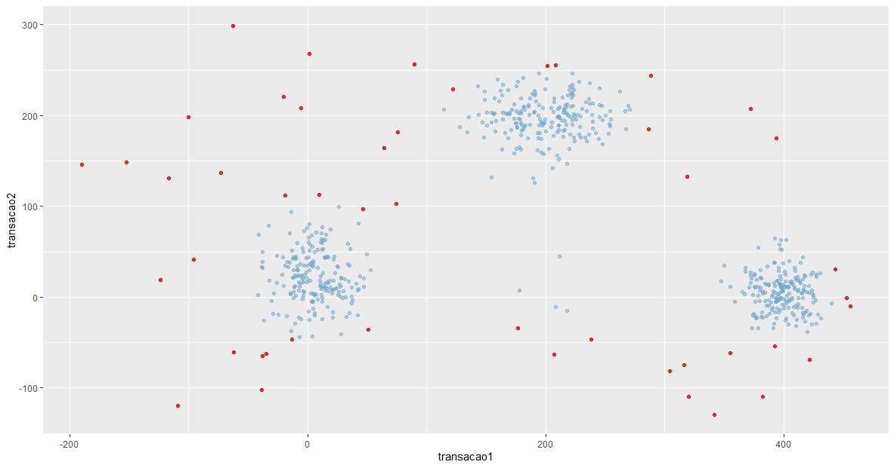

## 🧠 Detecção de Anomalias com R

Vamos utilizar a linguagem **R** para a construção de um modelo de *Machine Learning* voltado à **detecção de anomalias** em um sistema financeiro.

---

### 💼 Cenário

Temos acesso apenas aos **valores de transações de clientes**. Nosso objetivo é verificar se há indícios de **fraude** nesses dados. Para isso, iremos construir um modelo capaz de identificar padrões incomuns que possam representar comportamento suspeito.

---

### Construção do Modelo

#### Primeiros passos

Vamos instalar os pacotes necessários para o funcionamento do modelo:

```r title='R'
# Instala os pacotes
  install.packages("tidyverse")
install.packages("dplyr")
install.packages("solitude")
install.packages("ggplot2")
install.packages("readr")
```
> Sobre os pacotes: `tidyverse, dplyr, readr` **são para manipulação de dados**. O pacote `solitude` permite usar o **algoritmo de ML** para detecção de anomalias. O `ggplot2` nos permite a **construção de dados**.

Vamos carregar os pacotes instalados:

```r title='R'
# Carrega os pacotes nesta sessão R
library(tidyverse)
library(dplyr)
library(solitude)
library(ggplot2)
library(readr)
```

#### Carregando os Dados

Vamos carregar nossa base de dados para a sessão R:

```r title='R'
# Carrega os dados históricos
dados_historicos <- read_csv("dados_historicos.csv")

# Visualizando os dados carregados
View(dados_historicos)
```

---

#### Construindo o Modelo Não Supervisionado

> Antes de chegar nessa etapa, é necessário realizar uma análise exploratória no data-set, visualizando se há problemas com a base de dados, colocar os dados na mesma escala, etc. Estamos utilizando uma base de dados já formatada para a construção do modelo.

Vamos construir um **modelo de aprendizado não supervisionado**.

Caso optássemos por utilizar **aprendizado supervisionado**, seria necessário **adicionar uma nova coluna ao dataset** com a identificação de cada dado — ou seja, realizar a **etiquetagem** (*labeling*). Essa coluna indicaria, por exemplo, se determinado registro é ou não uma anomalia. Dessa forma, o modelo supervisionado poderia aprender a partir de **dados históricos rotulados**.

No entanto, neste caso, optaremos por um **modelo não supervisionado**, que **não requer dados rotulados**. Em vez disso, ele irá se orientar por meio de **resumos estatísticos** (como média, desvio padrão, distribuições, etc.) para detectar padrões e possíveis anomalias nos dados.


Caso queira obter a documentação do modelo utilizado:
```r title='R'
?isolationForest 
```

Vamos criar o modelo:

```r title='R'
modelo_ml = isolationForest$new() 
```

Vamos agora treinar o modelo com a nossa base de dados:

```r title='R'
# Treina o modelo
modelo_ml$fit(dados_historicos)
```

>**O que aconteceu?**
>
>O algoritmo varreu a massa de dados, buscando **grupos por similaridade**.
>
>Dentro de cada grupo, ele foi calculando a **singularidade interna** dos pontos de dados. Em seguida, fez o cálculo da **distância de cada ponto em relação ao centro do grupo**.
>
>Aqueles pontos que estavam **distantes do centro** foram marcados como **anomalias**.
>
>Ou seja:  
>O algoritmo **verificou o padrão** e **buscou os dados que estavam fora do padrão**.

Criando o score de anomalia:
```r title='R'
# Faz as previsões com o modelo usando os dados históricos
previsoes_historico = dados_historicos %>%
  modelo_ml$predict() %>%
  arrange(desc(anomaly_score))
```
> Vamos agora, pegar os dados, fazer as previsões com esses dados, então, quando as previsões estiverem prontas, o algoritmo vai entregar o 'anomaly_score', isto é, a pontuação de anomalia, e então vamos agrupar por ordem decrescente.

Vamos visualizar as previsões feitas:
```r title='R'
View(previsoes_historico)
```
> Visualizando as previsões, ele tem o id pra cada linha da previsão, ele tem a média de profundidade, e o mais importante o 'anomaly_score', ou seja, a pontuação de anomalia. O que estava fora do padrão ele deu um score de anomalia mais alto, para o que estava dentro do padrão, ele deu um score de anomalia mais baixo.

Vamos visualizar o score de anomalia através de um gráfico de densidade:

```r title='R'
# Density Plot 
plot(density(previsoes_historico$anomaly_score))
```
> Visualizando o gráfico, fica claro que o algoritmo nos dá as notas de anomalia, mas, como sabemos se isso é algo bom ou ruim? O que pode ser considerado uma anomalia? Para isso devemos definir o Score de anomalia.

---

#### Definindo o Score de Anomalia

Vamos agora definir o score de anomalia que será considerado dentro ou fora do padrão. **Atenção:** Essa etapa varia muito de cada regra de negócio, cabe ao analista definir qual é o padrão que será definido:
 
```r title='R'
# Quanto maior o anomaly score maior a chance do registro ser uma anomalia
# Vamos definir como regra que anomaly score acima de 0.62 é uma anomalia
indices_historico = previsoes_historico[which(previsoes_historico$anomaly_score > 0.62)]
```
> Definimos que, o padrão será 0.62, ou seja, tudo o que sair do padrão, será considerado uma anomalia. Então, definimos um índice padrão.

Vamos agora fazer o filtro:
```r title='R'
# Faz o filtro
anomalias_historico = dados_historicos[indices_historico$id, ]
normais_historico = dados_historicos[-indices_historico$id, ]
```

Vamos fazer um gráfico de dispersão para visualizar as alterações:
```r title='R'
colors()
ggplot() + 
  geom_point(data = normais_historico, 
             mapping = aes(transacao1,transacao2), 
             col = "skyblue3", 
             alpha = 0.5) + 
  geom_point(data = anomalias_historico,
             mapping = aes(transacao1,transacao2), 
             col = "red2", 
             alpha = 0.8)
```

out:



> Nesse gráfico, em azul, são os registros considerados normais, em vermelho, as anomalias.

**ATENÇÃO:** Por mais que tenhamos muitas anomalias, não quer dizer que se trata de uma operação **fraudulenta**, são apenas mudanças de padrão, cabe ao tomador de decisão que irá realizar um trabalho complementar para identificar se isso se trata de uma fraude ou não.
