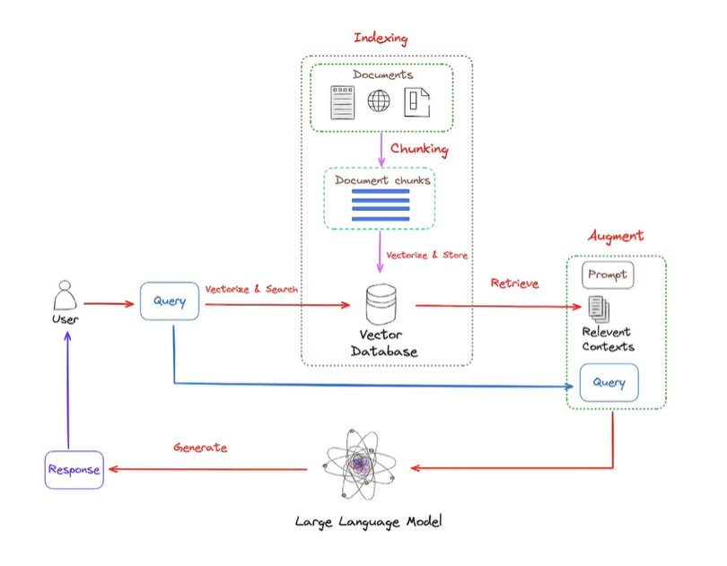

Assim como qualquer modelo de aprendizado de máquina, o LLM tem como conhecimento aquilo que estava presente nos dados de treino. Isso foi o que ele aprendeu. Logo, o LLM fica limitado a esse conhecimento.

Mas, como usar a capacidade de geração de texto do LLM para, por exemplo, gerar textos a partir de conteúdo interno de uma empresa, como documentos, contratos, notas fiscais, planilhas e bancos de dados.

Precisamos dar ao LLM esse contexto. E como fazer isso? Pode ser feito através de um banco de dados externo, por exemplo...

 
***

## O que é RAG?

**Retrieval Augmented Generation (RAG)**, ou em português Recuperação de Geração Aumentada, é uma técnica que combina modelos de geração de linguagem, como os LLMs, com sistemas de recuperação de informações, para melhorar a qualidade e a relevância das respostas geradas pelo modelo.

Essa abordagem é particularmente útil em situações onde o modelo precisa acessar informações externas ou contextos específicos que não foram completamente capturados durante o treinamento.

 
***

## GraphRAG

GrapRAG é uma extensão da técnica RAG que incorpora elementos grafos para melhorar ainda mais a qualidade e a contextualização das respostas geradas por modelos de linguagem.

Em vez de depender de documentos textuais ou bases de dados tradicionais, o GraphRAG utiliza estruturas de grafos para organizar, relacionar e acessar informações de maneira mais eficiente e estruturada.

A arquitetura RAG pode ser entendida em duas partes principais:

**Recuperação de Informação (Retrieval):** Antes de gerar uma resposta, o modelo RAG consulta uma base de dados externa ou um índice de documentos para recuperar informações relevantes que possam ser usadas na resposta. Esse componente de recuperação pode utilizar técnicas de busca tradicional, como TF-IDF, BM25 ou embeddings baseados em redes neurais, para encontrar textos que sejam mais relevantes ao contexto da pergunta ou ao prompt fornecido.

**Geração de Resposta (Generation):** Após a recuperação das informações relevantes, o modelo de linguagem (por exemplo, um LLM) usa essas informações como contexto adicional para gerar uma resposta mais informada e precisa. A geração pode ser condicionada diretamente pelas informações recuperadas, permitindo que o modelo integre dados factuais, citações ou outros detalhes específicos que não estavam presentes em seu conhecimento pré-treinado.

