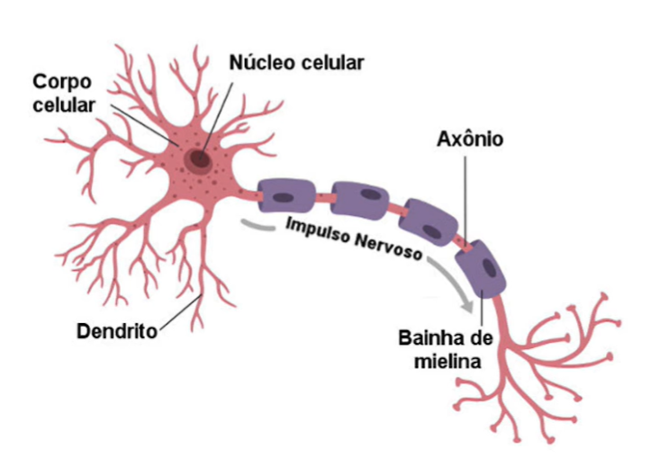
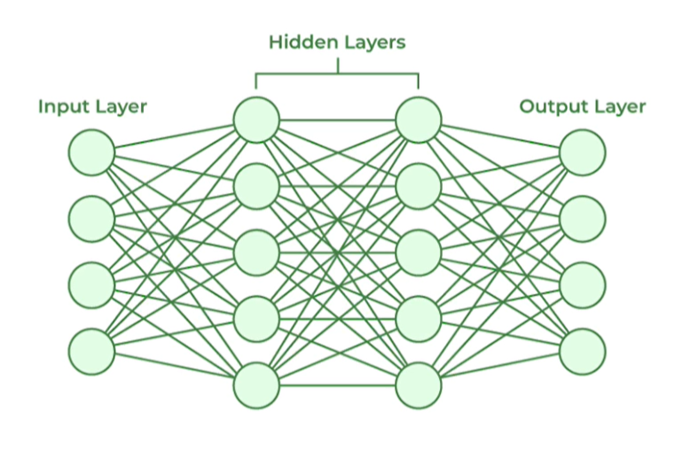
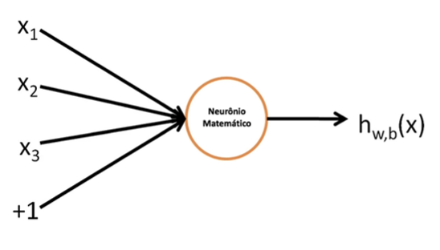
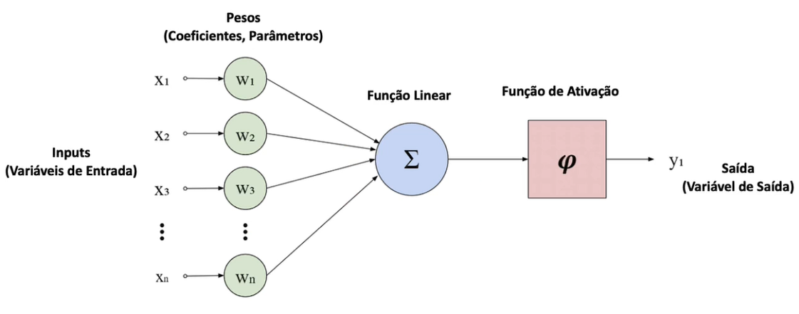

Há várias formas de construir sistemas de IA, mas uma estratégia é a que normalmente apresenta ótimos resultados e está presente nos principais sistemas de IA da atualidade.

Essa estratégia é baseada em uma arquitetura de aprendizado de máquina, chamada de Rede Neural Artificial.

As Redes Neurais Artificiais (RNAs) são modelos computacionais inspirados no cérebro humano, elas são projetadas para reconhecer padrões e aprender com os dados. Elas são compostas de: camada de entrada, camadas ocultas e camada de saída.

Quanto mais camadas ocultas, mais profundo é o modelo, exatamente o que chamamos de Deep Learning (Aprendizado Profundo).

 
***

A figura abaixo é a representação de um neurônio biológico e há bilhões deles em um cérebro humano.

>As sinapses entre os neurônios é o que gera a inteligência.

 
***

Abaixo, uma representação de uma rede neural artificial:

> Uma rede neural artificial contém neurônios matemáticos que são usados durante o treinamento com os dados.
>
> O resultado desse treinamento é que o chamamos de Inteligência Artificial.

 
***

## Neurônio Matemático

Representação de um neurônio matemático:

É um conjunto de operações matemáticas que nos permitem relacionar a entrada com a saída, agora vamos ao detralhamento do neurônio matemático:

O resultado do treinamento é um conjunto de pesos (ou parâmetros, ou coeficientes) que representam a relação entre entrada e saída.

Quando iniciamos, a principío não sabemos os valores dos pesos e por isso, buscamos dados históricos de entrada e saída. Iniciamos os pesos com valores aleatórios com base em uma estratégia de inicialização e treinamos o modelo para que aprenda os melhores valores de pesos.

O modelo aprende o padrão nos dados (se existir) e encontra os valores de pesos. Tudo isso é uma aproximação matemática e nunca vamos saber os valores exatos. O que estamos em busca é o conjunto de pesos que melhor explica a relação entre dados de entrada e saída.

Hoje, temos modelos na casa de trilhões de parâmetros, chamados de LLMs (Large Language Models)

> As representações gráficas acima, são somente para melhor compreensão e visualização, pois, na realidade, tudo aquilo são no fim do dia, cálculos matemáticos.