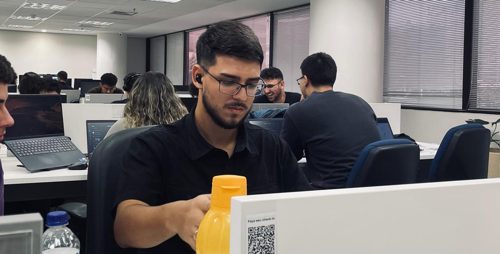
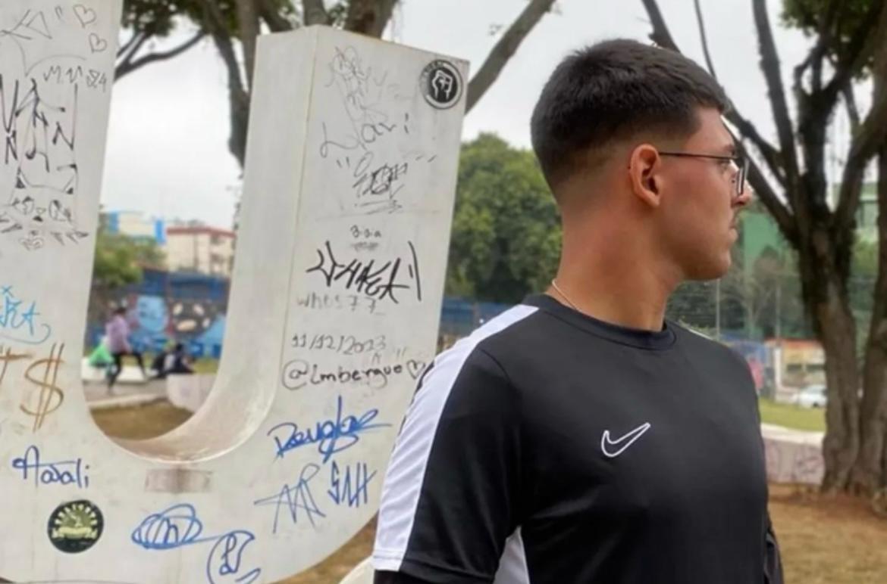
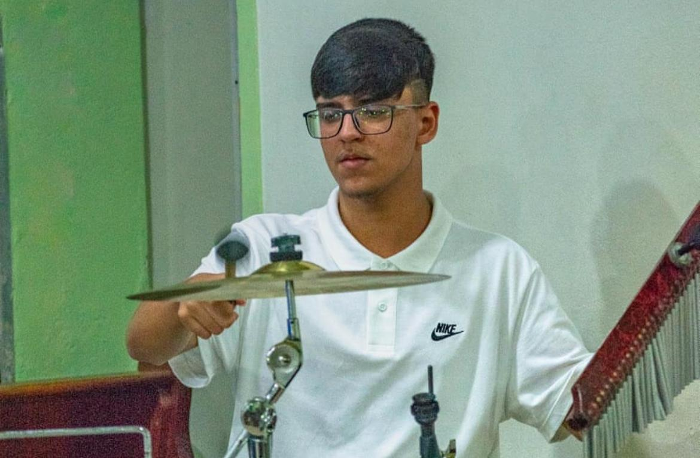
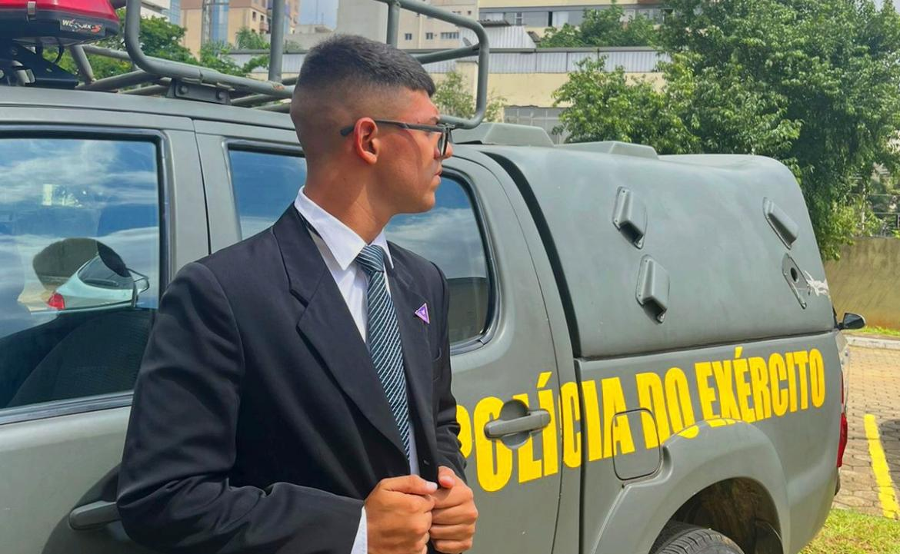
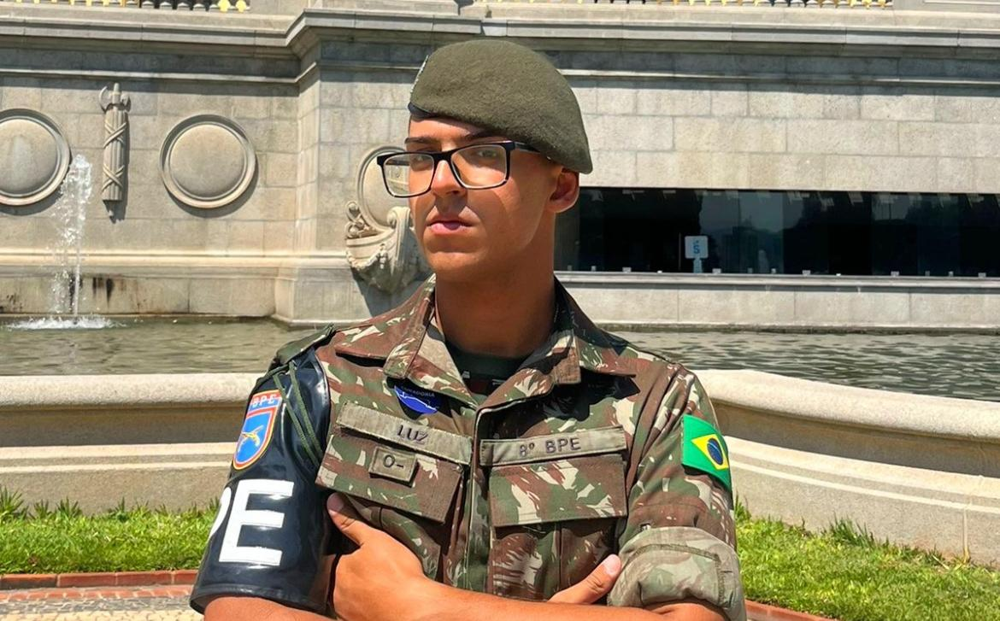

# Sobre mim

## Quem eu sou?

 

Me chamo João Vitor _Luz_ Campos, tenho 20 anos, moro na capital de São Paulo, sou estudante de análise e desenvolvimento de sistemas, atualmente trabalho na Stefanini Consulting dentro da célula do Banco do Brasil, atuando na área de Business Intelligence & Analytics. 

 

## 🎯 Hobbies

### 🏃‍♂️ Corrida

 

 Meu gosto pela corrida começou durante o serviço militar e se tornou um hábito essencial na minha rotina. Já completei uma meia maratona e sigo focado em evoluir ainda mais nesse esporte!

 

### 🥁 Bateria 

 

A música sempre fez parte da minha vida! Estudei bateria por 6 anos e, hoje, costumo tocar em casamentos, missas na minha paróquia matriz e diversos eventos. Além de ser um hobby, é uma forma incrível de expressão e conexão com as pessoas.

 

## Minha Trajetória Profissional

 

Bom, antes de atuar na área de tecnologia, já tive experiências em **outros setores do mercado**.

### 📌 Primeiras experiências profissionais  
Aos **15 anos**, tive meu primeiro emprego com registro em carteira, trabalhando como **auxiliar gráfico**. Apesar do cargo, atuei em **diversos setores da empresa**, desde a criação de artes até a produção do produto final. Essa experiência **ampliou minha capacidade de resolver problemas** e me permitiu enxergar diferentes etapas do processo produtivo.  

Aos **16 anos**, ingressei em uma empresa de **Consultoria de Planos de Saúde**, atuando no setor administrativo. Essa consultoria possuía um **pós-venda diferenciado**, e eu era responsável pela parte de documentação do cliente. Além disso, tive a oportunidade de atuar também na área de vendas. Diferente do convencional, **não éramos nós que entrávamos em contato com os clientes, mas sim eles que vinham até nós**. Essa dinâmica me permitiu **aprimorar meu entendimento sobre negócios, compreender as dores dos clientes e oferecer a melhor solução para cada caso**.  

### 📌 Empreendedorismo e gestão  
Aos **18 anos**, tornei-me sócio do meu pai em uma empresa de **móveis planejados**, onde atuei em diversas frentes, incluindo:  

- **Vendas e orçamentos**  
- **Planos de corte e projetos**  
- **Confecção do produto final**  

Essa experiência foi essencial para **expandir meu mindset**, melhorar minha **comunicação** e aprimorar minha **capacidade de resolver problemas**. Além disso, compreendi a importância de gerar **confiança no cliente** e garantir a continuidade do negócio.  

### 📌 Serviço militar e experiência com segurança  
Aos **19 anos**, fui chamado para servir nas **Forças Armadas**, no **8º Batalhão de Polícia do Exército**, como **Soldado Policial do Exército**. Durante esse período, atuei em **missões de segurança de autoridades, patrulhamento ostensivo e garantia da lei e da ordem**.  

Dentro do batalhão, tive a honra de atuar na **3ª Seção de Polícia do Exército**, responsável pelo **planejamento de missões**. Algumas das minhas principais experiências foram:  

✅ **Missões de segurança para o Presidente da República (Luiz Inácio Lula da Silva)**  
✅ **Atuação como Agente de Segurança Aproximada do Vice-Presidente (Geraldo Alckmin)**  
✅ **Apoio às enchentes no Rio Grande do Sul**  

Ao final do serviço, fui reconhecido com uma **referência elogiosa publicada no Boletim Militar** e um **certificado de Honra ao Mérito** por minha boa conduta e serviços prestados. Essa experiência **expandiu meu repertório, fortaleceu minha resiliência e me desenvolveu em diversas áreas de competência**.  

### 📌 Foco na tecnologia e carreira atual  
Aos **20 anos**, após deixar as Forças Armadas, decidi **focar na área de tecnologia**, iniciando minha faculdade em **Análise e Desenvolvimento de Sistemas**. Esse curso me permite atuar no **desenvolvimento de projetos que resolvem problemas reais de negócios por meio da programação**.  

Atualmente, trabalho na **Stefanini**, na área de **BI & Analytics**, dentro da célula do **Banco do Brasil**. Nessa função, estou expandindo meus conhecimentos em:  

📊 **Big Data**  
📌 **Fundamentos de Engenharia de Dados**  
🛠️ **Análise de dados e inteligência de negócios**  

Essa trajetória me permitiu construir uma **base sólida** e desenvolver **habilidades essenciais** para atuar no mercado de tecnologia! 🚀  
