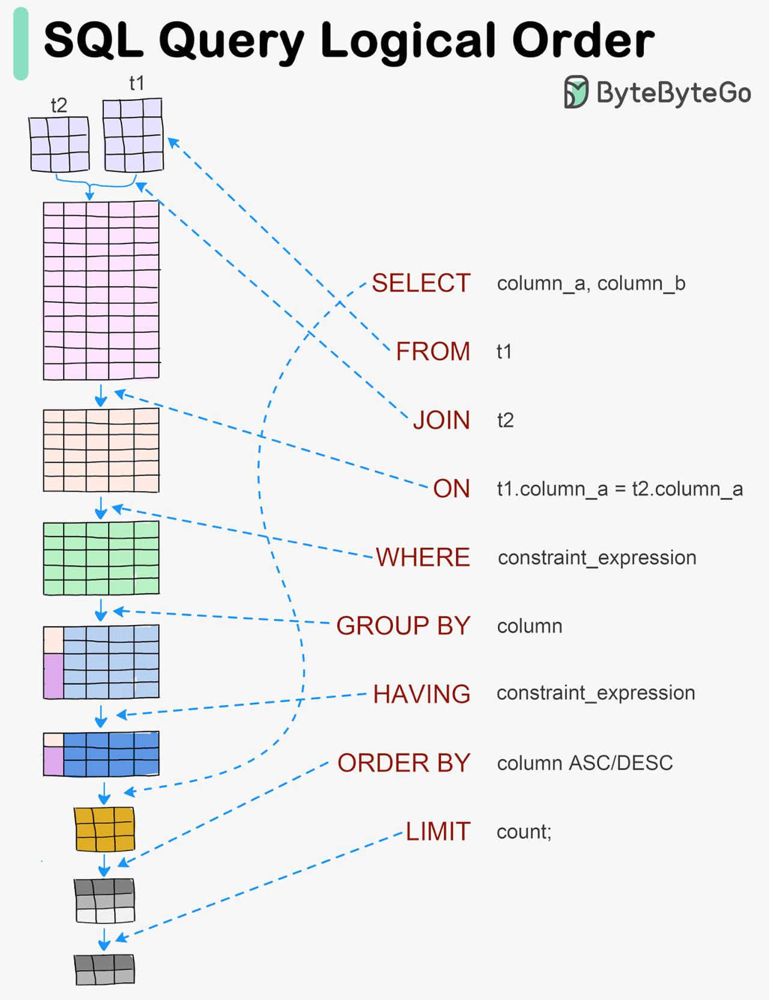

# 📝 Entenda a Ordem Lógica das Queries SQL

Quando você escreve uma query em SQL, a ordem que você digita os comandos não é a mesma que o banco de dados usa para processá-los.

Aqui está a ordem lógica que o SQL segue ao executar suas consultas:

1. 🔍 **FROM** – Define as tabelas que serão usadas.  
2. 🔗 **JOIN** – Combina tabelas com base em chaves definidas.  
3. 🔑 **ON** – Especifica a condição para as junções.  
4. 🗂️ **WHERE** – Filtra linhas antes da agregação.  
5. 📊 **GROUP BY** – Agrupa as linhas em conjuntos menores.  
6. 📝 **HAVING** – Filtra grupos após a agregação.  
7. 📋 **SELECT** – Seleciona as colunas que serão exibidas.  
8. 🗂️ **ORDER BY** – Ordena os resultados.  
9. 🔢 **LIMIT** – Restringe o número de resultados retornados.

